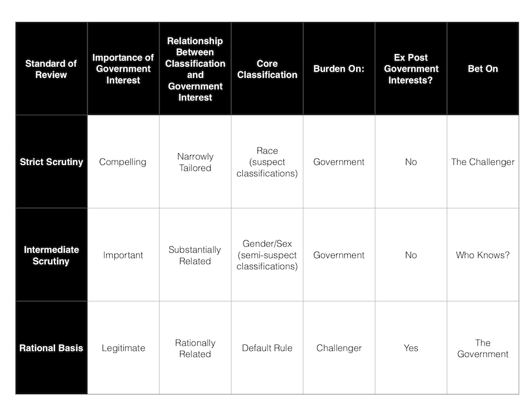

\newpage

# Purpose of this document

This document is a compilation of various handouts and other notes that I've created over the years for students in Constitutional Law.  It covers material from Constitutional Law I and II.  

This document, and the Constitutional Law classes that I teach, assume a basic knowledge of, and interest in, the history and workings of the United States government, at least at the level of an introductory college-level Political Science course such as "Introduction to American Politics." 

For students who lack this knowledge, some free resources that may be useful (I have not carefully reviewed these, and offer no warranties) include: 

- MIT's OpenCourseware (online lecture notes) for [an introductory American Politics course](https://ocw.mit.edu/courses/political-science/17-20-introduction-to-american-politics-spring-2013/).

- Videos and notes from Harvard University's [introduction to American Government on edX](https://www.edx.org/course/american-government-harvardx-hks101a-0).

- The open textbook, [American Government and Politics in the Information Age](https://open.umn.edu/opentextbooks/BookDetail.aspx?bookId=64).

\newpage

# CON LAW I MATERIALS BEGIN HERE

\newpage

# The nature of Constitutional Law

## The subject matter of Constitutional Law

Constitutional law is the law that governs the government itself. 

Consider the distinction between "public law" and "private law."  Most of the 1L classes are "private law" in a strong sense: they govern people's relationships to each other. Thus, contract and property law govern the voluntary relationships people create with one another, and in contract law we sometimes even say that people make their own private law. Tort law, in that sense, governs the involuntary or unintentional relationships people have with one another.  

Criminal law and civil procedure are "public law" in a weak sense: they govern the relationship between people and the government. But the governing goes all in one direction: both criminal law and civil procedure involve the government ordering people not to do things (kidnap and kill in one case, file frivolous lawsuits in the other). The government itself isn't ordered to do things. 

By contrast, Constitutional law is about as public as public law gets, it's actually about *the government* being ordered about. In a sense, you can think of it as the flip side of criminal law: criminal law is the government ordering people about, and punishing them for wrongs against the public; Constitutional law is the people (as a democratic citizenry) ordering the government about, and suing it for wrongs against the rule of law. 

The word "Constitution" itself explains part of what Constitutional law does: it *constitutes*, that is, *establishes*, *forms* the United States Government. In that sense, the Constitution is the basic description of how the sovereign people of the United States have established their government---it decrees, for example, that federal statutes shall be passed by majorities of both houses of Congress and signed by the President, and in doing so establishes the only way that federal statutes get made---trying to enact a federal law some other way wouldn't work.^[We might not even say that enacting a law some other way would even be illegal, it might just be a *nullity*. Like, if I declare myself King Gowder I and start issuing decrees, we wouldn't say that I've handed down unconstitutional laws, we'd just laugh at me and say that I didn't hand down laws at all. But other kinds of things we say are unconstitutional. If the President tries to do a "line-item veto," for example, we say that he acts unconstitutionally---he tries to use the veto power, but in an impermissible way. You need to become comfortable with this kind of distinction, between what we might call an illegal act that's sort of within the broad territory of someone's authority but can be successfully challenged, versus an act that's so far outside the bounds of what law even colorably authorizes that it can just safely be ignored. You'll see these ideas in thinking about courts acting without jurisdiction too, and even in areas like family law, where we sometimes talk about a difference between a totally *void* marriage, like trying to marry your dog, and a *voidable* marriage, like a marriage entered into because of fraud. You don't need an annulment to get out of the marriage with Fido.]

Third, the U.S. Constitution is *higher law*. By this, I mean that it is the law that governs laws themselves, and not just their procedural enactment (like "laws must be passed by a majority of both houses of Congress"), but also their substance (like "laws may not establish an official religion"). If another law conflicts with the Constitution, that other law must give way. This hierarchy is itself expressed in the Constitution's Supremacy Clause.

The U.S. isn't the only country to have a constitution. Some of the ideas underlying constitutional government go back millennia. For example, Athens of the 4th century B.C. had a distinction between higher laws and mere decrees; even earlier it had a form of judicial review. Some countries have constitutional principles without higher law or written documents. For example, in Britain, Parliament is considered sovereign and supreme: it can enact any law it pleases, even to the extreme of doing things like abolishing the monarchy, abandoning basic individual rights, changing the rules of its own elections, etc. However, British lawyers still understand there to be constitutional principles governing how Parliament may do so (forbidding it from enacting laws *retroactively*, for example).  To the extent the U.S. invented modern constitutional law, the real innovations were having one big written definitive document, having explicitly limited government (more on this in a moment), and having written individual rights in addition to allocations of government power.  Which leads to the next topic:

## Constitutional Law I vs Constitutional Law II

In Constitutional Law I, our subject will be the allocation of government powers *within the government.* When the President and Congress disagree about something, who wins? What about when the Supreme Court gets involved?  When the states and federal government disagree, who wins? The classical division of Constitutional Law I questions is into the domain of *federalism*---what the states get to decide, vs. what the feds get to decide---and the domain of *separation of powers*---what Congress gets to decide vs. what the President gets to decide vs. what the Supreme Court (& lower courts underneath it) gets to decide. 

Sometimes Constitutional Law I challenges to government action will come from other branches of government. For example, sometimes a state will sue the federal government claiming that the feds have intruded into territory left for the states. Very, very rarely, different branches of the federal government can sue one another.^[For an example, see this story: [http://www.cnn.com/2016/05/12/politics/obamacare-court-challenge-republicans/](http://www.cnn.com/2016/05/12/politics/obamacare-court-challenge-republicans/).] But the vast majority of Constitutional Caw I cases involve individuals (or companies, etc.) either suing the government to prevent the enforcement of some law, or defending lawsuits or criminal prosecutions from the government, either way on the grounds that the law the government seeks to enforce is beyond the scope of its authority---that the government, or particular branch of government, trying to boss someone around doesn't have the right to do so. 

Constitutional Law II is the law of specific substantive rights people have, that the government can't impede. A Constitutional Law I question is "does the President or Congress get to decide foreign policy" or "does the federal government or the state get to regulate the economy." A Constitutional Law II question is "does the government get to regulate pornography, or is making/consuming porn an individual right that can't be taken away?" 

Each state has its own state constitutional law too, but we won't cover that here. We also won't cover the criminal stuff (4th Amendment, 5th Amendment right against self-incrimination, etc.) in either Constitutional Law class; that gets allocated to criminal law and criminal procedure.

## Text + Supreme Court vs. Common Law and a Bunch of States

Another important fact about Constitutional Law is that it is not a common-law class. In torts or contracts or property you had a bunch of old rules, many of them passed down from middle-ages England and developed through the wisdom of time. There wasn't a single authoritative written source of those rules (except the UCC in contracts), instead there were a bunch of cases, that could be more or less persuasive. A state has authoritative rules in the form of the rulings of its highest court, but the U.S. in general just has "majority rules" and "minority rules," and states treat one another as persuasive authority only, not authority authority.

Constitutional law isn't like that. There's an authoritative (if vague-ish) text. That text says what the law is. And there is one high authority, the U.S. Supreme Court (though some people still disagree with that), that gets to interpret it (and boy oh boy does it take a lot of interpretation). So there's no "majority rule" or "minority rule," except when the Circuit Courts of Appeals have come to a different answer on something ("a circuit split").^[Of course, in those cases the Supreme Court often decides to hear the issue to resolve it. Federal law is supposed to be uniform.]

In some sense, this means that judges have less freedom. Common law is judge-made law, and while common law courts respect their own precedents, they're also free to change them when overwhelming policy considerations counsel doing so. By contrast, the Supreme Court has to obey the text. However, the Supreme Court can, and does, change its own interpretation of the text, and in doing so change Constitutional Law ("doctrine") without changing the Constitution itself. 

Because there's a text, we have to learn how to interpret text, as authoritative. Interpreting a Constitution or a statute is different from interpreting a case. In particular, we have a bunch of difficult and incredibly controversial questions about what we're trying to do when we interpret authoritative text. This is especially true when we get into ambiguous words (and they all get ambiguous if you poke at them enough). Are we trying to get at what the drafters (people like James Madison) *meant*? Are we trying to get at what ordinary people understand the text to mean? If so, which ordinary people---ordinary people today or ordinary people when it was written? Are we just trying to get at the "plain meaning" of the text? Do we use a dictionary?  

Another major feature of the Constitution, as opposed to ordinary statutes, is that the text is often written in terms of *values*. A statute might say "nobody may drive over 65 miles an hour," whereas the Constitution says things like "no cruel and unusual punishment." But "cruel" is a values word, just like the "unreasonable" in "unreasonable searches and seizures" and the "equal" in "equal protection of the laws." A court, in interpreting these Constitutional provisions, has to interpret the underlying *values* those words refer to. You'll wrestle with this stuff mostly in Constitutional Law II, where things get really really value-ey, but it will come up in Constitutional Law I as well. 

## The Idea of Limited Government

A (even *the*) key principle of Constitutional Law is that the federal government has *limited powers*---each branch, legislative, executive, judicial, has only the powers allocated to it by the Constitution (and those that follow by necessary implication), *nothing else*.

In particular, the federal government does not have a general power to do whatever it wants. Congress cannot legislate on any random subject it wants to: it can only legislate within the scope of its enumerated powers.

This means that there are two kinds of constitutional challenge to any Act of Congress.  Let's just call them *con law I challenges* and *con law II challenges*, to track the division of classes noted above. 

A con law I challenge is of the form "the Constitution does not grant Congress (or the President, etc.) the authority to act on this subject." For example, suppose Congress passed a "health and fitness" law, requiring every American to get a certain number of minutes of exercise per day. It's pretty clear that law would be unconstitutional: regulating people's exercise habits just isn't within the power of the federal government. This is a con law I challenge.

By contrast, suppose Congress passes a law forbidding the sale of the Bible in interstate commerce. There's no con law I challenge to this law---regulating interstate commerce is within Congress's enumerated power. But there's a big obvious con law II challenge: the First Amendment forbids the government from tampering with freedom of religion.

As far as the federal constitution is concerned, there is no basic con law I challenge to a state law. There might be con law II challenges, or there might be con law I-esque challenges based in state constitutions. In other words, as far as the federal constitution is concerned, the states have a *police power*, a term that just means "the general power to legislate for the public good." That "police power" is exactly what the federal government does not have. 

The previous paragraph needs to be compromised a little bit, however, because there are some areas that the Constitution commits to the exclusive authority of the federal government. For example, only the federal government can declare war, the states have no such authority. If a state declares war, there will be a kind of con law I challenge to that action, but not one rooted in the idea of limited and enumerated powers (the states don't have limited and enumerated powers, they have a general police power); rather, it's rooted in the fact that the Constitution explicitly took this power away from the states and gave it to the feds. (There are also many regulatory areas where the states and the federal government both have power.)

The individual branches of the federal government also have limited and enumerated powers that are subsets of the power of the whole. For example, even though the Constitution commits military command to the federal government, that doesn't mean that Congress can go out in the field and start ordering soldiers about. That's something that the Constitution allocates to the President.

## Some Basic Historical Facts

The Union started with the Articles of Confederation, ratified in 1781. It established a very weak central government, very strong states. Essentially the powers of the federal government were to conduct foreign relations and to resolve disputes between the states.

The main problems with the Articles were economic. First, no tax power. Accordingly, no public credit, and, even more dire, no resources for national defense. Second, no power over commerce between states, so states could, for example, impose import duties on one another, get into trade wars with another.

So in 1787, the framers basically went into a locked room and hashed it out. The Constitutional Convention wasn't actually planned by anyone. Basically, Virginia called a conference to talk about how much of a mess the Articles of Confederation were, and then at the conference everyone was like "let's rethink the whole thing." The Continental Congress eventually got with the program and authorized the convention to recommend revisions to the Articles... one view is that they had a fairly narrow charge, and they just went rogue and redid the whole thing.

The Constitution that came out of the process was very controversial. The states had lots of objections. Many thought the federal government was too powerful, many were upset by the absence of specific protections for individual rights (hence the Bill of Rights that got added right afterward). Lots of states ratified the Constitution with ratification statements saying, basically, "1, protect states rights better, 2. protect individual rights better."

The Federalist Papers, several of which we are reading in this course, were Madison, Hamilton and Jay's defense of the Constitution. They're very widely cited by contemporary Constitutional scholars and sometimes the Supreme Court as a way of getting at what the framing generation thought they were doing when they wrote and ratified the document. 

At the time, the political environment had two basic divisions---first the Federalists, who favored a strong central government (and, very roughly, a commercial economy). Exemplars include Alexander Hamilton and George Washington. Second the Anti-Federalists, who favored stronger states (and, again very roughly, a more agrarian economy). Exemplars include Thomas Jefferson. Madison started out a Federalist but later became a kind of de facto Anti-Federalist and close ally of Jefferson. One huge important issue right at the beginning was the creation of a National Bank---Hamilton was a major advocate, many states strongly opposed. The election of 1800 was a hugely important shift in early power from Federalists to Anti-Federalists.

Of course, the other huge division in the early United States was over slavery. In addition to the nascent moral opposition to slavery, it also gained political significance independent of the brutal oppression of the institution, because it also was part of the reason that the Southern states acted as a bloc to preserve their independent power and, to some extent, outsize influence in the national government (vestiges of which remain today), in order to protect slavery, and the interests of thinly populated agricultural states (and small states more generally) as against more densely populated states that would have an advantage in a strict one-person-one-vote electoral system (hence the Senate, and the apportionment of the Electoral College). Of course, the most notorious example was the "three-fifths rule," which provided that slaves would be counted as 3/5 of a person for the purposes of Congressional representation---giving Southern states massively disproportionate representation in the House of Representatives, since they could import slaves, who were not given any of the rights of citizens, and then count them in getting more votes for the masters. The balance of Congressional power between slave and free states continued to influence national politics up to the Civil War, particularly in the question of whether new territories would be admitted as slave or free states. The Missouri Compromise was the most important example of how the fight over the relative influence of slave states or free states would infect the operation of the national government. 

## Originalism, Living Constitution, etc.

There are two major theoretical camps about how the Constitution should be interpreted that you should be aware of.

1.  *Originalism* is the theory that the meaning of terms in the Constitution should be the meaning given to them by the framing generation. There are many varieties of originalism (it's a very fertile intellectual field), but the two key positions you should be aware of are: (a) the meaning is what the people who wrote/enacted it (i.e., Madison, Hamilton, etc., plus the other members of the Convention and the legislatures who ratified) thought they were enacting, and (b) the meaning is what the general public would have understood the words to mean at the time.  Generally, the second position ("original public meaning") is more popular today. The late Justice Scalia was one of the most important originalists in America; it's often (but not necessarily) associated with more conservative Justices and scholars. Originalists can be more "intentionalist," focusing on what people in the framing generation *meant* by what they wrote, or more "textualist," focusing on things like dictionary definitions and such from the framing generation. 

2.  The opposite position is often called *living constitutionalism*, but the label is mostly applied by its opponents (its proponents don't really have a term for it). Non-originalists/living constitutionalists think that the meaning of terms in the Constitution can change over time as social conditions change and the values of the American people change. It's typically associated with more liberal Justices and scholars, but, again, there's no particular reason that it has to be so associated. (Justice Kennedy, a Reagan appointee in the center of the court, is very living constitutionalist in his outlook).

Here's an example of how the two kinds of views might work. If a judge is trying to figure out whether a punishment violated the 8th Amendment's prohibition on "cruel and unusual punishments," an originalist judge would ask questions like "was this punishment customary in 1787?" and "was it considered cruel in 1787?" They'd use material like the statements of the framers, legislation in the First Congress and the states at the time of the founding, historical works on the extant practices of the criminal justice system in the 18th century, etc.  By contrast, a non-originalist judge would ask questions like "what is the best evidence about how much psychological damage this punishment inflicts?" and "have states and/or foreign countries over time moved to ban this practice?" That is, they'd ask about what our current standards are, what we understand today to be "cruel" and what is unusual today.

In reality, in practical constitutional arguments, both lawyers and courts deploy both originalist and non-originalist arguments when they happen to favor the position they think is correct.

## "Sovereignty"

The United States is a system of divided sovereignty between the federal and state governments. But fundamentally, of course, the sovereign is the People.  However, do the People exercise their sovereign authority primarily through the nation as a whole or through the states?  If you think the answer is "through the states," then you might have reason to support state claims of autonomy from federal authority; if you say the opposite, you might think the opposite.

Honestly, I think most of this talk about "sovereignty" as a theoretical concept is a bit of a distraction---at most, we might think that the framers had a theory of sovereignty and use it to interpret some ambiguous ideas in the Constitution---but it's hard to see why we might want to talk about *sovereignty* that way,  Consider *Bush v. Gore*: does it really add anything to the debate about its permissibility to start talking about whether the People exercise sovereignty through Florida or through the United States or both?

\newpage

# Doctrine and theory

Constitutional lawyers tend to understand how doctrine actually works by thinking about how it fits into overarching theories of the structure of rights and responsibility of government. 

For example, here's one way to think of the cases-and-controversies doctrines (advisory opinions, standing, mootness, ripeness).  We want the federal courts to not waste their time on cases where there aren't real issues at stake, and, more importantly, when they develop legal doctrines, we want them to do so in a proper adversary context---that is, with real parties with real issues at stake before the court, who have the incentive to develop evidence and argument, as well as access to real evidence pertinent to the question. 

If we have that idea in the background, we can use it to more fully understand how the doctrine gets applied.  For example: why did Massachusetts have standing to challenge the failure to regulate emissions leading to coastal erosion, while Defenders of Wildlife didn't have standing to challenge the failure to regulate federally funded foreign products leading to dead fluffy things?  Well, Massachusetts clearly had a much more concrete, real interest in keeping its lands from going back to the ocean---and it's reasonable to think that Massachusetts would have the capacity and incentive to do a much better job of putting forward evidence relating to the consequences of the EPA's failure to act, etc.^[Incidentally, this might also explain the court's maybe-dicta maybe-holding about the special role of states: a state generally has some interest in vindicating a broader set of legal rights than an individual does, as well as a generally greater capacity to produce good evidence and legal argument about such rights.] 

Similarly, we might think that the political question doctrine is fundamentally about how the courts are not fit to decide pure policy questions that lack legal standards---those are the province of the elected branches, it's just not something courts are capable of doing. We might even think that entertaining policy questions would *corrupt* the courts and undermine their legitimacy: if courts are deciding, for example, on matters of war and peace that aren't amenable to legal resolution, then it compromises their role as neutral arbiters of the law, and undermines their credibility and legitimacy with the people---credibility and legitimacy that they need in order to enforce their rulings on actual legal questions against the other branches. 

Having that kind of "theoretical" understanding of the basis of the political question doctrine helps us see how it's applied in real cases. *Baker v. Carr* isn't a political question because the equal protection clause gives the court real legal standards, that aren't just policy judgments, to apply.  *Luther v. Borden* is because there aren't legal standards to apply, and because the Constitutional structure anticipates that the political branches will handle fundamental questions like "is group of people X the legitimate government of a state." 

## Less doctrine, more argument.

Students who come to constitutional law often find themselves frustrated by the fact that doctrine in the area is very open-ended---often, the Court seems to be acting more like a political force than a judicial body, and the arguments seem to be very malleable and easy to manipulate.  This is a feature of the terrain, and it can be especially jarring in the spring semester of 1L year, when students have just gotten accustomed to the whole doctrine thing through their fall courses---and then it gets taken away in conlaw.

The best way to deal with this is to view Supreme Court decisions as arguments, not as rules of law--and particularly, as arguments about how to apply, or whether to apply, the doctrinal framework that they tell us they're applying. And by putting ourselves in the places of the justices, and of litigants, we learn to apply constitutional modes of reasoning; the ultimate goal being to be able to make our own constitutional arguments, not in terms of little-respected black letter niceties which we can get out of a book, but in terms of the core principles that drive the area of law. 

\newpage

# Practical lawyering in Constitutional Law

## Three Modes of Argument

In constitutional law, we have three key modes of argument.  These modes also show up in other areas of law, but they look a bit different in this course, and different modes are emphasized in different ways in our cases. 

The three kinds of argument are:

1.  Fact based/common-law style

2.  Textual interpretation

3.  Goals/values based.

These are all kinds of arguments that show up in cases, and that you will deploy as practicing lawyers. By learning to spot and understand them in the cases we read, you also learn to make them effectively in your eventual practice of law.

### Common-law style

You should be most familiar with this mode of argument. In contracts, or torts, or property, you spent most of your time reading cases with slightly different facts and trying to figure out how and why those factual differences lead to legal (outcome) differences. In practice, you'll turn to doing the same thing as an advocate: arguing that some should be followed because their facts are similar to the facts of the cases you have, and the results are good for your clients, while arguing that some other cases should be distinguished because their facts are different from your facts, and their results are bad for your clients.

This shows up in constitutional law too, of course. Consider some standing cases: we can distinguish *Massachusetts v. E.P.A.*  from *Lujan v. Defenders of Wildlife* because in the one case the plaintiff had a relatively concrete/definite and imminent injury (the undermining of coastal land), while the plaintiff in the other did not (vague plans to maybe go see some animals one day, which would be undermined if the government let them go extinct).

Note that to carry out this kind of argument you have to be able to argue that the facts you rely on are *relevantly* similar or different. For example, you can't distinguish two cases because the plaintiff in one is a redhead and in the other is a blonde.

So why does the difference between Mass v. EPA and Lujan matter?  Sometimes, you can make this relevance argument because the court in a prior case will have explained it: the majority opinion will explicitly say "we make this holding because of fact X, and if it had been fact Y it would have come out differently for the following reasons."

Sometimes, however, you have to use one of the other modes of argument to fill out the case for why the facts that you want to be relevant actually are relevant. For example, you might want to argue that there's some kind of textual (mode 2) or normative (mode 3) basis for thinking that concrete and definite injuries are more appropriate as a basis of standing than less definite injuries.

### Textual Interpretation

Sometimes, you've got a written authoritative text, like a statute or the constitution---or sometimes a contract.  Then, your goal is often to resolve uncertainty about what the words in that text mean. For example, "is this a regulation of interstate commerce" sometimes requires not just factual comparision to prior cases but also knowing something about what "commerce" means in the given context.

For example, the Court in Marbury v. Madison parsed the text of Article III and concluded (in part) that because the text explicitly gave Congress the power to mess around with the Court's *appellate* jurisdiction, but said nothing about a similar power with respect to the Court's *original* jurisdiction, that Congress lacked that power.

Sometimes, you can make an argument from the "plain meaning" of those words. Other times, you can make use of conventional interpretive principles ("canons" or "maxims" of interpretation---like *expressio unius est exclusio alterius*, which is one way to read Marbury---the Constitution explicitly said that the Supreme Court had jurisdiction over X, Y, and Z, so it doesn't have jurisdiction over anything else).

More often, however, you'll have to make an argument about *people*. Words don't have meaning on their own, they only have meaning to human beings who use them, and many words have different meanings to different groups of people, in the different social contexts in which they find themselves.

This means that the interpretive argument is at least two arguments:

1.  Who counts?  If you're doing constitutional law, should we care about the meaning the framers gave the words, ordinary people at the time, ordinary people now, or whoever? If we're doing contract law, do we interpret the terms via trade usage or ordinary usage of the general public?

2.  How do we learn the meaning the people who count give to the words?  Do we look at dictionaries? Do we look at legislative history? Do we look at the Federalist Papers, at James Madison's letters, at contemporary opinion polls?

Again, we often have to bring other modes of argument to bear on answering these questions (all three are deeply intertwined): we might think that the framers count, for example, because we have normative commitments (mode 3) to an ideal of the rule of law that privileges legal stability and finding the intentions of authoritative lawmakers. We might also/instead use the actions of the framers (or whomever we care about) as common-law style precedent (mode 1) to figure out what meaning they give to the words in the text---if the First Congress enacted some law that depends on a controversial interpretation of the Necessary and Proper Clause, that gives us some reason to think that they understood the kind of law they enacted to be within the meaning of those words. (Can you find an argument like that in *McCulloch v. Maryland*?)

### Goals and Values

Finally, you sometimes have to appeal to explicitly purposive or normative ideas. Sometimes these are structural or conceptual: you might argue our Constitution, taken as a whole, creates a certain kind of balance of state and federal power, or a certain kind of balance of Congress and Presidential power, and then argue from that general claim to the result in a particular case.

Sometimes, these are also values-based. The Constitution explicitly incorporates normative ideas, and sometimes you need to make arguments about what those values mean. Sometimes, for example, a court will just say "we made X constitutional decision because decision Y would have been super-undemocratic"---only usually in much more long-winded terms.

This mode of argument shows up in other areas of law as well. Thus far in your law school careers, you've probably heard it referred to as "policy argument." Think, for example, about debates about what a reasonable person would do in tort law, or about efficient choices of damages in tort or in contract. It's fair to say, though, that the explicit goals and values-based arguments are much more prominent in constitutional law than your other courses.

Once again, this mode of argument is closely tied in with the others. As you might imagine, there's a lot of disagreement about these big questions of structure and values; in order to resolve them we often have to appeal to the other modes. Why, for example, should my opinion of what it means to make a decision that accords with democratic values trump yours, if we have equally plausible arguments? Well, one reason might be if we think we can read the authoritative text (mode 2) that way, i.e., because the framers or some other relevant group meant to write it in there.

### The Upshot

All of these modes of argument show up in our constitutional law cases. By the end of 1L year, your goal should be to become sufficiently fluent in all of them that you can both understand them in the cases and deploy them in advocating for your own positions. Much of what we do in this course will be practice for developing this fluency.

\newpage

# Interlude: nonaquiescence

At various points in recent history, the Social Security Administration has had a "nonacquiescence" policy. On that policy, if a Circuit Court made a ruling interpreting social security law (such as the standards for who is disabled) that the SSA disagreed with, it obeyed it in the specific case---for example, it paid the benefits it was been ordered to pay---but did not apply it in subsequent cases, even within the same circuit. Under immense political pressure, plus the threat of contempt sanctions, the SSA backed down from that policy. But should it have had? Or was the policy permissible?

\newpage

# Justiciability

## The Five Justiciability Doctrines 

1.  Advisory Opinion: the federal courts will not opine on a legal question without there being an actual dispute. Congress or the President can't just call up the Chief Justice and say "we're considering doing X, is it constitutional?"

2.  Standing: when someone files suit, it has to be about an individual injury, and there has to be some relief the courts can give them.

3.  Mootness: if the dispute in a lawsuit goes away before the case is over, the case has to be dismissed.

4.  Ripeness: a lawsuit cannot be brought until the parties' interests are developed enough for the court to be able to access the evidence and give relief. 

5.  Political question: some issues, particularly of Constitutional law, are committed to the complete authority of the other branches of government, and the judicial branch may not rule on them. 

All of those except for the political question doctrine derive from the "cases" and "controversies" requirement of Article 3, which the Court has interpreted to mean that the judicial branch can only hear genuine disputes between two parties with real opposing interests to be resolved by the court. 

In addition to that textual rationale, there are some well-accepted policy reasons for enforcing the justiciability doctrines. First, there's a worry about wasting judicial resources by resolving cases where people don't have a real stake. Second, there's a worry that if the courts handle cases where there aren't litigants with an incentive to develop the facts and law (because they have actual money or other interests on the table, the court could make garbage precedent, based in inadequate facts and legal argument. The adversary system depends on parties with genuine motives to litigate the cases themselves to the fullest. 

## Standing

A person must have standing in order to bring suit in federal court. Standing doctrine is composed of two types of rules.  First, there are *constitutional* rules, derived from Article III's limitation of the federal judicial power to cases and controversies. Congress cannot confer jurisdiction on federal courts to hear cases that violate a constitutional rule. Second, there are *prudential* rules, judge-made standing rules meant to avoid undue litigation, ensure that the parties who bring cases to the courts are in the best position to develop the issues, etc. Congress has the power to legislatively override prudential standing rules.

The constitutional rules for standing are expressed in Lujan in roughly the following formula:

1.  "the plaintiff must have suffered an 'injury in fact'"  That's "an invasion of a legally protected interest," 

2. "there must be a causal connection between the injury and the conduct complained of... of the defendant" "not the result of the independent action of some third party not before the court," and

3.  "it must be likely... that the injury will be redressed by a favorable decision," not "speculative."

In addition, the Court makes clear that: 

1.  An injury in fact has to be "concrete," "particularized" ("must affect the plaintiff in a personal and individual way"), and "actual or imminent, not conjectural or hypothetical," and

2.  The plaintiff has the burden to establish standing.

There are roughly three prudential standing rules:

1. The plaintiff's injury must be in the "zone of interest" that the statute or constitutional provision was intended to protect. This mostly comes up in the context of statutory claims, and the basic idea is that if the plaintiff pleads an injury arising out of a violation of a statute, then the injury the plaintiff suffered must be the kind of injury that Congress intended to protect against (for those of you who remember torts, compare it to the test for negligence per se).^[A key case: *Air Courier Conference of America v. American Postal Workers Union*, 498 US 517 (1991) (Postal employee union lacked standing to challenge regulations waiving U.S. Post Office monopoly statute, because the statute was meant to protect the Post Office, not its employees.)]

2. "Generalized grievances" do not suffice.  The key kind of case where this comes up is in taxpayer standing, where someone challenges government expenditure and the injury they claim is that their tax dollars are being spent on some illegal program. With very few exceptions, these claims are rejected.

3. Third-party lawsuits (suits to vindicate the rights of someone else) are disfavored. However, where the third party has his or her own interest at stake too, sometimes they'll be allowed (classic case: *Craig v. Boren*, alcohol seller challenging sexist drinking age, the plaintiff has an economic interest in having the ability to sell to the people who are forbidden from buying).

A big open question is the extent to which Congress may confer "injury" for the purposes of standing on a plaintiff by giving them a cause of action.

Consider the *qui tam* lawsuit. That is where a private plaintiff brings suit against another private party, but on behalf of the government as a whistleblower, typically in order to recover money fradulently taken from the government---and if they win, the plaintiff gets a cut. With qui tam suits, Congress has essentially recruited private plaintiffs as bounty hunters for government fraud. See casebook discussion of *Vermont Agency of Natural Resources v. United States*, in which the Court approved standing in such cases.

A good exercise is to get very clear on how the qui tam is distinguished from *Lujan*.  At the very least, 1, the plaintiff has a concrete financial stake, and 2, there is another party with an individualized injury---the government---who can basically assign the claim to the plaintiff. Assigning claims is a traditional tool with a long common-law history (insurance companies, etc.).

The Supreme Court recently heard, but punted on, a very interesting case from the 9th Circuit on whether violations of an individual statutory right are sufficient injury to confer standing even in the absence of a concrete real-world harm---Spokeo v. Robins. [ADD LINKS]]

## Mootness

Hypo: Iowa City enacts an ordinance licensing a 48-hour "suspicion detention" in the city jail: if a police officer thinks you look suspicious, s/he can lock you up for two days to investigate you. Needless to say, this policy is flamingly unconstitutional.

Plaintiff, a victim of a suspicion detention, files suit seeking an injunction against the practice. Before the case can be heard, the 48-hour period expires, and s/he's released from jail. Is the case justiciable?

In that hypo, the defendant city is likely to argue that plaintiff's claim for injunctive relief is *moot*, because there is no longer any relief that the Court can grant. The plaintiff is already out of jail, and while s/he might have a claim for damages, that isn't the lawsuit that's been filed---the lawsuit that's been filed is for an injunction!

The plaintiff is likely to claim that the injury is "capable of repetition, yet evading review." That is, because the harm is so short, it's difficult for a court to review it before it stops, and so there's unlikely to be any way for a court to hear it. The complexities of this argument are beyond the scope of our coverage in this course, but suffice it to say that the defendant city will argue that it is unlikely that *this particular plaintiff* will be subject to the same illegal behavior again.^[See *DeFunis v. Odegaard*, 416 U.S. 312 (1974) (student's race discrimination claim against state law school admissions was moot when he had been admitted pursuant to a temporary injunction that had been stayed and was in final quarter of law school when case was heard in Supreme Court, notwithstanding possibility that similar discrimination may happen to others).] The result of this hypo is fairly debatable.

Mootness is the doctrine we invoke when a plaintiff has standing at the onset of litigation for a particular claim, but, in a sense, "loses" standing midway through because there's no longer any relief for the court to grant. By contrast, a case is threatened on *standing* grounds when there's no standing at the *beginning* of litigation.^[Compare the hypo above with *City of Los Angeles v. Lyons*, 461 U.S. 95 (1983), holding that victim of illegal police chokehold lacked standing to sue for injunctive relief to prevent future chokeholds (although he did have standing to sue for damages). Lyons filed his suit months after he was choked, and, the Court held, there was no reason to think he'd get choked in the future; accordingly, the case wasn't moot, instead, he'd never had standing in the first place. Lyons gets cited quite a lot in standing doctrine, but it's also an incredibly problematic case. There was a massive racial bias issue that the courts did not consider: the LAPD was notorious for using dangerous chokeholds on black men like the plaintiff. As Justice Marshall pointed out in dissent, 16 people had died in the last 8 years following LAPD chokeholds; 12 of them were black men. When then LAPD-chief Daryl Gates was asked about this racial pattern, his response, infamously, was the claim that the "veins or arteries of blacks do not open up as fast as they do in normal people." (As reported by Erwin Chemerinsky in *The Case Against the Supreme Court*.)]

Mootness is usually only a problem for claims for injunctive relief. Obviously, a damages claim cannot be mooted (unless the defendant outright settles the case by paying the claim), because that's purely retrospective relief---there's always something for the court to grant. It is because injunctions are prospective relief that there's the risk that the world might swoop in and grant the relief that plaintiff is asking the court to grant, mooting the case.

One important rule is that *voluntary cessation of unlawful conduct* is not sufficient to moot a case, for obvious reasons---otherwise the defendant might just turn around and do it again when the case is dismissed. However, there are some subtleties here: sometimes we will say a case is moot when the defendant really conclusively ends the conduct, like by repealing a statute alleged to be unconstitutional.

## Ripeness

Ripeness is kind of the opposite of mootness; the claim is not "you used to have a concrete claim, but you don't anymore," but, rather, "you might have a claim in the future, but not yet."

I am of the (controversial) opinion that ripeness in most real cases is just another way of getting at the absence of standing, i.e., the lack of a concrete or (especially) imminent injury.^[For a recent example of a ripeness case, see National Park Hospitality Association v. Department of Interior, 538 U.S. 803 (2003).]

## Political question

In an odd way, the political question doctrine is kind of the opposite of the sorts of ideas that we saw in Marbury v. Madison. Remember that Chief Justice Marshall's whole argument in Marbury was that the other branches had to obey the Constitution, and the Court's job was to say what the Constitution means, full stop. Now we learn that this isn't completely true, that if, for example, the Constitution says that the Senate shall try all impeachments, the Supreme Court has no business saying what "try," as written in the Constitution, means---that's actually the sole determination of the Senate.

Baker v. Carr, has the core test for political questions. The key passage states a test that runs as follows.

An issue is a nonjusticiable political question if the issue is characterized by one of the following:

1. "a textually demonstrable constitutional commitment of the issue to a coordinate political department" 

2. "a lack of judicially discoverable and manageable standards for resolving it,"

3. "the impossibility of deciding without an initial policy determination of a kind clearly for non judicial discretion," 

4. "the impossibility of a court's undertaking independent resolution without expressing lack of the respect due coordinate branches of government," 

5. "an unusual need for unquestioning adherence to a political decision already made," or 

6. "the potentiality of embarrassment from multifarious pronouncements by various departments on one question."

The these elements of the test have a few broad ideas in common: 

- The separation of powers means the Court can't decide everything---if it's asked to rule on the internal procedures of another branch (like the Senate's procedures for conducting impeachment in Nixon v. U.S.), or something within the unique competence of another branch, it should probably stay out of it. 

- The functions of the judiciary limit them to handling things that actually are subject to legal determination, not things like "what's a Republican form of government?" (Luther v. Borden.)  

- The U.S. government has to be allowed to govern. If the Court got to set aside government decisions on things like questions of war and peace, it would cripple the government altogether. (Can you imagine the courts calling back troops deployed abroad?!)

\newpage

# Justiciability hypoes

(A)

The War Powers Resolution is an Act of Congress that purports to prohibit the President from having U.S. military forces deployed more than 2 months without Congressional authorization. 

This is an open (and hotly contested) constitutional issue: the President is commander in chief, but Congress has the authority to declare war, so there's an ambiguity as to whether the power to declare war is a constraint on the President's authority to send troops into battle. (Ditto the powers to make rules for the government and regulation of the armed forces and to fund them.) 

So suppose suppose the President ignores the War Powers Resolutions and sends a ton of troops into battle for a long time without authorization, and then someone sues.

1. Who has standing? Does anyone? 

2: Is it a political question? 

(B)

Congress passes a law: "any person offended by unconstitutional government behavior may have a cause of action for $1,000,000 damages for that behavior against the United States." It then passes a second law, "the original jurisdiction of the Supreme Court shall include writs of mandamus for undelivered judicial appointments."  A law school professor, offended by Congress's passing the second law, files suit for damages against the United States. Standing?

(C)

A plaintiff in federal prison sues, alleging that the President uses his or her pardon power in a racially discriminatory fashion---freeing a bunch of white people but no black people. Is this a political question? 

\newpage

# Federalism

As we've discussed, the federal government has limited power. In the context of federalism, the key implication is that that Congress can only pass laws that the Constitution specifically says it can pass. Everything else is left for the states. 

Why did the framers do this?  Well, one reason is as a necessary compromise: the people at the time of the founding felt some loyalty to their states, and states demanded it. An additional complication, of course, was the effect of slavery, and the desire of states to retain their autonomy either permitting or forbidding it. 

But there were perhaps less brutally pragmatic reasons too. In a diverse country, people of different states have different interests---agricultural states might have different interests from industrial states, for example, and might need different laws in order to accommodate them.^[Here's a classic example. States have different laws about damage caused by wandering (i.e. trespassing) livestock. In rancher-heavy states, the law tends to be that you have to fence off your land or the livestock owner isn't liable ("fence-out" states). In farmer-heavy states, the law tends to be that owners of livestock have to keep the livestock penned in or they're liable for damage they do to other people's land ("fence-in" states).]  They also just have different values---conservative states might want to have fewer public benefits than liberal states, for example. There's also a democratic benefit in having governments representing smaller population groups making more decisions---it means individuals have more influence on who gets elected, which also means they have more of an incentive to actually learn something about the issues and vote sensibly. 

The federal system also fits into the general idea of the framers trying to protect against government tyranny. If the federal government requires help from the states to implement its policies, then state governments can resist overreaching federal policies. For example, even though marijuana is still a controlled substance under federal law, those states that have legalized it under state law can more-or-less make it possible for their citizens to have it---not because they have the power to override federal law (they don't), but because the federal government on its own doesn't have the resources to enforce its drug prohibitions---it needs the help of state police officers and courts to effectuate marijuana prohibition, and those states that have made it legal under state law are obviously going to be inclined to withhold that assistance.  Federal law enforcement often depends on voluntary cooperation from state and local police. (See also the debate about immigration "sanctuary cities" and even "sanctuary states.")

Of course, the anti-oppression assistance can go the other way too, especially after the civil war, when the three Reconstruction amendments gave Congress the power to enforce racial equality against the states. We'll talk about this some weeks down the road.

There are also a number of situations where we might think that state power is a bad idea. For example, suppose states could impose import duties against one another? Or suppose they could craft their own foreign policies? The framers realized that a number of things are best done on the national level, and allocated those powers to the federal government.

Now you're probably thinking "wait a minute, the Constitution is only a few pages long, and the federal government does a huge amount of stuff. What gives, Gowder?  Where are those limited powers of yours?" Well, what gives is that there are two gigantic holes that Congress has been driving the legislative truck through for a long time: the Necessary and Proper Clause and the Commerce Clause.  

The Commerce Clause is the subject of a subsequent handout.  I'll cover the Necessary and Proper Clause right now.

## Necessary and Proper

Congress can enact legislation that is "necessary" and "proper" to carry out its enumerated powers. 

### What’s Necessary?

Justice Marshall, in McCulloch, establishes the principle that “necessary” doesn’t mean “essential,” instead, it roughly means “useful.”

Moreover, separation of powers considerations suggest that Congress, not the Court, should be the judge of what is useful to carry out its enumerated powers. In Marshall’s words: 

> If a certain means to carry into effect of any of the powers expressly given by the Constitution to the Government of the Union be an appropriate measure, not prohibited by the Constitution, the degree of its necessity is a question of legislative discretion, not of judicial cognizance.

Note how this presupposes that Congress is pursuing one of its enumerated powers. Thus, we might read the quoted statement from Marshall above as a two-part test:

1.  Is Congress carrying out one of its enumerated powers?

2.  If so, is the means Congress has chosen rationally related to that end (and not otherwise prohibited, but that goes without saying)?

The second part of the test is a constitutional idea that is often known as "rational basis"---we'll see *lots and lots and lots* of this idea in constitutional law. 

Justice Breyer’s opinion in Comstock gives a somewhat more complicated formulation that seems more like a balancing test:

1.  Rational relationship to implementation of a constitutionally enumerated power.

2.  Modest addition to existing statutes (with a longstanding history).

3.  Extension/natural consequence of an existing (constitutional) system and reasonably adapted to the powers that system exercises.

4.  Properly accounts for state interests.

5.  Links between act and Article I enumerated power not so attenuated that it’s a general police power.

### What about Proper?

The clause says necessary and proper. In principle, it’s possible for there to be some statute that is necessary (in the sense of “useful”) to some enumerated power, but not “proper,” and hence unconstitutional.

Justice Marshall seemed to treat “proper” as roughly equivalent to “not banned by some other provision of the constitution.” In his words:

> If the end be legitimate, and within the scope of the Constitution, all the means which are appropriate, which are plainly adapted to that end, and which are not prohibited, may constitutionally be employed to carry it into effect. 

Lately, we’ve seen an attempt to make “proper” do some independent work, most importantly in Chief Justice Roberts’s opinion in NFIB v. Sebelius. 

That opinion suggested that the individual mandate wasn’t a “proper” way of carrying out Congress’s power over commerce because it’s not “narrow in scope,” but instead would be “a substantial expansion of federal authority” into an area traditionally left to the states. The key idea is that a law is not proper when it “undermine[s] the structure of government established by the Constitution,” by trampling too far on state policy territory. We’ll have to see if this goes anywhere in future cases.

\newpage

# Commerce Clause

The very short version: Congress's power to regulate interstate commerce became, in the latter 2/3 of the 20th century, the foundation for a truly staggering amount of federal regulation. Far more of our economic life is under the authority of the federal government than the Framers (with the possible exception of Alexander Hamilton) could have ever imagined.  Moreover, the federal government has use the commerce clause to reach a substantial amount of what some people might call non-economic activity as well as purely intra-state activity too.

In recent decades there have been substantial challenges to this broad power, some of which have been successful. Accordingly, it's all the more important to learn the history, because it might be that the Supreme Court will further roll back the commerce power. If it does so, lawyers involved in Commerce Clause litigation will need to understand the variety of possible positions on the extent of the power that have been taken in the past, so that they may advocate for their clients in selecting among them.

## Historical Periods

There are several distinct periods of commerce clause doctrine: 

1. The end of the 19th and beginning of the 20th century featured a Court that took a fairly restrictive view of the commerce power. 

2. The mid-20th century Court, from roughly *Wickard v. Filburn* to *United States v. Lopez*, took a very expansive view of the commerce power; essentially anything Congress wanted to do was acceptable. The Court struck down no laws as exceeding Congress's commerce power between 1937 and 1994.

3. The late 20th century and contemporary court, from *Lopez* onward, has been rolling back the earlier commerce clause expansion. In consequence, the doctrine is currently unsettled: it's unclear where the limits lie, or to what extent we might anticipate a return to some of the ideas from the earlier period. 

## Key Questions

Congress has power to regulate (1) "commerce" (2) "among the several states." Observe that there are at least two textual elements necessary in order to be a valid exercise of the commerce clause power.^[We'll see that Chief Justice Roberts's opinion in *NFIB v. Sebelius* suggests a third element as well: the Congressional enactment must be a *regulation*, where that means a rule governing existing commercial activity as opposed to commanding new commercial activity.]

The cases focus on four key questions: 

1. What's commerce?

2. What's "among the several states"?

3. How much deference do we give Congress about what substantially affects interstate commerce?

4. To what extent can Congress use the commerce power to get at noneconomic or intrastate policy ends?

### What's Commerce?

From *Gibbons v. Ogden*, we learn that commerce isn't just limited to buying and selling of goods---at the very least, commercial interstate transportation (aka: the buying and selling of services) is covered. 

Once you have transportation as well as buying and selling, the rest follows pretty easily: "commerce" means interstate economic activity in general, and also sweeps in some noneconomic activity using facilities (like the roads) that are also used in interstate commerce. Often we summarize this last idea by saying that Congress may regulate the **channels** and **instrumentalities** of interstate commerce. This means things like transportation networks are subject to Congressional regulation too.

### What's interstate?

The Court in *E.C. Knight* interpreted an antitrust law as not applying to manufacturing in order to make it constitutional.^[This is an important general principle of constitutional adjudication: if the Court can find a limiting interpretation of a statute that makes it constitutional, they'll choose it.] The theory was that manufacturing is not interstate commerce. This is no longer good law, but it's a good case to highlight the question: how is a regulation of manufacturing a regulation of interstate commerce? Possible arguments include: 

1. Manufacturing happens with materials that have travelled in interstate commerce. 

2. Manufacturing affects interstate commerce because if you make something, you don't have to buy it, and it affects the interstate market (this was a key idea in *Wickard v. Filburn*, albeit about agriculture rather than manufacturing).

3. Manufacturing affects interstate commerce because manufacturers compete with one another across state lines, so what a manufacturer in one state can get away with changes what a manufacturer in another state can get away with (this was a key idea in *United States v. Darby*).

### Interlude: The Substantial Effects Test 

Ultimately, the first and second issues were resolved in the cases we'll read soon with the **substantial effects test**. *NLRB v. Jones* and *United States v. Darby* capture the development of this doctrine, with *Wickard v. Filburn* being its high point. If some activity has a substantial effect on interstate commerce, Congress can regulate it. **This is extremely important.**

The substantial effects test is really a necessary and proper kind of idea: much like Congress's power over currency and such gives it the power to make a national bank in order to achieve its currency (etc.) policy, Congress's power over commerce gives it power over some intrastate/non-commercial activity in order to effectuate its commerce policy. Therefore, for example, Congress can reach activities that aren't clearly commerce or aren't clearly interstate if its regulation of interstate trade would be less effective without also regulating that activity.

Another important element of the substantial effects test is that the effects can be **aggregate**. In *Wickard* and in *Heart of Atlanta*, it wasn't relevant that one farmer's wheat production or one hotel owner's racial discrimination wouldn't affect the overall market for wheat or hotels; because discrimination in public accommodations in general affected the ability of African-Americans to participate in interstate commerce, and because wheat-growing in general affected the stability of the system of price controls Congress was imposing, Congress could regulate individual activity in those areas.

The substantial effects test was dominant through most of the 20th century, and is still good law today, although, as we'll see, in cases like *Lopez* and *Morrison*, the Court has reined it in somewhat. 

### How Much Deference?

Now that we have a substantial effects test, we have to answer the question: who gets to decide what counts as a substantial effect? 

The mid-20th-century cases show a substantial amount of deference, that resembles something like a **rational basis test**, i.e., if Congress could have rationally thought that some activity had a substantial effect on interstate commerce, it can regulate it. *Lopez* and *Morrison* are somewhat less deferential.^[In particular, there's now some talk about whether Congress must have evidence and/or formal Congressional findings to support the notion that some activity substantially effects interstate commerce. It's not clear yet how far the Court will go in this direction.]

### Indirect Regulation?

Here's a not-really-a-hypo hypo: assuming that wages and hours aren't themselves regulable under the commerce clause (i.e., because employment is intrastate), can Congress regulate them by prohibiting the transport of goods in interstate commerce where those goods have been made under working conditions that violate the Congressional policy? 

The early 20th century Court struggled to answer this question. Sometimes we saw the argument that Congress either has to have a commercial *motive*, as oppoed to something like a motive to carry out morals regulation (e.g., as the dissent argued in *Champion v. Ames*). Sometimes we saw the argument that the law had to have commercial or economic *effects* (*Hammer*). 

However, the mid-20th-century cases abandoned these ideas. *Heart of Atlanta* is a good example, where it's clear that the point and effect of the regulation weren't to create more interstate travel but to promote racial equality. 

Today, it's generally accepted that Congress may regulate noneconomic activity by prohibiting the use of interstate commerce to carry it out. For example, the Mann Act (enacted 1910) forbade the transport of women across state lines for immoral purposes.^[I think it was later amended to be slightly less blatantly sexist, and is now mostly used as an anti-prostitution/anti underage sex transport provision... but check with a criminal person to make sure that's right]. It's clearly within the commerce power. Because it's a regulation of the channels of interstate commerce, it doesn't matter that Congress was actually trying to outlaw kinds of sex it disapproves of. (Cf. *Hoke v. United States*, 227 U.S. 308 (1913).)

## The Demand for a Limiting Principle

In *Hammer* we also see an extremely important strategy of constitutional argument that comes up a lot in the commerce clause and necessary and proper cases: the demand for a limiting principle. Here's how this goes, step by step: 

1. We know that the Federal government has limited powers. In particular, it does not have a general police power.

2. Sometimes, the government claims a power under the commerce clause and/or the necessary and proper clause, to do something that looks pretty far from its enumerated powers. Examples: forbid child labor in manufacturing, civilly commit sex offenders, forbid guns in schools, require people to buy health insurance.

3. When the government claims that power, it needs a *theory* of how the regulated activity affects commerce, or how the regulation is necessary and proper to effectuate its enumerated powers. For example, in *U.S. v. Lopez*, (part of) the government's theory could be summarized as follows: "gun violence in schools makes it harder for people to get an education, which creates a less educated workforce, which lowers national economic productivity, substantially affecting interstate commerce."

4. The government's theory typically can be generalized and applied to other cases. For example, a general statement of that *Lopez* theory might be "Congress can regulate any behavior that might, in the aggregate, make the workforce less productive."

5. Then the government is faced with a demand: **what principle limits that general theory?** The *Lopez* theory sounds like it might entitle the government to regulate anything: command people to get 8 hours of sleep a night, to go to the gym every day, to study math in school, etc. But we know, from (1), that the government doesn't have a general police power. Therefore, the government must be able to state a plausible **limiting principle** that yields concrete cases to which their theory from (4) would not extend. If it can do so, then it has shown that its theory doesn't "prove too much."^[For those of you with a philosophy or a rhetoric background, this is a style of argument analagous to the *modus tollens* or *reductio ad absurdum*.]

The demand for a limiting principle really comes home to roost in *Lopez*: if you [listen to the oral argument](https://www.oyez.org/cases/1994/93-1260) you'll hear the solicitor general^[*Solicitor general*: a high-ranking lawyer in the Justice Department who does the government's major oral arguments in the Supreme Court. Often the President puts someone in this position as the job before a Supreme Court nomination.] get slaughtered in oral argument by multiple justices repeatedly demanding he give them a limiting principle; he was unable to do so, and the majority opinion beats the government up like crazy for that. 

Justice Ginsburg is very careful, in her sorta-concurrence sorta-dissent in *NFIB v. Sebelius*, to explain the limiting principle on the power to compel participation in commerce, against Chief Justice Roberts's and the Joint Dissent's claim that accepting the individual mandate gives Congress unlimited power to, for example, command the consumption of broccoli.

The demand for a limiting principle is still controversial: those in the liberal wing of the court typically argue that the commerce and necessary and proper powers should be interpreted with a rational basis test, and with the chief constraint being the democratic process, not some fixed Congressional no-go zone... but they've lost the last few cases. 

## Where are we going?

In general, the *Lopez-Morrision-NFIB* rollback of commerce clause power and of the substantial effects test (which, to repeat, is still good law... it's just less clear how far it goes) seems to hinge on four ideas: 

1. The demand for a limiting principle.

2. Less deference toward Congressional judgments of what has a substantial effect. 

3. More caution about Congressional intrusion into areas like education, family life, and the control of violent crime that have been the traditional province of the states.

4. More caution about Congressional regulation of activities that do not seem conceptually "economic." This is particularly important in *Morrison*, where we see the suggestion that intrastate activity that Congress regulates under the commerce power must be "economic in nature," and the assertion that the substantial effects test does not apply to non-economic violent crimes.

Let's also remember that the extent of the rollback is highly uncertain. *Gonzalez v. Raich*, for example, looks like a resurgence of the old mid-20th-century commerce clause doctrine in 2005. As I've been emphasizing, this doctrine is in flux, and it's hard to predict where the law will go in the coming years---particularly with the death of Justice Scalia. 

## Summary of "black-letter principles"

If you're confronting a commerce clause question on the multistate bar exam, where you're expected to give some kind of mechanical answer, here's what you'd rely on: 

1. Commerce is essentially all interstate economic activity. It's not limited to "buying and selling" rather than "manufacture" or "transport."

2. Congress clearly has the power to regulate the "channels and instrumentalities" of interstate commerce.

3. Congress has the power to regulate intrastate economic activity if that activity, taken in the aggregate, has a "substantial effect" on interstate commerce. However, it is no longer clear that Congress has the power to regulate intrastate noneconomic activity on the same grounds (Lopez, Morrison).

4. Congress may use its power over the "channels and instrumentalities of interstate commerce" to get at intrastate and/or noneconomic activity that it doesn't like, by prohibiting, e.g., the use of interstate commerce to transport the products of forbidden goods.

5. Congress may regulate intrastate activity incidental and necessary to an interstate economic regulatory regime (*Raich*).

6. Congress does not have the power to compel participation in interstate commerce (*NFIB*).

Later, we'll see that there's also a "dormant commerce clause," which is about restricting state regulation in the area.

\newpage

# Lopez hypo

Act of Congress: THE GUNS IN SCHOOL ZONES TAX
 
> Each person in the United shall pay a tax of $10,000 into the United States treasury each time she or he brings a gun into a school zone [as defined in the statute underlying Lopez]. This tax shall be reported and paid to the IRS with a person's ordinary income taxes.

Knowing, as we do from Lopez, that Congress can't forbid guns in school zones, should Congress be allowed to do an end-run around limitations on the commerce power by taxing them? Does it matter whether Congress intends, by so taxing, to deter the activity taxed, or whether it intends to raise revenue?  Does it matter whether the tax seems like a reasonable amount, or whether it's a ludicrous amount that nobody would ever voluntarily pay? 

\newpage

# Commandeering

The point of the anti-commandeering principle is simple: the federal government can't order about state and local governments in order to do its work.

This, **does not imply** that state and local governments are immune from regulation. Since Garcia v. San Antonio MTA, it's been well-established that Congress can impose ordinary laws on state and local governments, like minimum wages. 

What it can't do, however, is order the states to carry out governmental functions. For example, it can't command local police officers to enforce federal law, or command state legislatures to legislate.

Reno v. Condon, is about the distinction between these two kinds of regulation. This can be conceptually problematic, but doesn't pose a lot of real-world problems in day-to-day practice.

## Anti-Commandeering and Sanctuary Cities

The anti-commandeering principle is politically important right now. It's the principle that permits so-called "Sanctuary Cities"---where local law enforcement will not cooperate with federal immigration enforcement efforts---to exist. Of course, their existence is controversial. 

One key statute is 8 U.S.C. §1373, which reads, in relevant part, as follows:

> (a) In general
> Notwithstanding any other provision of Federal, State, or local law, a Federal, State, or local government entity or official may not prohibit, or in any way restrict, any government entity or official from sending to, or receiving from, the Immigration and Naturalization Service information regarding the citizenship or immigration status, lawful or unlawful, of any individual.
>
> (b) Additional authority of government entities
> Notwithstanding any other provision of Federal, State, or local law, no person or agency may prohibit, or in any way restrict, a Federal, State, or local government entity from doing any of the following with respect to information regarding the immigration status, lawful or unlawful, of any individual:
> (1) Sending such information to, or requesting or receiving such information from, the Immigration and Naturalization Service.
> (2) Maintaining such information.
> (3) Exchanging such information with any other Federal, State, or local government entity.

Consider the constitutionality of this law. May the federal government forbid a state from forbidding its officials from cooperating with the INS (ICE)? The statute purports to say to, for example, the state of California "you may not prohibit your police departments from keeping information about people's immigration statuses.  Is that consistent with *Printz v. United States*?

## Questions on the Tenth Amendment:

1.  Is the 10th Amendment an independent constraint on federal power, or just a redundancy? 

2.  20th century pattern: similar to that of the Commerce Clause, used as independent constraint on areas of Congressional regulation of citizens until post-new-deal period, where Court changed course. 

## Notes on the major cases

### New York v. United States

Consider the following **Hypo**

Congress passes a law requiring that producers of radioactive waste dispose of all their waste within their own state, in a facility guaranteed by the state to meet certain federal standards. If there's no such facility available for a producer, it may not engage in the activity that produces the waste.

If the answer is yes, how is that different from the issue before the Court? 

What else could Congress do to regulate in this area?  Are there any alternate routes to achieving its policy ends? 

What's the democratic argument the Court offers as normative support for its conclusion? Is it plausible?

Did the law in New York v. United States actually order the states to regulate? If not, what was the real problem?

### Prinz v. United States

Ask yourself: can state courts refuse to apply federal law? Is that different from the question in this case?  Why?

### Reno v. Condon

How is this case distinguished from *New York* and *Prinz*?

Footnote: the federal government can also impose (nondiscriminatory, proportionate) taxes on the states. See *Massachusetts v. United States*, 435 U.S. 444 (1978) (federal government may apply aircraft registration tax to state aircraft).

\newpage

# Commandeering hypos

(A)

Congress passes a law: no person may use the highways to transport any federal currency in denominations greater than $1000 across state lines.  Further, any state police officer who observes such an amount in a vehicle on the highways must attempt to ascertain its origin and, if there is probable cause to think it was transported over state lines, arrest the person and turn them over to the police. Constitutional? 

(B)

Congress passes a law: the "Radioactive Transit Passage Act of 2016," forbidding any person or entity who operates any roadway that is used in interstate commerce from discriminating against federally licensed nuclear waste carriers, and authorizing a private party to bring an administrative action before the interstate commerce commission to enforce it with both damages and injunctive relief.  The state of Iowa prohits the transport of nuclear waste on its highways, and Neds Nukes and Nail Cleaning, a federally licensed nuclear waste transport, files suit against the state for damages and an injunction.  

(C)

Congress passes the following law: 

"Any state official who arrests any person for a state drug offense must inform the United States Attorney of the arrest, so that the United States Attorney may prosecute such person for any relevant federal drug offenses." 

Further suppose that the federal government fully funds this (e.g., by establishing toll-free numbers to call), and that the state officials aren't obliged in any way to tell citizens that they're calling the feds.

\newpage

# Spending Clause

You'll notice that one of the powers of Congress is to tax and spend for the general welfare. And unlike the commerce power, this isn't bounded by subject area.

What this immediately suggests is that Congress can---and, you'll be totally unsurprised to learn, routinely does---spend money on lots of things that aren't otherwise within its powers. For an obvious example, the Department of Education spends tons of money on grants to local school districts to support various federal priorities. 

The immediate question the spending clause raises, given that many of these grants are given to state and local governments, is whether they can be used to coerce local officials to carry out federal law in ways that would otherwise be forbidden by the anti-commandeering principle.  

This, of course, is another politically fraught question, as one strategy that the current President has been planning against sanctuary cities is to take away their federal funding---in order to give them a strong incentive to cooperate with federal law enforcement. Here is a relevant excerpt from an executive order of January 25, 2017:

> In furtherance of this policy, the Attorney General and the Secretary [of Homeland Security], in their discretion and to the extent consistent with law, shall ensure that jurisdictions that willfully refuse to comply with 8 U.S.C. 1373 (sanctuary jurisdictions) are not eligible to receive Federal grants, except as deemed necessary for law enforcement purposes by the Attorney General or the Secretary.  The Secretary has the authority to designate, in his discretion and to the extent consistent with law, a jurisdiction as a sanctuary jurisdiction.  The Attorney General shall take appropriate enforcement action against any entity that violates 8 U.S.C. 1373, or which has in effect a statute, policy, or practice that prevents or hinders the enforcement of Federal law.

A careful reading will suggest that this part of the order might not have very much in the way of teeth to it (how much federal money do the AG and secretary of homeland security have control over which aren't either distributed by law or deemed necessary for law enforcement purposes?), but let's suppose that it does. 

Suppose, for example, that a sanctuary city receives $10,000,000 in discretionary federal funds administered by the Attorney General. Further suppose that this represents 2/3 of the city's law enforcement budget, but that the AG concludes that it isn't "necessary" (obviously not using Justice Marshall's definition of "necessary").  Can the AG say, purusant to this executive order, "order your police to turn over information about undocumented people who have been picked up to ICE, or we take away the money?" Does it matter what the money is for? 

\newpage

# NFIB v. Sebelius

Obviously this is a really big case for us.  It actually ties together 100% of the federalism material we've seen thus far---the commerce clause, the necessary and proper clause, the taxing power, and the spending power used to commandeer. 

It will help to have a basic idea of the underlying statutory structure and the policy reasons behind it.  So here's the broad outline.

## Basics of the ACA

The Affordable Care Act (a.k.a. "Obamacare") was a systemic effort at reforming the health insurance system in the United States. Its key features were as follows:

1.  An "individual mandate" requiring everyone to get insurance on pain of a payment (to be characterized below).

2.  A variety of restrictions on the kinds of terms insurers can impose in policies.

3.  The establishment of "exchanges" in the states, either by the states or by the federal government itself, to allow people to buy health insurance (sometimes subsidized).

4.  The expansion of Medicaid, a federal+state funded, state administered program for providing insurance to the needy, and federal funding to go along with the expansion. A state that declined this expansion would lose existing Medicaid funding.

The overall project was to expand access to health insurance, expand the coverage of existing plans and reduce restrictions in them, and lower costs. 

Of those four key ideas, the first requires the most explanation. Why would the government want to require everyone to buy insurance, even if they don't want or need it? 

The answer requires detouring into a little bit of insurance economics.  

Imagine an insurance market with thee people in it, call them, in order of healthiness, Sick, Normal, and Crossfit. Each of them is going to have a different average yearly health care cost.  Let's suppose that the average cost of Sick's health care each year is $7,000; Normal's average yearly cost is $4,000, and Crossfit's average yearly cost is $1,000, mostly from having weights dropped on his/her feet.  

Let's suppose that all the people in the market know how healthy they are.  The insurance company knows *approximately* how healthy the people are, and does its best to charge people a little bit more than their average yearly cost. After all, that's how insurance works: you pay roughly your average cost, and in exchange, if you get hit by a bus and have to get millions of dollars of care, the insurance company has your back. 

However, the insurance company doesn't know quite as well as the individuals do how costly their lifestyles are.  So its estimates are going to be a little biased toward the average. Moreover, the law already prohibits some things that insurance companies could use to more accurately price people: it can't force you to get a genetic screening and the raise your price if you have predispositions to any diseases, it can't fly drones outside your window to monitor your diet... 

So the insurance company knows its average cost is $4,000.  It knows that Normal is about average, and it charges Normal $4,000.  It knows that Sick is a bit sicker than average, so it charges Sick, say, $6,500, and it knows that Crossfit is a bit healthier than average, so it charges Crossfit, say, $1,500. (Plus a small amount of profit in each case.)

So far so good. Except that Crossfit drops weights on his/her *foot* but not on his/her *head*.  So Crossfit is paying $1,500, and only getting about $1,000 in benefits. That's stupid. Crossfit cancels their insurance. 

All of a sudden, Insurance Company's costs go up to $5,500 on average. Since Crossfit was (effectively) subsidizing health insurance for Sick and Normal, their rates have to go up in order to keep Insurance Company in business. Suddenly Normal is getting charged more for the same insurance, and it's in Normal's interest to quit too.  And so on.

This problem is known to insurance economists as "adverse selection"---in an insurance market when the insured have better information than the insurers, the less risky (health insurance: less sick) tend to be paying more than they're getting back, and that tends to give them a reason to get out of the market.  But this is a process that can repeat itself (google "adverse selection death spiral"), and, in unfavorable markets, this can mean that ultimately the people left in the insurance market are the very risky, who are paying a lot. 

The point of the individual mandate is to put a stop to adverse selection. I'll be blunt: this is a form of economic redistribution. It directly subjects the healthy to charges that aren't in their economic best interests, in order to lower costs for the less healthy. 

There are also some secondary reasons for an individual mandate. One big problem is that people without insurance still get sick. And then many folks end up in emergency rooms (which are required to at least stabilize all comers without regard to ability to pay---this has been the law since 1986's Emergency Medical Treatment & Labor Act---see 42 U.S.C. §1395dd). The individual mandate is also meant to relieve this burden on emergency departments.

## The Challenge in NFIB

The plaintiffs in NFIB challenged the individual mandate and the medicaid expansion. 

With respect to the individual mandate, three theories were raised in defense of the provision:

1.  It's just an exercise of straight-up interstate commerce regulation. (After all, the health insurance market is national, and it's definitely economic activity.)

2. It's necessary and proper to the rest of the insurance regulation, as a means to the end of lowering rates for the poorest and sickets.

3.  The penalty that you pay if you don't get insurance is really just a tax. (If you're interested, it might benefit you to google "pigouvian tax.")

With respect to the medicaid expansion, the defense was straight-up spending clause, the claim of the challengers was that it was sufficiently coercive to amount to unconstitutional commandeering.

\newpage

# Eleventh Amendment and sovereign immunity

Eleventh Amendment and Sovereign Immunity doctrine are kind of messy. Here's the short version: 

The idea of "sovereign immunity" is that a government may not be sued without its consent. 

The text of the Eleventh Amendment only strips federal courts of jurisdiction over suits against states by "foreigners" (i.e., suits from citizens of other states, or other countries). As a citizen of Iowa, if I brought suit against Illinois, I wouldn't be entitled to bring it in federal court.^[Some, including on the liberal wing of the current Court, have argued that this merely bars *diversity* jurisdiction, not federal question jurisdiction as well. But the current doctrine, to the extent it's clear, is that the Eleventh Amendment bars both federal question and subject matter jurisdiction. There are also issues about the extent to which the *federal* government has sovereign immunity, but this handout will only discuss the states.]

But the Supreme Court has nonetheless created a much broader sovereign immunity doctrine with no obvious textual foundation.

## How did we get here?

The Eleventh Amendment was originally enacted in response to *Chisholm v. Georgia*, 2 U.S. (2 Dall.) 419 (1793), which allowed a South Carolian to sue Georgia for revolutionary war debts. As Article III of the constitution says that the judicial power extends "to controversies... between a state and citizens of another state," it seemed the original text of the Constitution authorized these suits. Almost instantly (in constitutional time), the Eleventh Amendment was ratified. 

Since then, there has been great dispute about the broader implications of the Eleventh Amendment. It has been read as expressing a rule of *sovereign immunity* from suit much broader than its plain terms would otherwise suggest. 

According to this theory, the Eleventh Amendment merely captures a preexisting legal principle of sovereign immunity, according to which the Constitution, and in particular Article III, never divested the states of the immunity that they had in the first place. 

One way to interpret the Eleventh Amendment on that theory is that *Chisholm* was a mistake, and that all the Eleventh Amendment did was clarify existing law. Like almost any view, this has some support in the writings of the founders; in particular, Hamilton wrote in Federalist 81 a spirited defense of the idea that states remain immune from suit.

It also has a little bit of textual support. The leading words are "The Judicial power of the United States *shall not be construed*" (emphasis mine). The "shall not be construed" language might be read to suggest that the ratifiers were not *changing* existing law, but rather reversing an unfortunate *misconstrual* of existing law---and this is consistent with the idea that the Constitution before the enactment of the Amendment did not strip states of a sovereign immunity that they originally had.

While that kind of theory is highly controversial, it makes the best sense of the Supreme Court cases that have extended sovereign immunity: 

- *Hans v. Louisiana*, 134 U.S. 1 (1890), holding that states also have sovereign immunity against suits by their *own* citizens in federal court.

- *Alden v. Maine*, 527 U.S. 706 (1999), holding that states have sovereign immunity in state court too.

## What's The Actual Doctrine?

There's a lot of sovereign immunity doctrine, to which we're not going to devote time in this course. However, for purposes of things like the bar exam, here are some rules: 

1. States are immune to suits for damages without their own consent (however, they often do consent, e.g., by statute), by any person, in state or federal court. 

2. They're also immune to claims brought in federal administrative agencies.

3. They're also immune to suits in equity (i.e., injunctive relief).

4. Congress cannot (with some exceptions relating to Congress's power to enforce the Fourteenth Amendment, which we'll discuss later in the course) authorize suits against states without their consent.

5. They are *not* immune from suits brought by other states (with the exception for when they're just bringing private claims on behalf of their own citizens) or the federal government. 

6. They are also not immune from some kinds of *in rem* suits, which are basically certain kinds of suits involving property, and which include some admiralty and bankruptcy claims.

7. The Eleventh Amendment does not strip the Supreme Court of jurisdiction to hear appeals from courts that do have jurisdiction over the original claims (i.e., if a state consents to be sued in state, but not federal court, about some matter, the Supreme Court may hear an appeal).

8. Sovereign immunity does not apply to suits against cities, counties, or other such political subdivisions of a state (except in some circumstances where relief would tap into the state treasury).

## Practical Sovereign Immunity Lawyering

The doctrine of sovereign immunity is not as harsh as it seems for two reasons. 

First, as noted above, states often consent to suit (because, democracy). Most states have something like a tort claims act consenting to a broad array of suits, often with procedural requirements like prior notice to the state to give them an opportunity to settle.^[See e.g. Iowa Tort Claims Act, Iowa Code sec. 669 <https://www.legis.iowa.gov/law/iowaCode/sections?codeChapter=669&year=2016> (consenting to personal injury and property damage tort suits in state court under various conditions)]

Second, and more importantly, the Court has interpreted the doctrine of sovereign immunity in a very formalist sense: only when the state is actually named, or its treasury is directly at risk, does sovereign immunity apply. This means that a plaintiff can often sue a state official for injunctive relief which effectively works against the state.  

The key case there is *Ex parte Young*, 209 U.S. 123 (1908), which allowed injunctive relief in federal court against state attorney general to prohibit enforcement of an allegedly unconstitutional statute. There's some weird theoretical shuck and jive underlying the opinion; I'm happy to talk further about it if you want. 

But leaving the theory aside just this once, the practical implications of *Young* are as follows: 

1.  You can sue a state official for prospective injunctive relief, such as enjoining ongoing policies or practices of the state. These suits are permitted even when complying with the injunction would cost the state money.

2. You cannot sue a state official in their official capacity for damages that will be paid directly by the treasury.^[You also cannot sue for retrospective injunctive relief that requires payment out of the state treasury, e.g., for wrongly denied back payment of welfare benefits. *Edelman v. Jordan*, 415 U.S. 651 (1974).]

3. You *can*, however, sue a state official for damages that they are personally obligated to pay, *even if* the state has agreed to indemnify them.^[However, before doing so, you should make yourself aware of common-law immunities these officials sometimes have, as well as immunities that may be conferred by the statute giving you a cause of action.]

Jargon note: suing a state official for damages that they're personally obliged to pay are called "individual capacity" suits. Suits against a state official for action that they must take on behalf of the state (like for the injunction) are called "official capacity" suits. Item (2) above is equivalent to saying that official capacity suits for damages are not permitted. When we label a suit an "individual capacity" or an "official capacity" suit, we don't refer to the capacity in which the official was *acting*, but the capacity in which the individual was *sued*.^[*Hafer v. Melo*, 502 U.S. 21 (1991)]

## Wrap-up

There are lots of other rules relating to sovereign immunity. I've given you enough to do things like get through the bar exam.  But these are actually only **the very basics**. There are lots more rules and exceptions to the above.  

If you actually have ambitions to practice in this area, you must spend some focused time learning the rest. There are entire practice manuals devoted to suing the government.  There is a [pretty good section of a legal aid practice manual on the subject.](http://www.federalpracticemanual.org/node/47)

\newpage

# Dormant Commerce Clause

The Supreme Court has concluded that Congress has such a big and overwhelming power over interstate commerce that the states themselves totally lack the power to impede it, even in the absence of federal action.  

What does this mean?  Well, take an obvious kind of case. Suppose the state of Iowa decides to pass a law requiring its businesses to use raw materials from Iowa if they're the same price or cheaper than out-of-state materials.  You have some livestock in Iowa. You better buy Iowa corn, not Illinois corn, if it's available for the same price, or you go straight to the pokey.

By now, you should have a strong intuition that there's gotta be something wrong with that picture.  After all, a big part of the point of the commerce clause and of Article I---indeed, a big part of the point of the Constitution in general, as opposed to the Articles of Confederation---was to create a unified national economy. And that obviously wouldn't work if states could start trade wars with one another. 

So the Supreme Court has found this broad idea in the sort of whitespace surrounding the Commerce Clause, prohibiting states from taking action to engage in economic protectionism against other states. And the name of the set of doctrines that cover this is the "dormant commerce clause."

(FYI, quick vocabulary note: "protectionism" is a term that means "regulations meant to prefer local commerce over outsiders." The idea of the word is that advocates of protectionism are trying to "protect" their own producers against outside competition.)

## What's the Black-Letter Law?

There's a little uncertainty around the margins of the doctrine, but most people would summarize the rule as: 

1. If states discriminate against interstate commerce, the regulation is struck down unless it passes something like strict scrutiny;

2. If states adopt regulations that do not discriminate against interstate commerce but do burden interstate commerce, the regulation is subject to a balancing test that weighs the burden on interstate commerce against the state's interest in regulating.

### What's a discrimination against interstate commerce?

There are basically three kinds of discrimination: 

1.  Facial discrimination,

2. Discrimination with a protectionist purpose, and

3. Discrimination with a protectionist effect.

The easiest case is where a state flat-out makes a law treating interstate commerce differently. Examples: *Philadelphia v. NJ*, you can't import garbage from out of state, *Granholm*, different rules for in-state and out-of-state alcohol, and so forth.  This is called "facial discrimination."  The word "facial" here doesn't refer to a beauty product. Rather, it means "on the face of the law," that is, written right into the text.

For example, here's a facially discriminatory tax: "No grocery stores may sell fruits in Hawaii unless those fruits were grown in Hawaii."

By contrast, here's a tax that is clearly discriminatory, but isn't *facially* discriminatory against interstate commerce: "No grocery stores may sell fruits other than pineapples in Hawaii."  That doesn't explicitly, that is, "facially," discriminate against non-Hawaiian produce, but it still discriminates because *who else grows pineapples in the U.S., huh?*

The cases we'll read reveal a few subtle issues, however. First, it isn't just regulations like "nobody from out of state shall bring their dirty trash in to dump in a landfill in New Jersey" that count. Discriminatory taxes count as well.^[Also, it doesn't just have to be a law, like on the statute books. Discriminatory application of non-discriminatory laws can count too, like if a licensing authority just *by an amazing coincidence* exercises its discretion to grant licenses to in-staters but not out-of-staters.] Subsidies out of general revenue *do not* count (Iowa can pay the pig farmers---out of general tax revenue), but they cannot be structured as discriminatory tax exemptions or taxes on an industry that are earmarked to be rebates to local producers. For example, Iowa can subsidize corn farmers out of the taxes we all pay, but it can't impose a tax on corn and then give a rebate to the Iowa farmers.

When we get into protectionist purpose and effect, the easiest way to think about it is in terms of two key issues^[Note: this isn't really formal "doctrine," as such, but I do think these are helpful rules of thumb.]: 

1. Does the law exclude everyone out of state from its benefits/injure everyone out of state in the industry, or just some people? 

2. Does the law have some plausible public purpose other than protectionism? 

See how these two rules of thumb help us out with the collection of note cases in the Sullivan and Feldman casebook on the subject:

*Hunt*: The law didn't injure everyone out of state, just those in Washington, but Washington was clearly the major competitor, more to the point, it was hard to imagine any purpose that the law would achieve other than to prefer in-state growers to Washington's. Therefore, struck down.

*Bacchus*: The law had one special tax exemption only for an in-state industry, and the court couldn't come up with anything it did other than subsidize local industry. Struck down.

*Exxon*: The law benefited not only in-state independent fuel dealers but also out-of-state independent fuel dealers, at the expense of vertically integrated oil companies (which were out of state, to be sure). Also, the law had a purpose to it other than protectionism: to keep vertically integrated suppliers from unfairly favoring their own dealers. Therefore, the law was constitutional. 

*Minnesota v. Clover Leaf*: The law benefited out-of-state as well as in-state pulpwood producers, plus the law had an environmental protection purpose. Therefore, constitutional.

### What's this "strict scrutiny" business?

In Con Law II, you'll learn a lot more about "strict scrutiny." For present purposes, it's enough to know the basic formulation: when we say a law is subject to "strict scrutiny," we mean that: 

1. It must be justified by a *compelling government interest* -- this means something really important, like winning wars or stopping murderers -- and 

2. The law must be *narrowly tailored* to achieve that interest -- this means that if the court can come up with an alternative law that would achieve that interest, but is less naughty with respect to whatever constitutional principle got the law in to trouble (e.g., less discriminatory-against-interstate-commerce), then the law is not narrowly tailored, and will be struck down.

This formulation of strict scrutiny mostly applies in the Con Law II context, particularly when we get to the Equal Protection Clause of the 14th Amendment. It's not completely clear that this is *exactly* the same thing that happens with protectionist legislation in dormant commerce clause cases (sometimes the Court talks about "important" interests, for example), but it's close enough to use as a general working idea of what's going on.

In the dormant commerce clause case, this mostly means that very few cases of actual protectionism will go through. One likely exception would be quarantine laws, like those prior cases discussed in *Philadelphia v. New Jersey*, because of the compelling interest in preventing, e.g., the movement of diseased cattle.

### What's the market participant exception?

Sometimes states act like ordinary economic actors---owning factories, buying and selling products, hiring construction workers, etc. The market participant exception allows states to discriminate in favor of their own residents. If Iowa owns a car repair shop, for example, it can give free oil changes to Iowans but not to Illinoisans (Illinoisese? Illinoisoids?). It can even refuse to sell oil changes to Illinoisites altogether. 

However, *South Central Timber Development v. Wunnicke* stands for the proposition that the state can't go too far.  But we're not reading that case, I cut it out of the readings, and you're not responsible for it or the details of the doctrine on the exam.  It just gets too far into the weeds to be worth teaching, and tends to confuse more than it enlightens. 

### Tell me more about burdening interstate commerce.

Sometimes a state imposes a regulation that doesn't treat people from in-state and out-of-state differently at all, but that still makes it harder to conduct interstate commerce. The clearest example is one of the note cases, *Bibb v. Navajo Freight Lines*, where the Court struck down an Illinois law requiring curved mudguards. The issue here wasn't that Illinois trucks tended to have curved mudguards while out-of-state trucks tended to have straight mudguards or anything like that---there was no reason to think the law favored local interests at all. Rather, the problem was that all the other states allowed straight mudguards and one state required them, so any truck passing through Illinois ---wherever it came from --- would have to change its mudguards at the state line. 

What happens next is a balancing test. And in balancing tests, courts have a lot of discretion, so there's not a lot that I can say to help you resolve these cases. In Bibb, there was substantial skepticism about the idea that it had any benefit for the state at all (it was alleged to be a safety benefit), and it was massively inconvenient for trucks to carry two sets of mudflaps, so it was struck down.

### Is there anything else I need to remember?

Yes, two important things. 

1. Recall that the dormant commerce clause is the negative space created by Congress's power over interstate commerce, and its role as the regulator of the national economic market. It follows from this, and the Court has consistently held, that Congress has the power to authorize states to violate the dormant commerce clause. For example, Congress could pass a law providing that "states may forbid the importation of milk from out of state," and then states that did so would be safe from dormant commerce clause challenge for doing so.

2. The privileges and immunities clause also forbids some kinds of state economic discrimination (as well as various kinds of non-economic discrimination) against out-of-staters. There's some overlap (some stuff violates both), but there's not complete overlap: some things might violate privileges and immunities but not the dormant commerce clause, or vice versa.

For your extreme convenience, here are some differences between P&I and dormant commerce clause: 

- P&I is an independent constitutional prohibition, Congress *does not* have the power to authorize violations of the privileges and immunities clause. 

- P&I only applies to "citizens," which, most importantly, does not include corporations.

- P&I doesn't cover all kinds of commerce, although it does cover important individual economic activity like practicing a profession; it also covers the individual "fundamental" rights that you'll learn about in con law II.

- There's no market participant exception to P&I.

- Also, do not confuse the privileges and immunities clause of Article IV with the privileges and immunities clause in the Fourteenth Amendment. They're totally different things (and the latter is almost, though not quite, a dead letter for unfortunate historical reasons, but may be touched upon very briefly in Con Law II).

## Is the Dormant Commerce Clause Textually Justified?

You might rightfully worry about the dormant commerce clause. Did the Supreme Court just make it up? States, after all, have a general police power, and it does not necessarily follow from the mere fact that Congress is allowed to regulate interstate commerce that states are not so allowed---states and Congress might have concurrent authority over lots of things, so long as the Constitution does not divest states of authority over them. 

Article I Sec. 10 specifically divests states of certain powers, including to enter into alliances, coin money, start wars, etc., but it does not explicitly divest states of the power to regulate commerce within its borders in ways that discriminate against interstate commerce.^[There's one textual argument that one might make here: Art. I Sec. 10 prohibts states from taxing imports or exports. But that's usually read to only mean taxing *international* imports and exports. *Woodruff v. Parham*, 75 U.S. 123 (1868), though this case contradicts dicta from an earlier Marshall opinion.]

In the early cases, we see some talk about the possibility that the Commerce clause granted an exclusive power in Congress. But it's not obvious why that should be the case, particularly if we think that Congress always has the power to preempt contrary state laws within its domain if it disagrees with a state regulation (we'll discuss preemption next week). After all, the Constitution already prohibited states from doing stuff that the framers thought was *so dangerous* that we couldn't wait for Congressional preemption to put it down (like starting their own wars). 

However, there is reason to think that nonetheless the framers meant to forbid it. After all, there's a ton of stuff in the Federalist Papers, especially from Hamilton, about how bad it is if states interfere with interstate commerce.

**Federalist 7** argues it would be really bad if states could have distinct commercial policy---that essentially it would cause civil war.

> The competitions of commerce would be another fruitful source of contention. The States less favorably circumstanced would be desirous of escaping from the disadvantages of local situation, and of sharing in the advantages of their more fortunate neighbors. Each State, or separate confederacy, would pursue a system of commercial policy peculiar to itself. This would occasion distinctions, preferences, and exclusions, which would beget discontent. The habits of intercourse, on the basis of equal privileges, to which we have been accustomed since the earliest settlement of the country, would give a keener edge to those causes of discontent than they would naturally have independent of this circumstance. 

* * *

> The opportunities which some States would have of rendering others tributary to them by commercial regulations would be impatiently submitted to by the tributary States. The relative situation of New York, Connecticut, and New Jersey would afford an example of this kind. New York, from the necessities of revenue, must lay duties on her importations. A great part of these duties must be paid by the inhabitants of the two other States in the capacity of consumers of what we import. New York would neither be willing nor able to forego this advantage. Her citizens would not consent that a duty paid by them should be remitted in favor of the citizens of her neighbors; nor would it be practicable, if there were not this impediment in the way, to distinguish the customers in our own markets. Would Connecticut and New Jersey long submit to be taxed by New York for her exclusive benefit? Should we be long permitted to remain in the quiet and undisturbed enjoyment of a metropolis, from the possession of which we derived an advantage so odious to our neighbors, and, in their opinion, so oppressive? Should we be able to preserve it against the incumbent weight of Connecticut on the one side, and the co-operating pressure of New Jersey on the other? These are questions that temerity alone will answer in the affirmative.

**Federalist 11** argues that part of the point of the Constitution is to promote united commercial markets:

> An unrestrained intercourse between the States themselves will advance the trade of each by an interchange of their respective productions, not only for the supply of reciprocal wants at home, but for exportation to foreign markets. The veins of commerce in every part will be replenished, and will acquire additional motion and vigor from a free circulation of the commodities of every part. Commercial enterprise will have much greater scope, from the diversity in the productions of different States. When the staple of one fails from a bad harvest or unproductive crop, it can call to its aid the staple of another. The variety, not less than the value, of products for exportation contributes to the activity of foreign commerce. It can be conducted upon much better terms with a large number of materials of a given value than with a small number of materials of the same value; arising from the competitions of trade and from the fluctations of markets. Particular articles may be in great demand at certain periods, and unsalable at others; but if there be a variety of articles, it can scarcely happen that they should all be at one time in the latter predicament, and on this account the operations of the merchant would be less liable to any considerable obstruction or stagnation. The speculative trader will at once perceive the force of these observations, and will acknowledge that the aggregate balance of the commerce of the United States would bid fair to be much more favorable than that of the thirteen States without union or with partial unions.

In **Federalist 22**, Hamilton claims trade wars have already happened during the Articles of Confederation, and that they've led to political dissension: 

> The interfering and unneighborly regulations of some States, contrary to the true spirit of the Union, have, in different instances, given just cause of umbrage and complaint to others, and it is to be feared that examples of this nature, if not restrained by a national control, would be multiplied and extended till they became not less serious sources of animosity and discord than injurious impediments to the intcrcourse between the different parts of the Confederacy. "The commerce of the German empire is in continual trammels from the multiplicity of the duties which the several princes and states exact upon the merchandises passing through their territories, by means of which the fine streams and navigable rivers with which Germany is so happily watered are rendered almost useless." Though the genius of the people of this country might never permit this description to be strictly applicable to us, yet we may reasonably expect, from the gradual conflicts of State regulations, that the citizens of each would at length come to be considered and treated by the others in no better light than that of foreigners and aliens.

Still, you might fairly say: "Ok, we get it. Trade wars between the states? Really bad. But the framers also gave us a solution to them: Congress may regulate interstate commerce, and in doing so may use its power under the supremacy clause to make laws that preempt any such local regulations.  In the absence of Congressional action, by what right do the courts act?"

That would be a fair question, and really, the only answer I can give you is "that's the doctrine we have." 

\newpage

# Preemption

The doctrine of preemption is a product of the Supremacy Clause: if Acts of Congress enacted pursuant to its constitutional authority are the supreme law of the land, then any other law has to give way. The constitutional term of art for "give way" is "preemption."

Here's a basic example. Suppose Congress passes a law saying that all cars have to be painted in neon, glow in the dark, colors so they're easier to see at night.  And suppose the state of Iowa has a light pollution law forbidding glow in the dark paint on vehicles operated within the state.^[Let us assume away any dormant commerce clause objections to Iowa's law.]  You're picking out the paint color for your car. What do you do?  

The answer is simple: you follow the federal law and paint your car with the neon glow sparkle bling. Federal and state law conflict, the federal law is within Congress's power^[assume that's true here because blah blah blah channels and instrumentalities of interstate commerce, road safety, hand-wave hand-wave] so the federal law preempts the state law.

### Different kinds of preemption.

The Supreme Court has explicitly named three kinds of preemption.  Conceptually, there are really four categories, tracking two dimensions of doctrine, but it's only realistically possible to ever see three of them.

The first dimension: is preemption **express or implied?**  Sometimes Congress says "state law in this area is preempted."  Sometimes, it just writes legislation, and state law stuff that is inconsistent with that stuff gets preempted automatically, without Congress saying so.

The second dimension: does preemption **cover the whole field or just areas of conflict?** Sometimes, Congress keeps states from legislating in an entire area of human activity; sometimes it just keeps states from legislating where there's a direct conflict between state legislation and federal legislation. 

Put together, you have four possible categories of preemption: express field preemption, express conflict preemption, implied field preemption, or implied conflict preemption.  *However*, the notion of "express conflict preemption" is kind of silly.  Why?  Because state law is *always* preempted when it directly conflicts with valid federal law. So Congress never says "state legislation to the contrary is preempted."  Why would it?  It doesn't need to.^[Congress can, if it wants to, say "state legislation to the contrary is *permitted*, like when it establishes its own regulatory structure for some activity but permits states to establish their own alternative regulatory structures if they want, and decrees that the federal regulations will give way if the states do so. Remember New York v. United States, the commandeering case? That was one of the alternatives the Court mentioned as available to Congress.]  

Accordingly, when you see references to "express preemption," we're talking about "express field preemption."  And when you see references to "conflict preemption" and "field preemption" we're talking about "implied conflict preemption" and "implied field preemption."

Hereafter, I'll use the terms as given in the casebook and cases.  With no further ado, some details:

**Express preemption** is the easy kind: sometimes Congress says "everything states do in this area is preempted." 

Here's an example: do you want to know why airlines can lie to you about everything, overbook flights, and mess you around in dozens of different ways and not get sued for it?^[Grouchy airline victim editorial: in any other industry, "overbooking" would be called "fraud." Selling more stuff than you have traditionally is grounds for a prison sentence.] Here's why: in the Airline Deregulation Act, 49 U.S.C. \S 41713 provides, in relevant part:

> a State... may not enact or enforce a law, regulation, or other provision having the force and effect of law related to a price, route, or service of an air carrier that may provide air transportation under this subpart.

However, even express preemption requires statutory interpretation. Taking this example: what is "related to a price, route, or service of an air carrier?"  Does it just cover price controls and direct route regulation, or does it place airlines above the (state) law altogether by preempting things like state contract and tort law? 

I'm very sad to report that the answer in the case of the Airline Deregulation Act is the latter.  In *Northwest Inc. v. Ginsberg*, the Supreme Court held that the Airline Deregulation Act doesn't preempt the rules of contract that the parties may bargain into, but it does preempt state law rules that are imposed on all contracts, like the implied duty of good faith and fair dealing, and basically all of state consumer protection law.^[Grouchy airline victim editorial: That's right: thanks to Congress, *an airline is not obligated to act in good faith when it makes a contract with you*.] Incidentally, this was a 9-0 opinion. However, not all cases of express preemption are this broad. It all depends on legislative intent.^[This is a good opportunity to think about the policy consequences of preemption. While there's good reason to have a national air travel market regulated by one central authority, it's also hard to deny that it's much easier for the airlines to lobby/corrupt Congress and the FAA than it would be to do the same in all 50 states, and harder for shafted consumers to influence those central agencies than it is to influence state legislators and regulators. In that way, preemption comes with a real democratic cost.]

**Field Preemption** is where Congress impliedly preempts an entire field of regulation. Typically this is by regulating it all itself (or by handing over responsibility for that area to an administrative agency, in which case Congress's preemptive power will pass through to agency rules issued under its authority---about which, see basically all of administrative law). A court will be more likely to find field preemption in a traditional area of federal concern. Again, remember that this is *implied*: if Congress says "we preempt the whole field," then we have a case of express preemption like the Airline Deregulation act.   

There's not a whole lot to say about field preemption, except that, like in express preemption, the the court will look at Congress's intent. We say that if Congress intended to "fully occupy the field," then state law is preempted. And this is so *even if the state law is fully consistent with the federal law and the purposes behind it.*  That's the difference between field preemption and conflict preemption: with field preemption (and express preemption) the state can't legislate *even if everything the state does is totally compatible with what the feds did*.

The PG&E case in this week's reading is a nice illustration of how there can be disagreement about the extent of the field that Congress intended to occupy, even when all agree that there was a field it did so intend to occupy. In that case, the Court held that Congress intended to occupy the field of safety regulations of nuclear plants, but not of economic regulations of the same.^[*See also, Silkwood v. Kerr-McGee Corp.*, 464 U.S. 238 (1984), which followed the case in the readings and further held that Congress's occupying the field of safety regulations did not peeempt state tort claims based on nuclear injuries---in particular focusing on the fact that Congress established a program to indemnify some nuclear plant operators against private tort suits---thus, on the Court's argument, evidencing Congress's belief that such suits could still be brought even after its legislation.]

Sometimes the court will also look at things like the extent of the federal interest in the area and the extent to which allowing states to particpate in regulation will undermine the federal scheme.  We can think of those either as independent doctrinal ideas or as guidelines that might lead a court to think that Congress intended preemption (that is, as interpretive principles); it doesn't really matter for the ultimate result.^[One good example of these ideas is *Pennsylvania v. Nelson*, 350 U.S. 497 (1956).]

**Conflict Preemption** comes in two flavors (sub-types). The first is what we might call *impossibility preemption*: it's impossible to obey the federal law and the state law. Congress requires trucks to only have curved mudflaps, Iowa requires trucks to only have straight mudflaps. Nobody can obey both laws, so the Supremacy Clause eats the state law.

The second is what we might call *purposes preemption* (sometimes also called "objectives preemption" or "obstruction preemption" or lots of other things): the state law impedes the purposes/objectives of the federal program. An example is in the PG&E case, where the challenger claimed that California's law conflicted with the federal purpose, embodied in Congress's atomic energy legislation, of promoting nuclear power. 

As you saw in that case, the Court disagreed, largely because it had a different view of the federal purposes than the challenger did. It interpreted Congress's having particularly carved out space for states to enact economic regulations as an indication that the Congressional purpose was not to promote nuclear power *no matter what*, but to promote nuclear power compatible with economic viability judgments made by states. California's making an economic viability judgment, therefore, did not conflict with that Congressional objective.

As you should be able to tell by now, all the action here is in... 

### Legislative intent and statutory interpretation

**Hypo**: Suppose Congress passes the following law: 

> All widgets made in the United States shall be made with no more than .002mm tolerance between the flange and the squirtle. 

and the state of Iowa passes the following law: 

> All widgets made in Iowa shall be made with no more than .001mm tolerance between the flange and the squirtle. 

Is the Iowa law preempted? That depends.  Did Congress intend to set a *floor*---that is, the .002mm tolerance is the least demanding standard that's acceptable for widget-makers, but a state can mandate a more demanding standard?  Or did Congress intend to set a *ceiling* as well---there's no more demanding requirement allowed? In the latter circumstance, but not in the former, the Iowa law is preempted.

To sort out the answer to that question, we have to delve into legislative intent. Here are some things the Court might consider: 

- What kind of judgments did Congress make in enacting the statute (as evidenced, for example, by legislative history, or by other statutory language), or, in the case of a statute where this decision is made by an administrative agency, what kind of judgments did Congress authorize the agency to make? Are those judgments inconsistent with having a higher standard? For example, is there evidence that Congress balanced the safety needs of a more demanding standard against the economic cost?

- Did Congress comprehensively regulate the area in a way that might suggest that it intended for its regulations to be the only ones covering an area? (That is, did it intend to do field preemption?)

- Is the regulation in a traditional area of state concern or an area where federal regulation is traditionally dominant? The court will be more cautious about finding preemption in the former category.^[I like to think of this as being basically for the same reason that we use trade usage and such to interpret contracts---because when people make decisions and utter legally significant words, they do so against a backdrop of prior behavioral and linguistic practice, and if they mean to upset that prior practice, they're likely to recognize the need to do so explicitly. Accordingly, the courts will tend to require Congress to use more explicit words if it preempts state regulation in an area (like education, family law, etc.) traditionally controlled by the states, and will find preemption with a hair trigger in areas like foreign relations that are characterized by pervasive federal authority.]

Statutory interpretation is a subject all on its own, of which we cannot more than touch the surface in this course. It's very much worth your time to take administrative law or some other class that has a heavy focus on statutory interpretation in order to learn it properly. 

\newpage

# Separation of powers and executive power

We're about to embark on a big shift of gears. Thus far, we've mostly been focused on federalism rather than separation of powers, and our chief object of analysis has been the domain of Congressional power versus the domain of power reserved to the states. We've only thought about separation of powers in the context of *judicial self-restraint*---that is, the extent to which the judiciary sometimes declines to get involved in cases in order to adequately respect the powers of the legislature and the executive---and, very briefly, in terms of *congressional checks over the judiciary* (as when we talked about the powers of jurisdiction-stripping, court-packing, etc. in the context of the New Deal cases).

But the really important separation of powers issues are between the President and Congress.  It's reasonable to think, from things like the Necessary and Proper Clause, that Congress was really intended to be the sort of main driving force of government when the Constitution got put together.  But over the centuries, the President has steadily grown in power, for at least two reasons:

1.  As the economy and technology have progressed, it's gotten a lot more complicated to regulate economic activity, so Congress has delegated a lot of authority to specialist administrative agencies within the Executive Branch.

2. As the U.S. has become a superpower and gotten involved in more stuff (and also as the threats against U.S. security have gotten more sophisticated), the military, intelligence services, law enforcement, and such, all under the President, have taken on a broader scope of activity to meet those needs. 

One way to think about the core questions in this part of the course is: "how should constitutional law respond to those changes in the world?"  Should the law/does the law quietly let the President grow in power, relative to Congress, or should it reign the executive branch in?

There are three settings where these questions tend to come up: 

1.  Congress delegates power to the President, authorizes the President to decide something.  There, the question typically is "is this something Congress may permissibly delegate to the President, or does it have to do it itself?"

2. President acts without explicit Congressional permission.  There, the question typically is, "is this something that the President can do on his own authority, or does it require a statute authorizing it?"

3. President acts against Congressional command, on the claim that the matter is within authority constitutionally delegated to  the President not to Congress. (In some cases, this is obviously true---e.g., the pardon power, but in many cases it's less clear, e.g., the division of authority for military action.)  There, obviously, the question is "is this an Article I or an Article II power?"

(Compare this to Justice Jackson's very influential concurrence in *Youngstown Sheet and Tube v. Sawyer*.)

## Foundation: The Vesting Clause Question

There's an interesting linguistic difference between Article I and Article II.  Here's the relevant part of Article I: 

> All legislative powers herein granted shall be vested in a Congress of the United States...

Here's the relevant part of Article II:

> The executive power shall be vested in a President of the United States of America...

Do you notice a difference?  Congress gets the legislative powers "herein granted."  The President just gets the executive power, full stop.  

Some people have read the absence of a "herein granted" in Article II to suggest that the President, unlike Congress, has *unenumerated* powers---that there was a background idea of the scope of executive power in the heads of the framers (maybe something to do with the kinds of powers traditionally exercised by the British Crown, only minus the bad tyrannical stuff), and the President gets to exercise all that stuff.  People who think that way tend to think that the specific grants of power in Article II are merely by example, or stuff that the Framers wanted to be absolutely sure the President got, not an exclusive list. 

There's also the "take care clause," providing that the president shall "take care that the laws are faithfully executed."  This too is textually ambiguous: is it a restraint, just commanding that the president shall do his/her job and enforce the laws Congress passes?  Or is it a broader power to take necessary action to hold the system together (like, for example, by seizing steel mills during a war... see the very first case we're reading in this section.)

The textual argument on the other side is that the rest of Article II grants specific powers to the president. Typically when general language is followed by specific language, we interpret specific language as constraining the general; more concretely, if the president had all the executive power, why would we need to specifically say that he has the pardon power, the commander in chief role, the power to make appointments, etc.

Other people give more weight to the Necessary and Proper Clause, which, remember, gives Congress, not the President, the power to carry into effect the powers of the whole federal government, including the executive branch: 

> To make all laws which shall be necessary and proper for carrying into execution the foregoing powers, and all other powers vested by this Constitution in the government of the United States, or in any department or officer thereof.

If you give a lot of importance to the stuff after the comma in the N&P clause, you'll probably be inclined to think that even if the President does have a bunch of unenumerated powers, Congress gets to decide how they get carried out, gets to make rules about their exercise, etc.

## Major Areas of Controversy

As we get started, I'd like to give you a quick overview of the major substantive areas where controversies often arise about the balance of power between Article I and Article II.

- Foreign relations.  Who has the power to recognize foreign countries?^[Here, "recognize" means "grant formal diplomatic status to."  This *really matters a lot.*  For example, China might well declare war if the U.S. granted formal diplomatic recognition to Taiwan. Israel has a big stake in what the U.S. says about the state/not-state of Palestine. etc. etc.]  How much stuff can the president agree to do, and actually commit the U.S. to doing, in an "executive agreement" rather than a treaty ratified by the Senate?  (And how much stuff can the President and Senate together get done by treaty without going through the full lawmaking process and involving the House?)

- Military action. Congress has the power to declare war, but the President is the Commander in Chief of the army.  Can the President use troops, e.g., to invade somewhere else, without Congressional consent? 

- How much policy change can the President achieve by an "executive order" issuing commands to the agencies within the executive branch?  More generally, how much power does the President have to order around officials within the executive branch?  Do we have what's called a "unitary executive," where, e.g., the entire state department, EPA, Patent and Trademark Office, etc. etc. are merely extensions of the President's will subject to very granular orders at all times ("you shall approve this patent," "you shall grant this procurement contract to X Corp., not Y Corp."), or does the bureaucracy have independent decision-making power? 

- Related to the last one, can the President fire executive branch officials at will?  Can Congress pass laws insulating executive branch officials from firing (e.g., saying that some official can only be fired for cause)? 

- How much legislative power may Congress delegate to the President? Under what circumstances may Congress authorize agencies under the supervision of the White House to enact "regulations" that have the force of law?  How much discretion may Congress give such agencies?  May Congress give the President other powers over the legislative process by law, like the infamous "line-item veto" they tried in the 90's, where the President could veto individual parts of budget bills?  (The Supreme Court said "no" to that one.)

A lot of these questions also come up in administrative law, which you really should take.

## A Bit of History

To understand the debates over executive power and separation of powers, it helps to have a little history under your belt. 

There have been two great controversies in the territory of con law I. The first is the scope of Congress's power over the economy. The second is the President's power to use the officials of the executive branch to carry out his or her preferred policies, or, on a more modest version of the argument, to act in times of national emergency. This is often called "inherent power," because it's claimed that it's inherent to the executive function, not a result of a specific grant like the veto power or the pardon power or the commander in chief power or the like. For example, when Congress couldn't agree to raise the government debt ceiling in 2011 and there was a real risk of default, law professors [Eric Posner and Adrian Vermeule](http://www.nytimes.com/2011/07/22/opinion/22posner.html?_r=0) claimed that President Obama had the power to raise the debt ceiling by personal fiat to prevent economic crisis.^[Note: I think this is an incredibly stupid argument. But respectable people---or, at least, what amounts to the same idea, professors at fancy schools---made it, and that fact alone is interesting.]

Simplifying a little, the key question is whether the President is a mere functionary--whose job it is to simply carry out the instructions of Congress, run the day-to-day business of administration in accordance with those instructions, plus to execute a very small handful of independent powers, like the pardon power and the veto power. Or is the president a mighty source of independent power, able to carry out a policy agenda independent of Congress?

A lot of what we'll see in this section is originalist argument on the question. But what we'll see is that the views of the framers---and for that reason, we might also imagine the framing generation---are quite unclear, and even move back and forth. There's a point where Madison and Hamilton swap positions on executive power, for example.

As for more straightforwardly normative and structural arguments, here there are also good arguments on both sides. On the side of more presidential power, people point out first that the president is the only person actually elected by the entire country, and also that the president has the capacity for swift action in times of national emergency, particularly when matters of war and peace are involved. Against, the fear is the centralized power can lead to tyrannical government with too much power---especially since the president's control over the military establishment and its capacity and need for secret action mean that often things the president does are imperfectly at best subject to democratic checks, as we've seen for example with the surveillance scandals of the last few years. Requiring statutory authorization for everything the president does, and constraining executive discretion, can be seen as a bulwark against this kind of power, and against developing the kind of executive prerogative that the framers sometimes say they saw in the British crown before the revolution.

That word, *prerogative*, is really important.  One position that was kicked around for a few centuries in England was that the King had a reservoir of power above and beyond Parliament, that could be used to, for example, impose forced loans (that is, taxes) and imprison people who didn't pay. This was the occasion for an immense amount of conflict between Crown and Parliament, and even contributed to a brief revolution in the 17th century; actually, by the time of *our* revolution the royal prerogative was mostly gone, but people were still scared of it---and are still scared of it today.^[In the last footnote, I threw some mud at Eric Posner and Adrian Vermeule, who have ludicrously excessive views of the breadth of executive power. For the polar opposite problem, you might read the work of Phillip Hamburger, yet another professor at a fancy school.  He has argued, essentially, that ordinary administrative law notice and comment rulemaking is equivalent to the royal prerogative to imprison people without trial exercised by the Stuart kings. This view is also stupid, and it says something about the decline of the Constitutional Law professioriat that some of our most famous constitutional law scholars take such ludicrously unreasonable positions on both sides of the executive power debate.] The power to, for example, imprison U.S. citizens without trial on national security grounds, claimed in the war on terror, smells a lot like prerogative.

Almost immediately after the founding, the question arose whether or not the President has the power to fire executive officials.^[For background: there are three kinds of executive officials: those who are appointed by the president with the advice and consent of the Senate, high officials like cabinet members; subordinate officials who are usually hired within the bureaucracy or appointed by cabinet members (either as an administrative responsibility, or because Congress has vested the appointment power in thempursuant to its power noted in Article II sec. II.), and officials for whom Congress has vested the appointment power outside the executive branch.] The First Congress was considering the creation of a Department of Foreign Affairs, and had a month-long debate about where the power to remove the head of that department should be, and whether the Constitution vested that power in the president. The result, known as the "decision of 1789," is often cited for the proposition that the First Congress, and particularly Madison as a leader of that debate, had endorsed the theory that the President has the power to fire executive officials. Yet it was not all clear what the founders believed. Hamilton, for example, had not that long beforehand written Federalist 77, which claimed that the Senate's power to consent to appointments came with the Senate's power to consent to firings, and that this was an important feature of the Constitutional order, promoting stability of government. 

A few years later, Hamilton and Madison switched sides, in a sense: George Washington had issued a proclamation of neutrality in a war that had been recently started with France; in a famous serial debate known as the letters of Pacificus (Hamilton) and Helvidus (Madison), Hamilton argued that the President had inherent power to issue this declaration. Madison, by contrast, argued that he did not.  So those two most important of our Founding Fathers(tm) clearly disagreed on basic questions of executive power, not only with one another but also with themselves... 

Fast-forward to the second great removal debate. After the death of Lincoln, Andrew Johnson, a southern Democrat (read: fan of slavery), became president and started to roll back Reconstruction.^[Quick history reminder: Reconstruction was the set of programs that the Radical Republicans in Congress enacted in order to help out the freed slaves and bring the South to heel.] The Radical Republicans who dominated Congress, aiming to forestall Johnson's betrayal of Lincoln's legacy, enacted the Tenure in Office Act, which forbade the firing of officials (that is, Lincoln's appointees) without the Senate's approval. It passed over Johnson's veto, and Johnson promptly violated it, firing the reconstructionist Secretary of War, Edwin Stanton. The House of Representatives impeached Johnson by an overwhelming majority, and he was spared removal in the Senate by a single vote. The act was repealed a couple of presidents later. The debate about the President's power to remove continues to this day.

The potential for abusing the power to sack officials has also been seen more recently than Andrew Johnson's use of it to undermine reconstruction. The infamous "Saturday Night Massacre" is the most important example. In fall 1973, Richard Nixon was under investigation for his many crimes, and Archibald Cox, the special prosecutor in charge of the investigation, was getting on Nixon's nerves. (Incidently, my [crim law professor back in the day](https://en.wikipedia.org/wiki/James_Vorenberg) had been Cox's deputy.) So Nixon ordered the attorney general to fire Cox. The attorney general refused, and resigned. Then Nixon ordered the deputy attorney general to fire Cox. He too refused and resigned. Finally, the solicitor general, Robert Bork, took Nixon's orders and fired Cox. A district court judge ultimately ruled that the firing was illegal, on the basis of DoJ regulations.  Nixon eventually, of course, got hounded out of office. (See above, re: many crimes.)

Modern controversies over executive power continue. For decades, presidents and Congress have disagreed over the constitutionality of the War Powers Act, which attempts to limit the amount of time the President can have troops deployed abroad without Congressional authorization.  

More recently still, the Obama Administration was embroiled in political controversy as well as litigation over DACA, the Deferred Action for Childhood Arrivals program--that's where Obama declined to enforce immigration laws against people who came to the country in violation of those laws as children---the famous dreamers. Challengers alleged, among other things, (a) that Congress, not the President, has the authority to determine who gets to stay in the country, and (b) that the President has a duty in Article II under the "take care" clause to actually enforce the laws. The basic Constitutional argument on behalf of Obama was that the executive always has prosecutorial discretion on what laws to enforce---just like the local cop has the discretion not to write you a ticket for speeding, to let you off with a warning, and just like the local District Attorney has the discretion to decide not to prosecute victimless marijuana crimes, the President has the discretion to say that the nation's immigration enforcement resources are better spent on higher-priority matters, and to systematically refuse to prosecute certain categories of immigrants. The Supreme Court heard a case about this program in 2016, but got stuck on a 4-4 tie.^[United States v. Texas. http://www.scotusblog.com/case-files/cases/united-states-v-texas/]

## What's the point?

The framers were, yet again, concerned with preventing what they saw as tyranny---as the government getting too big for its britches and bossing people around in unacceptable ways.^[By the way, what exactly *is* tyranny? Well, for the framers, it was, roughly speaking, some combination of infringements on individual rights and narrow interests ("factions") bossing everyone else around.]  

Both federalism (divided sovereignty between state and federal levels) and separation of powers (divided federal powers between branches) are directed at preventing tyranny by forcing anyone who actually wants to do anything to get other people's consent, and, in particular, other people's consent where those other people are elected by different constituencies and have different institutional incentives. For example, the Senate was originally elected by state legislatures, as opposed to the House, which has always been elected by the people; the idea was (roughly) that elites in the Senate would have a veto over populist stuff initiated in the House, and populists in the House would have a veto over elitist stuff initiated in the Senate. (They got a lot of these ideas from Rome.)

Here's Federalist 51 on the subject of separation of powers in particular:

> But the great security against a gradual concentration of the several powers in the same department, consists in giving to those who administer each department the necessary constitutional means and personal motives to resist encroachments of the others. The provision for defense must in this, as in all other cases, be made commensurate to the danger of attack. Ambition must be made to counteract ambition. The interest of the man must be connected with the constitutional rights of the place. It may be a reflection on human nature, that such devices should be necessary to control the abuses of government. But what is government itself, but the greatest of all reflections on human nature? If men were angels, no government would be necessary. If angels were to govern men, neither external nor internal controls on government would be necessary. In framing a government which is to be administered by men over men, the great difficulty lies in this: you must first enable the government to control the governed; and in the next place oblige it to control itself. A dependence on the people is, no doubt, the primary control on the government; but experience has taught mankind the necessity of auxiliary precautions. This policy of supplying, by opposite and rival interests, the defect of better motives, might be traced through the whole system of human affairs, private as well as public. We see it particularly displayed in all the subordinate distributions of power, where the constant aim is to divide and arrange the several offices in such a manner as that each may be a check on the other that the private interest of every individual may be a sentinel over the public rights. These inventions of prudence cannot be less requisite in the distribution of the supreme powers of the State.

\newpage

# Youngstown exercise

Here is a summary of Justice Jackson's three categories.

**Category 1**: Congress has legislatively authorized the President to do it.

**Category 2**: Congress has neither authorized nor forbidden the Presidential action (it has not spoken).

**Category 3**: Congress has legislatively forbidden the Presidential action.

Take ten minutes or so, *individually*, and write down one concrete example for each of the following situations:

1. Something that would be impermissible for the President even under category 1. 

2.  Something that would be permissible for the President under category 1, but not permissible under category 2. 

3. Something that would be permissible for the President under category 2, but impermissible under category 3.

4. Something that would be permissible even under category 3. 

\newpage

# Additional excerpts from Medellin

The Medellin case (note case on p. 328 in Sullivan and Feldman) is important, but the facts aren't super clear from the casebook.^[Incidentally, it will also help in your general understanding of treaties to realize that Congress can, via the ordinary lawmaking process, abrogate a treaty at will.  Whether the president alone can abrogate treaties is a more difficult question---the court flailed around before failing to come to a decision in Goldwater v. Carter, 444 U.S. 996 (1979)]  Here are some more excerpts that will help:

> *The International Court of Justice (ICJ), located in the Hague, is a tribunal established pursuant to the United Nations Charter to adjudicate disputes between member states. In the Case Concerning Avena and Other Mexican Nationals (Mex.v.U.S.), 2004 I.C.J. 12 (Judgment of Mar. 31) (Avena ), that tribunal considered a claim brought by Mexico against the United States. The ICJ held that, based on violations of the Vienna Convention, 51 named Mexican nationals were entitled to review and reconsideration of their state-court convictions and sentences in the United States. This was so regardless of any forfeiture of the right to raise Vienna Convention claims because of a failure to comply with generally applicable state rules governing challenges to criminal convictions.

> In Sanchez–Llamas v. Oregon, —issued after Avena but involving *individuals who were not named in the Avena judgment—we held that, contrary to the ICJ's determination, the Vienna Convention did not preclude the application of state default rules. After the Avena decision, President George W. Bush determined, through a Memorandum for the Attorney General (Feb. 28, 2005), that the United States would “discharge its international obligations” under Avena “by having State courts give effect to the decision.”

> Petitioner José Ernesto Medellín, who had been convicted and sentenced in Texas state court for murder, is one of the 51 Mexican nationals named in the Avena decision. Relying on the ICJ's decision and the President's Memorandum, Medellín filed an application for a writ of habeas corpus in state court. The Texas Court of Criminal Appeals dismissed Medellín's application as an abuse of the writ under state law, given Medellín's failure to raise his Vienna Convention claim in a timely manner under state law. We granted certiorari to decide two questions. First, is the ICJ's judgment in Avena directly enforceable as domestic law in a state court in the United States? Second, does the President's Memorandum independently require the States to provide review and reconsideration of the claims of the 51 Mexican nationals named in Avena without regard to state procedural default rules? We conclude that neither Avena nor the President's Memorandum constitutes directly enforceable federal law that pre-empts state limitations on the filing of successive habeas petitions. We therefore affirm the decision below.

> In 1969, the United States, upon the advice and consent of the Senate, ratified the Vienna Convention on Consular Relations, and the Optional Protocol Concerning the Compulsory Settlement of Disputes to the Vienna Convention. The preamble to the Convention provides that its purpose is to “contribute to the development of friendly relations among nations.”  Toward that end, Article 36 of the Convention was drafted to “facilitat [e] the exercise of consular functions.” It provides that if a person detained by a foreign country “so requests, the competent authorities of the receiving State shall, without delay, inform the consular post of the sending State” of such detention, and “inform the [detainee] of his righ[t]” to request assistance from the consul of his own state. 

> The Optional Protocol provides a venue for the resolution of disputes arising out of the interpretation or application of the Vienna Convention.  Under the Protocol, such disputes “shall lie within the compulsory jurisdiction of the International Court of Justice” and “may accordingly be brought before the [ICJ] ... by any party to the dispute being a Party to the present Protocol.”

> The ICJ is “the principal judicial organ of the United Nations.”  It was established in 1945 pursuant to the United Nations Charter. 

> Under Article 94(1) of the U.N. Charter, “[e]ach Member of the United Nations undertakes to comply with the decision of the [ICJ] in any case to which it is a party.”  The ICJ's jurisdiction in any particular case, however, is dependent upon the consent of the parties.  The ICJ Statute delineates two ways in which a nation may consent to ICJ jurisdiction: It may consent generally to jurisdiction on any question arising under a treaty or general international law,  or it may consent specifically to jurisdiction over a particular category of cases or disputes pursuant to a separate treaty. The United States originally consented to the general jurisdiction of the ICJ when it filed a declaration recognizing compulsory jurisdiction 1946. The United States withdrew from general ICJ jurisdiction in 1985. By ratifying the Optional Protocol to the Vienna Convention, the United States consented to the specific jurisdiction of the ICJ with respect to claims arising out of the Vienna Convention. On March 7, 2005, subsequent to the ICJ's judgment in Avena, the United States gave notice of withdrawal from the Optional Protocol to the Vienna Convention. Letter from Condoleezza Rice, Secretary of State, to Kofi A. Annan, Secretary–General of the United Nations.

> * * * 

> 34 The interpretation of a treaty, like the interpretation of a statute, begins with its text.  Because a treaty ratified by the United States is “an agreement among sovereign powers,” we have also considered as “aids to its interpretation” the negotiation and drafting history of the treaty as well as “the postratification understanding” of signatory nations. 

> As a signatory to the Optional Protocol, the United States agreed to submit disputes arising out of the Vienna Convention to the ICJ. The Protocol provides: “Disputes arising out of the interpretation or application of the [Vienna] Convention shall lie within the compulsory jurisdiction of the International Court of Justice.”  Of course, submitting to jurisdiction and agreeing to be bound are two different things. A party could, for example, agree to compulsory nonbinding arbitration. Such an agreement would require the party to appear before the arbitral tribunal without obligating the party to treat the tribunal's decision as binding. See, e.g., North American Free Trade Agreement (“On receipt of the final report of [the arbitral panel requested by a Party to the agreement], the disputing Parties shall agree on the resolution of the dispute, which normally shall conform with the determinations and recommendations of the panel”).

> The most natural reading of the Optional Protocol is as a bare grant of jurisdiction. It provides only that “[d]isputes arising out of the interpretation or application of the [Vienna] Convention shall lie within the compulsory jurisdiction of the International Court of Justice” and “may accordingly be brought before the [ICJ] ... by any party to the dispute being a Party to the present Protocol.”  The Protocol says nothing about the effect of an ICJ decision and does not itself commit signatories to 508 comply with an ICJ judgment. The Protocol is similarly silent as to any enforcement mechanism.

> The obligation on the part of signatory nations to comply with ICJ judgments derives not from the Optional Protocol, but rather from Article 94 of the United Nations Charter—the provision that specifically addresses the effect of ICJ decisions. Article 94(1) provides that “[e]ach Member of the United Nations undertakes to comply with the decision of the [ICJ] in any case to which it is a party.”  The Executive Branch contends that the phrase “undertakes to comply” is not “an acknowledgement that an ICJ decision will have immediate legal effect in the courts of U.N. members,” but rather “a commitment on the part of U.N. members to take future action through their political branches to comply with an ICJ decision.” 

> We agree with this construction of Article 94. The Article is not a directive to domestic courts. It does not provide that the United States “shall” or “must” comply with an ICJ decision, nor indicate that the Senate that ratified the U.N. Charter intended to vest ICJ decisions with immediate legal effect in domestic courts. Instead, “[t]he words of Article 94 ... call upon governments to take certain action.” In other words, the U.N. Charter reads like “a compact between independent nations” that “depends for the enforcement of its provisions on the interest and the  honor of the governments which are parties to it.”

## Some bonus advice

Foreign affairs rules are difficult.  If I had to distill some rules out of it for purposes of exams and such, it would probably look like this: 

1.  Justice Jackson's typology. Do it.

2. Preexisting practice matters a lot.  Many of these cases revolve around discussions of what presidents going back to George Washington thought they could do. 

3. When Presidents act with plausible Congressional authorization, the courts will rarely get in the way (absent violation of federalism or individual rights principles).

4. The President has broad power to make "executive agreements" with foreign countries, with effects similar to treaties, and they've never been struck down; on the other hand, the President has never tried to make an "executive agreement" that conflicts with a statute, and it seems much less likely that such a thing would be upheld.

5. When there is a conflict between a treaty and a federal statute, they're treated as of equivalent precedence, i.e., the last one wins.  This is why Congress can abrogate a treaty at will, and why, presumably, can also control the "executive agreement" power.

\newpage

# Interlude: impoundment

A fact that may be of interest to you when we look at Clinton v. New York: many presidents have claimed a power of "impoundment" to decline to spend funds appropriated by Congress. Jefferson kicked it off by declining to spend some money appropriated for the navy. See Train v. City of New York, 420 U.S. 35 (1975) for Congress's power to restrict this alleged power of impoundment.

\newpage

# Administrative law

Much of the material about executive power starts to shade into Administrative Law.  As I keep saying, you really need to take that course; this material will help you see why.  I can't really teach you any significant part of adlaw at the same time as Constitutional Law, but I can at least give you a basic introduction to the key terms and concepts so that you can understand this week's reading. 

So here's something you might not know. Huge amounts of law, especially but not exclusively in the domain of economic regulation, is written by executive branch agencies under the control of the President, pursuant to a delegation of authority from Congress.

Just to give you an idea of the scope of the regulatory state, here are some particularly huge examples: 

- Title 26 of the Code of Federal regulations is filled with Treasury Department regulations interpreting and filling out the Internal Revenue Code. That is, these are sources of law that directly apply to you and dictate how you file your taxes, how the various provisions in the tax code will be read to pick your pocket, etc. 

- The DEA gets to ban drugs under the Controlled Substances Act. You can see the list of the DEA actions to add to the list here: https://www.deadiversion.usdoj.gov/schedules/

- Of course, commercial life is comprehensively regulated. Financial regulation, for example, shows up in regulations by the SEC, FDIC, etc. etc. etc. 

- Title 40 of the CFR is run by the EPA, which regulates all kinds of activities that affect the environment. 

I could go on for a very long time.

Here's something else you might not know. Huge amounts of adjudication of these rules of law is carried out in the first instance by people called "Administrative Law Judges," who rule on cases within executive agencies. Here are some more examples: 

- If you file a claim for Social Security benefits, and it's denied, your first appeal is to an ALJ within the SSA. 

- Many labor law claims, including union disputes, whistleblower protections, etc. can be decided by ALJs.

- The Securities and Exchange Commision initiates enforcement actions against people alleged to have violated securities laws through its ALJs. 

There are serious questions about the constitutionality of the ALJ system---see [this blog post for more](https://www.washingtonpost.com/news/volokh-conspiracy/wp/2016/12/28/are-the-secs-administrative-law-judges-unconstitutional/) and also [this](http://blogs.orrick.com/securities-litigation/2016/03/30/breaking-news-supreme-court-declines-to-address-the-constitutionality-of-securities-and-exchange-administrative-forum/).  There are particular worries when these agencies adjudicate cases that look quasi-criminal, such as SEC enforcement actions that can involve substantial monetary penalties against individuals. 

There are also serious questions about the constitutionality of the regulatory system. In particular, a doctrine known as *Chevron* deference says that courts have to defer to agency interpretations of the statutes they enforce---but this has been quite widely questioned as an inappropriate surrender of the Judicial Branch's duty to, as Justice Marshall put it, "say what the law is."  

Indeed, the whole system of issuing regulations has been questioned as a violation of the oft-referenced but rarely used nondelegation doctrine. The intuition here, in simple forms, is this: the Framers required that laws be subject to the approval of both Houses of Congress and the President or a veto override for a reason, namely, in order to present abuse of power that might come with the unchecked power to make rules. But allowing administrative agencies to make rules without that kind of process leads to too much concentration of power---especially when they also get to adjudicate those same rules.^[The Administrative Procedures Act does impose many constraints on the rulemaking and adjudicative process of agencies, however. You'll learn about this when you take administrative law.]

Note that Justice Gorsuch, the newest Supreme Court Justice, is known to be opposed to *Chevron* deference. This may change the direction the Court takes with respect to these questions in the long run. 

\newpage

# Civil rights enforcement powers

For our closing section in con law I material, and a transition to con law II material, we're going to look at the 13th, 14th, and 15th amendments.  Those three amendments are *primarily* individual rights amendments, and their individual rights components constitute the majority of the con law II class.  However, you'll notice when you reread them (you should reread them) that they also authorize Congressional action.

In fact, those three amendments, which are collectively called the Reconstruction Amendments, radically reshaped the balance between state and federal power (mostly in ways you'll learn about in con law II: these are actually the textual source for the application of the individual rights provisions of stuff like the 1st amendment gets applied to the states). Let us recall the history: part of the claim of the south in the civil was was that their "state's rights" (to enslave people) were under threat. When they got beat, the first thing that Congress (dominated at the time by "Radical Republicans," whom, the historians in the room may recall, were radical mainly because they wanted to compensate the people who had been enslaved for, well, being enslaved. [40 acres and a mule and all that.](http://www.pbs.org/wnet/african-americans-many-rivers-to-cross/history/the-truth-behind-40-acres-and-a-mule/)) wanted to do was weaken their power bases. 

So, naturally, when they amended the Constitution to create individual rights for the freed slaves, they also decided that Congress would get to take charge of implementing those rights. They certainly weren't about to leave it to the states. So each of the Reconstruction Amendments gives Congress the power to enforce, by appropriate legislation, its provisions.

This immediately raises a number of mixed federalism/separation of powers questions: 

1.  Enforce against whom?  We typically think that those rights only grant individuals rights *against the government* (e.g., the government can't do race discrimination); but can Congress also make laws prohibiting private citizens from doing things like race discrimination?  (Recall that Congress certainly can do so under the commerce power, at least in economic life, but can it also do so under the 13th, 14th amendments?)

2.  Who gets to decide the content of the rights?  Marbury v. Madison suggests that the Supreme Court gets to decide what individual rights are under these amendments, but does Congress's enforcement power mean that Congress gets to say, for example, "We know the Supreme Court said that act X doesn't violate individual rights under the 14th amendment, but we think it does, so states shall not do it."

So the Congressional enforcement power could mean anything on a spectrum from a maximalist "Congress gets to define these individual rights violations and hold individuals responsible as well as the state," to a minimalist "Congress just gets to provide for some penalties for when states violate them."  

Ultimately, what we get out of the caselaw is something in between: 

- Congress can't reach private action under the 14th and 15th amendments, but it *can* reach private action under the 13th amendment, to prohibit the "badges and incidents of slavery," and can also do things like create causes of action against people who use the state's power (police officers who violate rights, for example).

- Congress cannot expand the scope of constitutional rights against the state, by forbidding things the Supreme Court has said is ok under the 14th amendment. 

- Congress can implement what we might call "remedial" rules, that is, rules that don't directly prohibit what the constitution already prohibits, but do help effectuate that prohibition. (Think of the exclusionary rule in the criminal procedure context.)

\newpage

# CON LAW II MATERIALS BEGIN HERE

\newpage

# Procedural Due Process

Today I'm going to introduce you to the most fundamental doctrine in all of American law: procedural due process.

To begin, why do I say that procedural due process is so fundamental? The answer is that it describes the difference between government power under law and government power not under law. Every government in the world that can fairly be said to be ruled under law must have some kind of doctrine that works something like procedural due process.

To see why, let's look at the relevant part of the Fifth Amendment (the Fourteenth is only different in that it refers to states as the deprivers).

> “No person shall be… deprived of life, liberty, or property, without due process of law.[]” 

This is about as straightforward a legal rule as you can get.  You can't be shot, locked up, or have your stuff taken without due process. Of course, there is no such thing as a straightforward legal rule, so there are many questions we might want to ask about this. Consider the following.

- Who is a person?

- Who are the actors whose behavior this clause regulates?

- What counts as a deprivation?

- What counts as life, liberty, or property?

- What constitutes due process of law?

The answers to a number of these questions are pretty straightforward. For the most part, a person is a legal person: corporations yes, cats no. (My cat excepted.) Likewise, it's pretty clear that this stuff just applies to the government: to the feds through the fifth amendment and through the states through the fourteenth, although we might argue whether the passive voice construction should have meant that it applied to the states from the get-go, or even whether it obligates the government to regulate private violence.

But the last three on this list are less than clear. Let's talk about them.

## What interests?

First, what interests are protected? The Constitution says "life, liberty, and property." We kind of know what life and liberty are. But property? We think we know what that means. You took a class in 1L year, you got the notions of real property, and bundles of rights, and chattel---these are the kinds of things that make up property.

But what about stuff that the government has promised to give you in the future? Well, in Goldberg v. Kelly, 397 U.S. 254 (1970), the Court held that this can be a property right too. The idea is that the recipient has a statutory entitlement to the benefits. And there were determinate statutory standards for who was entitled to receive the benefits. So it looks a lot like a property right---a legal rule saying that persons who meet the following conditions X Y and Z are entitled to get A B and C.

>Appellant does not contend that procedural due process is not applicable to the termination of welfare benefits. Such benefits are a matter of statutory entitlement for persons qualified to receive them. Their termination involves state action that adjudicates important rights. The constitutional challenge cannot be answered by an argument that public assistance benefits are ”a ‘privilege,' and not a 'right.'" Relevant constitutional restraints apply as much to the withdrawal of public assistance benefits as to disqualification for unemployment compensation, or to denial of a tax exemption, or to discharge from public employment.

So let's think about a hypo for this. Before class, I want you to come up with an answer to the question: what happens if I promise you a passing grade in this class, in exchange for your consistent attendance? I work for the government---the University of Iowa is a state institution. Do you have property interest in that?

What if I write it in the syllabus? “everyone who shows up to every class will pass?” 

What if it’s part of official university policy? 

What if I make it into a contract? It looks like it’s supported by consideration… I want you to show up to class, you want a passing grade… 

If not in your grades, what about your status as a student? If I accuse you of cheating on an exam, do I have to give you some kind of process before trying to expel you? Does it depend on the content of a written policy from the university?

Board of Regents v. Roth, 408 U.S. 564 (1972), gives some insight on these questions. In that case, the Court held that a state university professor could have a property interest in his job, although he didn't have one in that case. And then later, in Cleveland Board of Education v. Loudermill, 470 U.S. 532 (1985), the Court found one in the job of a school security guard.

Here's what the court said in Roth:

> To have a property interest in a benefit, a person clearly must have more than an abstract need or desire for it. He must have more than a unilateral expectation of it. He must, instead, have a legitimate claim of entitlement to it. It is a purpose of the ancient institution of property to protect those claims upon which people rely in their daily lives, reliance that must not be arbitrarily undermined. It is a purpose of the constitutional right to a hearing to provide an opportunity for a person to vindicate those claims.

So what do we get out of this? Number one, a property interest is created by some external law, like state law. You have a property interest only if the state says you're entitled to something. 

Number two, it has to be important. You don't get due process if your state employer says that you have to take your lunch break at 12:30 instead of noon. 

Number three, it kind of has to look like an entitlement, the kind of thing that you can justifiably rely on being provided under the substantive law in question. And you can usually tell that this is the case more or less by the extent to which the law conditions eligibility for the entitlement on specific facts or rules and operates more or less mechanically rather than by some kind of discretionary policy decision.

And this is important: once an interest is created by state law, the procedures provided in state law do not control the process that is due. What controls is the constitution, which judges whether or not the procedures provided for by the state are sufficient. 

### Property interests: summarized

1. Created by state law 

2. But once found, state law procedures do not control, how much process is due, constitution does. This is important. 

3. Must be an important interest. 

3. Must be an "entitlement” --- and we look for a justifiable reliance/expectation, and a test for eligibility that relies on specific fact-finding rather than open-ended policy decision. 

## How much process is "due?" 

There are lots of different kinds of legal process someone could get before the government deprives them of a life, liberty, or property interest. Let's think about some questions: 

- Do you get a hearing before or after deprivation? (often the key issue) 

- Do you get a lawyer? If so, is that lawyer to be paid for by the government? 

- Do you get to call witnesses? If so, do you get compulsory process to get them (i.e., subpoenas)? 

- Do you get to seek discovery from the government? 

- Do you have a right to confront witnesses against you (like via cross-examination)?

- Do you have a right to a judicial officer who is independent of the agency that's making an adverse decision?  Access to a formal court?  

- Do you have a right to an appeal?

In the criminal law, we have a full adversary process with extensive procedural protections for the defendant, and it has to happen before the defendant is deprived of liberty for an extended period of time---that's what the speedy trial right does, forbids the government from taking away people's liberty to a large degree before a hearing. Criminal defendants get a privilege against self-incrimination, a government provided lawyer, a right to confrontation, all kinds of things like that.

By contrast, here's all the court said about the process to be provided to the fired government employee before the firing, in Cleveland Board of Education v. Loudermill, 470 US 532 (1985):

> The essential requirements of due process, and all that respondents seek or the Court of Appeals required, are notice and an opportunity to respond. The opportunity to present reasons, either in person or in writing, why proposed action should not be taken is a fundamental due process requirement. The tenured public employee is entitled to oral or written notice of the charges against him, an explanation of the employer's evidence, and an opportunity to present his side of the story. To require more than this prior to termination would intrude to an unwarranted extent on the government's interest in quickly removing an unsatisfactory employee.

However, the court also made clear that the reason so little process was provided pre-termination was because the employee was also provided with a full hearing after the fact, that is, he could get his job restored ex post. This question of pre-termination vs post-termination process is often the key issue in procedural due process cases.

In Matthews v. Eldridgee, 424 U.S. 319 (1976)  (you need to know this case) the Court laid out a three-part balancing test that has been applied ever since. In application, it's honestly pretty ad hoc---it doesn't actually give courts lots of guidance (and as a result, in actual practice, you will have to look for cases similar to yours). But you still have to give lip service to it, and it tracks a kind of intuitive notion of fair process.

The three parts are:

First, **the weight of the private interest at stake**. A person who is deprived of welfare benefits could end up sleeping on the street or struggling to get food---this is a very significant interest, and there probably ought to be more process before the state deprives someone of that property interest. By contrast, we might imagine, say, if the state seizes your luggage at the airport there's a much smaller private interest at stake. So there's much more reason to have pre-termination process in the hearing in the former case than the latter.

Second is **the risk of erroneous deprivation**. This is a factor that makes the most sense when it's judged against the existing process that the state has provided---remember that procedural due process cases come up when someone challenges an existing procedure. And it can be broken down into two sub-factors. There's the reliability of existing procedures---are they fair? Do they do a pretty good job of getting the right answer? And then there's the marginal benefit of additional procedures---is there something that the government could do which would make the process much more reliable or fair?

Third is **the government's interest in avoiding additional process**. Sometimes the government interest will be purely administrative: extra process costs money and creates an administrative burden, the government has a legitimate interest in keeping its budget down and its bureaucracy as un-cumbersome as possible. However, sometimes the government will also have additional interests in avoiding process. If, for example, there's a military or law enforcement emergency, sometimes the government has a reason to act quickly, and the government has a strong interest in avoiding the delay that would be incurred if it had to provide pre-termination process.

## What counts as a deprivation?

Doesn't everything the government does deprive someone of something? After all, when they pass a law that says "no driving over sixty-five," that deprives me of the liberty to go really fast. When they impose income taxes, they deprive all of us of property. When the city demands that homeowners get a permit before building a shed on their land, it arguably deprives homeowners of both liberty and property. Does everyone get a hearing in all of these cases?

Well, one old case suggests maybe yes. In Londoner v. City and County of Denver---a case that Monday's reading cites---the Court held that there had to be a hearing before imposing special assessments on landowners to pay for paving the road adjacent to their land.

So how come I don't get a hearing before the IRS makes the University of Iowa take a third of my salary out of my paycheck every month? We'll discuss that in class.

That concludes our introduction to Procedural Due Process. We'll discuss this stuff in the next two classes. After we finish our discussions, I'll make a little bit of additional material online to summarize our conclusions.

\newpage

## Addendum: an algorithm for PDP problems

**Step 1: Is plaintiff challenging individualized state action?**

If YES, proceed to step 2.

If NO, stop here, there's no procedural due process claim.

**Step 2: Does plaintiff have a life, liberty, or property interest?**

If YES, proceed to step 3.

If NO, stop here, there's no procedural due process claim.

UNSURE? Here are some rules of thumb:

- Has the state created an entitlement?

- Do people rely on it?  

- Is there an important interest at play?

- Is it the sort of issuewhere the government decision could be right or wrong?

**Step 3: Apply *Matthews* balancing**

- How important is the individual interest?

- What’s the government interest in avoiding more process? 

- Would additional process make the government decision more accurate?

\newpage

# Equal Protection Clause part I

## Looking back at PDP

Before we get into our core Equal Protection material, let's think about Procedural Due Process again. 

You may have noticed that Procedural Due Process recovers one of the core themes of Con Law I: the separation of powers. One way to understand what happened in Bi-Metallic is that procedural due process drew the line between the functions of the judiciary and that of the legislature. The legislature makes rules, but doesn't apply then to any person in particular; a person isn't entitled to the procedural protections of judicial process as long as the legislature sticks to that role. The judicial role begins when decisions start getting made that apply to individuals. (How does the executive fit in all this? Well, the executive applies law to individuals, but typically by invoking judicial process. Also, the executive runs the administrative agencies, and, if you take administrative law, you'll learn that the Bi-Metallic case tracks what ad law people know as the distinction between "regulation" and "adjudication.")

Let's think of this a little more carefully, though. Suppose the legislature makes a law "nobody may drive over sixty-five miles per hour." I don't get to show up in court and demand procedural due process to challenge the law's mere existence. Of course, when I get pulled over for speeding, I get to challenge the application of the law to me by the executive (for example, to claim I wasn't speeding, that the police misinterpreted the statute, or to bring some other, substantive, constitutional challenge to the law), but I don't get to claim that the legislature followed improper procedures in regulating me in the first place, because the law was general. If the legislature enacted a law saying "Paul Gowder doesn't get to drive over sixty-five," then I get to challenge that law on procedural due process grounds in addition to all the rest.

In short: the legislative branch makes general law, but does not get to operate on individuals.  Legislative acts, properly understood, typically aren't subject to due process challenge.  (Foreshadowing: what does "general law" mean?  Well, maybe the Equal Protection Clause can help?)  The judiciary and executive apply those laws to individuals, and are subject to procedural constraint before doing so.

## Danger and democracy

You might think this is kind of alarming. The legislature can't take your property individually. But it can enact generally applicable laws that simply strip away property rights from everyone. But isn't that worse? To be sure, the democratic process protects you against such laws, as the Court pointed out in *Bi-Metallic*. But that's cold comfort: if the government just tried to take your property individually, you'd still have the protections of the democratic process, but you'd also get the protections of the courts. So why is the more dangerous power covered by fewer protections?

One answer we might give is that the democratic process is more effective in regulating generally applicable laws. If Congress just passes a law like "the police go beat up Paul Gowder" or "we take Paul Gowder's stuff" (laws which, respectively, also violate the bill of attainder clause and, in the absence of compensation, the takings clause) then my fellow citizens don't have any particular motivation to put a stop to it. But if Congress passes a law "the police beat everyone up" then there's a pretty good chance the voters will have some things to say about it, because it hurts them too. For that reason, many constitutional scholars would say that one key idea is that the Courts give more scrutiny to laws directed at people who can't defend themselves in the political process.

That is the core message of the most famous footnote in all of constitutional law: footnote four in *United States v. Carolene Products*, 304 U.S. 144 (1938). I've reproduced this footnote in its entirety (minus citations) below, take a moment to read it:

> There may be narrower scope for operation of the presumption of constitutionality when legislation appears on its face to be within a specific prohibition of the Constitution, such as those of the first ten amendments, which are deemed equally specific when held to be embraced within the Fourteenth. 

> It is unnecessary to consider now whether legislation which restricts those political processes which can ordinarily be expected to bring about repeal of undesirable legislation is to be subjected to more exacting judicial scrutiny under the general prohibitions of the Fourteenth Amendment than are most other types of legislation. On restrictions upon the right to vote, see [omitted]; on restraints upon the dissemination of information, see [omitted]; on interferences with political organizations, see [omitted]; as to prohibition of peaceable assembly, see [omitted].

> Nor need we enquire whether similar considerations enter into the review of statutes directed at particular religious, [omitted], or national, [omitted], or racial minorities, [omitted]: whether prejudice against discrete and insular minorities may be a special condition, which tends seriously to curtail the operation of those political processes ordinarily to be relied upon to protect minorities, and which may call for a correspondingly more searching judicial inquiry.

So if judicial scrutiny is directed at protecting the democratic process, then Carolene Products identifies at least two obvious grounds for invoking that scrutiny. First, "legislation which restricts those political processes which can ordinarily be expected to bring about repeal of undesirable legislation," like infringements on voting rights and free speech, and second, " prejudice against discrete and insular minorities ... which tends seriously to curtail the operation of those political processes ordinarily to be relied upon to protect minorities"

But if we interpret procedural due process as essentially the command that the legislature make generally applicable laws, rather than target particular people, then that leads us right into the next area of constitutional law for this course, in which we directly struggle with the command that the law only be equal. The Equal Protection Clause. As we'll see, that's usually interpreted as a similar kind of generality requirement: the government is required to have particular reasons before it treats people differently. But this one applies not just to the legislature, but to the executive too, forbidding, for example, racial discrimination in policing. So now we turn to that.

## Equal Protection of the laws is what?

The Equal Protection Clause comprises the following parts of the text of the 14th Amendment: "no state shall... deny to any person within its jurisdiction the equal protection of the laws."

Let's start by noticing some of the textual ambiguity here. 

- As before, who is a "person?" But that's the easiest question. Here are some harder ones. 

- First, is there a similar principle that applies to the federal government? The text says "state."  Does that mean the feds can do things like engage in race discrimination? 

There isn't an equal protection clause for the feds written into the constitution, but in *Bolling v. Sharpe*, 347 U.S. 497 (1954) the Court basically turned around and applied equal protection principles to the federal government through the Fifth Amendment's due process clause. We'll talk about this more later, but lots of people think this was a dubious move, and that there's reason to think that equal protection principles apply less stringently (if at all) to the feds than to the states.

Another is what counts as "equal" law. One way to think about the idea of equal law is law that treats everyone the same. Another is law that treats people equally given their circumstances. Here's an example: a hypothetical law "everyone must pay a poll tax of ten thousand dollars in order to vote" nominally treats everyone the same, but is it really an "equal" law, or is it a law that treats the poor unequally?

Finally, another puzzle is the use of the word "protection." Does that limit the scope of the equal protection clause? We'll talk about that in a moment. First, a little bit more background and context.

### Two kinds of challenge

Let's think about two legal routes a plaintiff might use to attack government action that treats her differently. One way is the procedural due process route. *Londoner v. City and County of Denver* is the epitome of that route. Remember that Londoner is the case that preceded *Bi-Metallic*. In it, Justice Moody held for the court that a plaintiff complaining of an individualized tax assessment was entitled to a hearing. I didn't assign this case to you, partly for reasons of time, and partly out of mercy because it's nearly unreadable. But anyway, that's the holding, and you should already know this both from reading *Bi-Metallic* and from our discussion in class.

The procedural due process route allows a plaintiff to say "this government action singled me out, and I'm entitled to procedural protections before that happens." It isn't an attack on the substantive result: the procedural due process claim in Londoner wasn't "the tax assessment they imposed on me was illegal, or was for the wrong amount." Instead, it's "even if the tax assessment ultimately turns out to be legally correct, I'm entitled to a formal process to allow that to be determined."

By contrast, let me tell you about another case that we'll not be reading. We're skipping this case not because it's too hard but because it's too easy, but it's still well worth a look at some point. In *Village of Willowbrook v. Olech*, 528 U.S. 562 (2000), the Court held that a plaintiff could raise an equal protection challenge to a city requirement that she grant a 33 foot easement on her property as a condition of getting a connection to the city water supply. The basis of the challenge was that the plaintiff was treated differently: other citizens seeking water connections had only been required to give up 15-foot easements. But the nub of the claim wasn't procedural---Olech wasn't claiming that she had been denied a hearing. Rather, it was substantive: she claimed that the decision was illegal for unjustifiably treating her differently from everyone else.

So one way to think about both procedural due process and equal protection are as alternative ways for plaintiffs to raise the classic kindergarten claim "UNCLE SAM WAS PICKING ON ME!" As the lawyer for plaintiff, you want to bring a procedural process claim when your client has been picked on by **a general law or power that has been applied to her individually without a hearing**.  For example, the government threw your client in jail without a hearing, or the legislature passed a bill of attainder against her (quick exercise: go find out what a bill of attainder is if you don't already know).  

By contrast, you want to bring an equal protection "class of one" claim---that's the kind of claim at issue in *Willowbrook v. Olech*, and we'll talk about it more later---when some government agent has applied some kind of general rule or power to your client but you think the rule itself or its application is **substantively unfair**---there is insufficient reason to treat your client one way and to treat everyone else differently. We'll fill out this notion of "insufficient reason" in the coming weeks, that's the core doctrinal question in equal protection law. 

In sum, the key difference between EPC and PDP is that EPC is about the *substantive fairness of government action* while PDP is about the *fairness of the procedure that is used to determine government action*.

But, of course, most equal protection cases aren't about singling out individuals. They're about singling out groups. Let's turn to that.

### Let's be originalist for a second.

If we think about the actual history of the equal protection clause, it was, of course, enacted to protect groups, and in particular one group: black folks. After all, the Fourteenth Amendment was one of the three Reconstruction Amendments, imposed on the defeated South after the Civil War; in the context of the Thirteenth Amendment, outlawing slavery, and the Fifteenth Amendment, establishing the right to vote for black people, it is obvious that the point was to regularize the legal status of freed slaves. So, for an originalist, the Equal Protection Clause pretty clearly is about protecting against group discrimination rather than protecting against singling out individuals to demand bigger water pipe easements or some such nonsense.

One way to read the idea of equal protection is as about the literal "protection" of the law. One critical way that the South oppressed black people from Reconstruction through Jim Crow is by failing to protect black citizens from white violence. The Southern states simply failed to enforce the laws against things like murder and assault and arson against white people who committed those crimes against black people, thus allowing organized racial terror groups like the Klu Klux Klan, lynch mobs, etc. to run rampant. On a literal textualist reading of the Equal Protection Clause, this is the core behavior it was intended to forbid. White people had the protection of the laws from violence, black people didn't.

For some strong evidence of this interpretation, see the Enforcement Act of 1871 (better known as the Ku Klux Klan act), 17 Stat. 13 (posted on ICON). Most significantly, section 3 of the act reads in relevant part as follows:

> That in all cases where insurrection, domestic violence, unlawful combinations, or conspiracies in any State shall so obstruct or hinder the execution of the laws thereof, and of the United States, as to deprive any portion or class of the people of such State of any of the rights, privileges, or immunities, or protection, named in the constitution and secured by this act, and the constituted authorities of such State shall either be unable to protect, or shall, from any cause, fail in or refuse protection of the people in such rights, such facts shall be deemed a denial by such State of the equal protection of the laws to which they are entitled under the constitution of the United States: and in all such cases... it shall be lawful for the President, and it shall be his duty to take such measures, by the employment of the militia or the land and naval forces of the United States... as he may deem necessary for the suppression of such insurrection, domestic violence, or conspiracies.

(Emphasis mine.) Section 4 of the act goes on to address cases in which "the constituted authorities are in complicity with, or shall connive at the unlawful purposes of, such powerful and armed combinations," and authorizes the President to suspend habeas corpus.

But we now universally think the Equal Protection Clause covers a much broader scope. It's well established that the equal protection clause covers discrimination against people other than African-Americans, and that it prohibits discriminatory law in general, not just---or perhaps not even---the mere failure to protect people against private criminality. (I say perhaps not even because there's some nasty caselaw about there being no private claim for police failure to protect, although there are still arguments available---see generally *DeShaney v. Winnebago County Department of Social Services*, 489 U.S. 189 (1989). This has been a particular issue in domestic violence cases, about which Harvard's Berkman center has a really interesting discussion at this link: [http://cyber.law.harvard.edu/vaw00/basics.html](http://cyber.law.harvard.edu/vaw00/basics.html).) At any rate, it's well settled that the equal protection clause bars things other than race discrimination against African-Americans, and it bars discriminatory law in general, not just letting racist terrorists kill people.

### Classification vs subordination

There are two ways of interpreting the idea of discriminatory law. One is "the classification approach." The idea here is that a law discriminates, and thus is subject to equal protection challenge, if it treats people differently. On the classification approach, it doesn't matter whether the law that treats people differently is good or bad for some subordinated minority group. For example, a law providing favorable treatment to black people is just as subject to challenge as a law injuring black people.

The other approach is the subordination approach. The idea there is that the Equal Protection Clause isn't about people being treated differently, it's about unjust social hierarchy. So if laws perpetuating unjust social hierarchy are what the Clause prohibits, then there's only a challenge when a law actually picks on, not just anyone, but someone on the bottom of the totem pole. On that conception of Equal Protection, a law picking on black folks and favoring white folks is subject to challenge, but a law picking on white folks and favoring black folks isn't, because of the existence of background racial hierarchy favoring whites over blacks.

The choice between those two conceptions of equal protection is a subject of hot academic dispute. The defenders of the subordination approach have two main arguments: first, a historical or originalist argument: the same victorious northern abolitionist republicans who imposed the Fourteenth Amendment on the South also passed a bunch of laws that quite explicitly provided favorable treatment to freed slaves. For example, Congress set up the Freedmen's Bureau, which provided copious financial assistance to former slaves, and attempted to carry out outright redistribution. And this also makes more sense in context. If the purpose of the amendment at the time was to regularize the status of freed slaves, then this doesn't mean treating the freed slaves the same as the enslavers, it means raising the condition of the freed slaves until they can stand on an equal footing. The second is a philosophical and moral argument about what equal law means... that argument is a bit more complex, but if you want the very best version of it, well, I published that article myself, it's called Equal Law in an Unequal World. Feel free to read it.

By contrast, the classification approach defenders have a very strong argument of their own, which is fundamentally that the courts are not competent to adjudicate social hierarchy. Can you imagine showing up to court and having to convince a court, ok, group A is socially dominant relative to group B, so the law ought to allow discrimination in favor of B and against A? This is practically the definition of a political question, something so messy and controversial that it seems like it would be outrageous to allow the judicial branch to make rulings about it.

But I said "academic dispute" for a reason. As a matter of doctrine, the Supreme Court has come down pretty squarely on the side of the classification approach. This isn't necessarily permanent. Lots of academics and some activists (particularly on the political left) advocate for the Court to go to the subordination approach. So the first step in any equal protection claim is to establish that the challenged state action classifies people into some kind of group (even a group of one, about which more later) along some dimension, like race, gender, sexual orientation, or, really, any kind of classification, like neighborhood or hair color or political party or whatever.

Ok, so that's really the basis for understanding equal protection. You need to understand that stuff, because it'll help us explain the weird decisions that seem to come down from the Supreme Court on the daily. Now let's drill down some into the details.

## Actually analyzing EPC cases

So with all that groundwork laid, how do we actually analyze equal protection cases? There are two ideas we need to get out.

### More and less suspect classifications

First is the idea of different kinds of suspicion attached to different classifications. If we're going to be originalists at all, then we can't just flat-out ignore the fact that this Amendment was put into the constitution in order to prevent race discrimination. If we know *nothing else* about the Fourteenth Amendment, we know that. So, intuitively, the courts ought to have a shorter fuse for race discrimination than for other kinds of discrimination. In fact, for an originalist, it need not be obvious that the Equal Protection Clause ought to do anything other than prevent race discrimination. In general, even if we follow the classification approach, we ought to think that some kinds of classification are more worrisome for the purposes of equal protection scrutiny than others.

"But wait!" you say. "Why do we need to do this at all? Why don't we just forbid classifications?" Well, we can't do that. Every law is a classification. The law "people under 21 can't buy booze" is an obvious example, but obviously we don't want that to be unconstitutional. "Latino people can't buy booze?" Clearly unconstitutional. One way to explain those judgments is to say that racial classifications get treated more suspiciously than age classifications. And, indeed, that's exactly what we do. Recognizing that every law classifies citizens into a group of people that are covered and a group of people that aren't, the Supreme Court has established a hierarchy of classifications ordered by their level of suspiciousness. 

There are a bunch of different groups, and I'll give you a handout later on which summarizes all of this for you. But here's the secret takeaway in all of this. The subordination view has snuck back into the classification view, it has to sneak back into the classification view, because we have to have a way of telling which classifications are nasty and which are not nasty, otherwise we have to give careful equal protection scrutiny to laws that distinguish between children and adults, or people convicted of felonies and people not convicted of felonies, and all kinds of other classifications that we intuitively accept.

For right now, the minimum you need to know is this: 
1.  Race is a suspect classification, meaning that when the government classifies people by race it is very likely to get struck down. There are other suspect classifications, but race is the big one. 

2.  Gender is a semi-suspect classification, meaning that when the government classifies by gender, it's still quite likely, although not as likely, to get struck down. 

3.  Most other kinds of classifications are not suspect classifications, meaning that it's pretty likely for such classifications to be upheld.

One of the most persistent questions in all of equal protection law is how to decide what's a suspect classification. Race is the easy case, because, again, the amendment was written to stop race discrimination. But there are lots of other issues about how we figure out which other categories get treated as suspicious. Does it have something to do with a history of discrimination? Does it have something to do with that idea given in the Carolene products of "discrete and insular minorities," that is, people who are easy to target and too politically weak, because a minority, to defend themselves in the political process? We'll explore that in more detail in a few weeks.

### Levels of scrutiny

A level of scrutiny is a way of expressing an overall balancing test, where what we're balancing is the importance of what the government is trying to achieve by the classification and necessity of the classification to the government's ends against the perniciousness of the kind of classification the government is making.

Before we actually describe the levels of scrutiny, it's best to get a handle on the concept by developing some intuition about the underlying balancing test. Suppose a serial killer is on the loose in Iowa City, and all the police have to go on is that a redhead was seen buying a bunch of weapons. Can the police go and interrogate all redheads? Suppose you represent a redhead who is being followed by the police, and you file an equal protection lawsuit, what result would you expect? Stop and think about it for a minute.

It's pretty reasonable to think that the police will win this one. Why? Well, the need is pretty dire---people are going to die if they don't act, the only way they can act is by discriminating against redheads, and hair color is not a suspect classification --- there's no long nasty history of discriminating against people based on hair color, etc.

Now consider a different kind of case. Suppose there's some weakish statistical evidence that men are marginally more likely to speed than women, and accordingly, the state of Iowa passes a law that charges men an extra $500 a year for auto registration. It's obvious that this is a much weaker case for the government: gender is a semi-suspect classification, so that side of the balancing scale doesn't look so good---there is lots of historical gender-based discrimination, so the courts tend to be more suspicious of it. On the other side, reducing speeding isn't nearly as urgent a government interest as stopping a serial killer,^[Or is it? After all, traffic kills lots more people than Charles Manson-types...] and there isn't that close a tie between this auto registration fee and that goal. The government probably loses this one.

So that's the underlying logic behind the analysis of all equal protection cases---or, at least, all equal protection cases that depend on classification. There's a different category of equal protection case, called a fundamental rights case, which we'll get to later.

HOWEVER we don't actually do an explicit balancing test when we analyze equal protection cases. It's there under the hood, but the Court has developed a series of rules for expressing that balancing test in terms of levels of scrutiny. 

Right now we'll only cover one of them. "**Strict scrutiny**" is what the Court applies to suspect classifications. Strict scrutiny is something we'll see come up again and again in this course in various forms, and across different doctrines, but for now just think of it as how we are to evaluate race discrimination cases.^[Foreshadowing: semi-suspect classifications, like gender, get "intermediate scrutiny." Everything else gets "rational basis scrutiny."]

When we apply strict scrutiny, we have to ask two questions. First, **what's the government interest at stake**? To satisfy strict scrutiny, it has to be "**compelling**." 

How do we know what's a compelling interest? Well, there are some obvious ones --- national security, for example. But beyond that, a compelling interest is kind of what five justices think is a compelling interest---we'll think about this at quite some depth. One important subtlety is that the government doesn't get to make up a compelling interest after the fact: there has to be some reason to think that the compelling interest or interests that justify the classification were actually behind the classification in the first place.

Second, is the government action "**narrowly tailored**" to achieve that compelling interest? Sometimes narrow tailoring is also described as "the least restrictive means," but the two formulations basically mean the same thing: the government action has to be a very close match to the compelling interest. That has two implications: first, the government action can't engage in any more classification than is necessary to serve the compelling interest. If there's a way to achieve the compelling interest without classifying, or with less classification, then the government has to take it. Second, the government action has to actually serve the compelling interest. In other words, it has to be effective.

Importantly, the burden is on the government to show all of this. So typically, strict scrutiny means its very probable that the government will lose.

How does this work in terms of the balancing principle I described above? Well, note how we're still balancing the government's interests against the nastiness of the kind of classification. It's just that the nastiness of the classification comes into the balance in the choice of a level of scrutiny. For really nasty kinds of classification, like race, we choose the highest level of scrutiny, strict scrutiny, and hence choose a rule that requires a really close match to a really important government of interest to balance it. For less nasty kinds of classification, we choose a lower level of scrutiny.

So that's the long start to an even longer tour of how equal protection works. You'll notice from looking at the syllabus that we spend several weeks thinking about the equal protection clause and race. The reason is that we're going to go back to the beginning and loop over all these ideas again in the course of digging deep into the cases. So the first couple cases we read aren't going to be using the levels of scrutiny framework, but we're going to see how it develops, and we're also going to see, through reading the cases, a lot of the subtlties of how this whole mess works, and a lot of the ambiguities in it. So let's go!

## Summary of strict scrutiny

- Government must have a **compelling interest**

- The compelling interest has to be government’s **actual motivation**, not something that is made up after the fact/for purposes of litigation (there are difficult evidentiary questions here)

- The classification must be **narrowly tailored** to achieve that interest 

- That means the classification must be *necessary* to achieve that interest, there can’t be a way to do it without the classification, and, the classification must be effective (to what extent? It’s not clear) at achieving that interest.

- The government *bears the burden of proof* to show that something meets strict scrutiny. 

*Rule of thumb: in strict scrutiny cases, government has an uphill battle/is quite likely to lose (but not always!)* 

\newpage

# Exercise: Prison Segregation

You’re a young lawyer in the Iowa Attorney General’s office. One morning, the warden for the state’s largest prison shows up and tells you that s/he has a serious problem with racial violence: the prisoners form into racist gangs and fight with one another, and several have been killed. 

In order to solve the problem, the warden would like to build segregated dining and recreation areas. Each major racial grouping will have one such area, and prisoners will be required to attend the area consistent with their race. For present purposes, we can assume that every prisoner has a clear and accepted racial identity. 

The warden is worried that this policy will be subject to challenge under the Equal Protection Clause. You’ve been asked to render your advice. 

Working in a group of 3-4 people, come up with the best arguments you can, both for and against the constitutionality of the policy. Please conduct this exercise both under the theory of why segregation is unconstitutional given in Brown v. Board of Education and under current Equal Protection doctrine (to the extent you think they are different), as explained in the videos and materials for this section of the course. If the arguments depend on unknown factual questions, please identify what those questions are and make explicit assumptions about them. Finally, please come to a conclusion about which argument is best, but be prepared to defend either position. 

\newpage

# Exercise: Racial School Acceptance

The City of Liberalland allows students to attend any high school in the district. However, some schools are particularly popular, because parents think they provide a particularly good education, and so they quickly fill up.

Rather than simply accept students to the popular schools by lottery, Liberalland, concerned with counteracting the lingering effect of residential segregation, decides to organize a racially based acceptance plan. When more students wish to attend a school than there are available spaces, the district checks the racial mixture of the school. If it does not match the racial mixture of the population in the whole school district, the district accepts students from the most underrepresented race, then the second most underrepresented race, and so forth.

Unsurprisingly, someone with standing files suit. What result?

\newpage

# Exercise: Laundry

The city of Jerkville passes a law granting a Board of City Planners the discretion to permit or deny licenses for dry cleaners in wooden buildings. The stated justification for this law is that dry cleaners pose an increased risk of fire in those buildings.

As it turns out, one racial group predominantly owns dry cleaners in wooden buildings, and the Board of City Planners denies licenses to all of the people from that racial group, while permitting people from other racial groups to operate dry cleaners in those buildings.

Unsurprisingly, someone with standing files suit. What result? 

\newpage

# Exercise: Pittstroit

The city of Pittstroit is a decaying industrial town whose core industries have long ago been shipped overseas. Its economic collapse was accompanied by increasing residential racial as well as class segregation, as upper-income whites largely fled to the wealthier outskirts and lower-income minorities remained in the central city. The central city has fallen further behind economically, and has begun to experience many of the standard problems of economically declining areas: high crime, poor health, expensive public benefits burdens, lack of transit, etc. As a result, public budgets of the entire urban area have become strained, and the wealthier and whiter residents of the outskirts have found themselves paying higher taxes for services to the central city. More upsetting to them, their children are attending the same schools as academically underperforming students from impoverished backgrounds, in an underfunded citywide school district.

Accordingly, the residents of the outskirts have petitioned the state legislature to permit them to incorporate as independent municipalities, with their own tax bases and school districts. The legislature has enacted a bill permitting the incorporation.

The leader of a local civil rights group has appeared in your office. According to her organization, the anticipated result of this municipal incorporation would be that the municipalities on the outskirts would have schools that are substantially whiter and substantially better-funded than before; the remainder of the city in the middle would have schools with a substantially greater minority population and, unsurprisingly, those schools would also suffer a substantial decline in resources. Lots of other disparaties would be created too, but her organization is focused on education.

Based on the cases we've read thus far, and assuming there's a plaintiff with standing, does her organization have a basis for challenging the municipal incorporation under the Equal Protection Clause? 

The organization has extensive investigative resources, so if there are particular kinds of evidence that need to be developed in order to provide a factual grounding for such a challenge, she'd probably appreciate it if you told her where to look.

\newpage

# Exercise: Affirmative Action

The University of Liberalland (U of L) is the state's flagship university, and has very high admissions standards. However, it has many more students who apply each year than meet its standards. Its medical school, in particular, is very prestigious and accepts far fewer students each year than it would like to, were teaching resources unlimited.

Recently, several studies have been published suggesting that medical care for patients from disadvantaged groups is significantly enhanced by having doctors who are members of those groups, and who can empathize with the difficulties experienced by those communities. As it turns out, Liberalland has several major urban areas with lower-income, racially segregated, inner cities, and with distinctive health problems rooted in the conditions of those areas (crime, lack of access to healthy food, mold/lead poisoning and other housing deficiencies, the physical consequences of stress from racial discrimination, etc.), and doctors from U of L often end up working in hospitals that serve those areas.

You're the general counsel of the U of L. The dean of the medical school comes to you to ask your advice about several potential policies to better serve these communities. These include:

- Creating a special admissions track for students who are from the economic, racial, and geographic backgrounds reflected in the above-noted areas (ERGB students).

- Funding special scholarships for ERGB students who commit to working in the relevant areas.

- Randomly selecting the class from among qualified applicants, in the hopes that this policy will increase the representation of ERGB students.

- Randomly selecting the class, but reshuffling and re-picking if a given randomly selected class does not have a sufficiently large number of ERGB students.

Advise the dean as to whether any of these policies, or any other policies which you may come up with, are constitutionally permissible.

\newpage

# Equal Protection part II: Gender, intermediate scrutiny

Now we're moving to our second broad Equal Protection topic, intermediate scrutiny and sex and gender classifications. This is actually going to run a lot shorter than our first topic, but not because it's less important. Rather, it will run shorter because the basic logical structure is the same, only the details of the standard differ, and there are some new questions that are hard to answer. But most of your understanding of race cases can transpose directly to sex and gender cases.^[n.b. I say "sex/gender" classifications, and otherwise use them interchangeably, but theorists who study the subject usually say that "sex" refers to a biological classification, and "gender" to a social role, and that they come apart.]

Incidentally, intermediate scrutiny also applies to "legitimacy," that is, whether someone's parents were married. But this is pretty rare.

## Intermediate scrutiny

The key difference between race and sex/gender is the notion of intermediate scrutiny. Like strict scrutiny, the burden of proof is on the government, and like strict scrutiny, you can't use after-the-fact invented justifications.

The big difference, however, is in the actual level of scrutiny applied. Where for strict scrutiny, the government needs a **compelling** interest, in intermediate scrutiny the government merely needs an **important** interest. And where for strict scrutiny, the classification has to be **narrowly tailored** to the interest, in intermediate scrutiny the classification must only be **substantially related** to the interest.

What does that mean in practice? Well, the difference between important interests and compelling interests isn't particularly clear. It's not like we usually see pairs of cases where the same interest was proffered for both race and sex discrimination, and the government won on sex but not on race. Every compelling interest presumably is also an important interest, but not every important interest need be a compelling one. But I can't just list things that important interests but not compelling interests.

### Compensatory remedies for women but not for people of color??

There is one possibly bizarre corner of the rule. It turns out, probably (based on some old cases that may not survive if it ever comes up in the Roberts court), that the government is allowed to be more solicitous of the subordinated when it comes to gender than when it comes to race. That is, broad social remedial purposes are permissible under intermediate scrutiny, but not strict scrutiny: the government can take the initiative to remedy social gender-based injustice. Justice O'Connor's majority opinion in Mississippi University for Women v. Hogan, 458 U.S. 718 (1982), discusses this at length, although doesn't apply it; earlier cases that did apply it, and which O'Connor cites, include Califano v. Webster, 430 U.S. 313 (1977), and Schlesinger v. Ballard, 419 U.S. 498 (1975). It's easiest just to quote her directly:

> It is readily apparent that a State can evoke a compensatory purpose to justify an otherwise discriminatory classification only if members of the gender benefited by the classification actually suffer a disadvantage related to the classification. We considered such a situation in Califano v. Webster, 430 U.S. 313 (1977), which involved a challenge to a statutory classification that allowed women to eliminate more low-earning years than men for purposes of computing Social Security retirement benefits. Although the effect of the classification was to allow women higher monthly benefits than were available to men with the same earning history, we upheld the statutory scheme, noting that it took into account that women "as such have been unfairly hindered from earning as much as men" and "work[ed] directly to remedy" the resulting economic disparity. 

> A similar pattern of discrimination against women influenced our decision in Schlesinger v. Ballard, supra. There, we considered a federal statute that granted female Naval officers a 13-year tenure of commissioned service before mandatory discharge, but accorded male officers only a 9-year tenure. We recognized that, because women were barred from combat duty, they had had fewer opportunities for promotion than had their male counterparts. By allowing women an additional four years to reach a particular rank before subjecting them to mandatory discharge, the statute directly compensated for other statutory barriers to advancement.

But we know from, e.g., *Parents Involved*, that this isn't permissible in the case of race.  What gives?  This seems kind of perverse:  Remedying social injustice against racial minorities isn't a compelling interest, but remedying social injustice against women is an important interest? 

To be clear: the perversity follows from the fact that this outcome seems to fly in the face of the original purpose as well as key normative meaning of the Reconstruction amendments.  The 14th Amendment is supposed, if we're originalist at all, to provide the strongest protection to that racially defined class of people who have been victimized by the legacy of slavery. So if the levels of scrutiny framework means that it forbids government action to actually make up for some of the wrongs committed against that group, while permitting the government to make up for wrongs committed against another group who were not intended to be the original beneficiaries of the amendment's protection, that seems ludicrous.

Here's an argument to potentially justify this difference.  I don't necessarily endorse it, but it's worth considering: the cases striking down remedial purposes tend to mostly strike down state action; the cases upholding remedial purposes tend to mostly uphold federal action.  Thus, an alternative way to read these cases, although one that requires being a little aggressive in one's interpretation of the corpus, is to say that the federal government just has broader remedial power over social injustice than the states do, because a) the enforcement clauses of the reconstruction amendments arguably grant Congress explicit remedial powers plus because b) after all, the whole point of them was as part and parcel of a federal effort to remedy state discrimination and regularize the status of an egregiously oppressed group of people, and c) let's not forget that the equal protection clause, technically speaking, doesn't even apply to the federal government: it was reverse-incorporated through the 5th Amendment's due process clause in Bolling v. Sharpe, but it doesn't have to be the case that the standards are exactly the same. Anyway, one occasionally hears arguments along these lines.

What about substantial relatedness? People typically say that the classification can be a little overinclusive or underinclusive. Another way to think about substantial relatedness is that the government doesn't have to do as little gender classification as humanly possible the way it would with race. But its gender classification does still have to be pretty important for the goals it's pursuing.

### Why intermediate scrutiny?

In view of the fact that there has been a massive history of discrimination against women, why not just apply strict scrutiny to sex/gender classifiations?  A number of possible justifications come to mind:

- Originalism: the 14th amendment was actually aimed at race, so it ought to have the strictest standard. Potential counterargument: we apply strict scrutiny to categories other than race, most notably alienage. See generally Bernal v. Fainter, 467 U.S. 216 (1984).

- Carolene Products: although there's a history of official discrimination against women as well as lots of present social discrimination, women at least in principle are less politically vulnerable than racial minorities, since, after all, women make up a numerical majority of the population. So the need for constitutional protection is perhaps somewhat lesser.

- Historical: Congress tried to enact an equal rights amendment specifically providing for equal rights for women. It didn't get ratified by enough states. Arguably, that failure makes it less democratically legitimate to turn around and apply strict scrutiny to sex/gender classifications.

- Pragmatic: there are some actual meaningful biological differences that more-or-less track sex lines (like reproductive role, obviously); the same cannot be said for race, according to most credible scientists. So maybe that justifies being a little less cautious about sex classifications ---although the answer to this justification might be "well, that doesn't preclude strict scrutiny, because consideration of biological differences could come in on the narrow tailoring prong."

## What counts as sex/gender discrimination?

Because lots of other characteristics are linked to sex and gender, it cannot be obvious what sorts of things constitute sex/gender discrimination.  In particular, here are two things that might count, but do not do so under current doctrine:

- *Sexual orientation*.  You might argue that sexual orientation discrimination is just a form of discrimination based on the relationship between a person's sex/gender and the sex/gender of their preferred partner(s). For some reason, however, the Court has never held this.

- *Pregnancy*.  You might think that since only women can become pregnant, and sex difference is (arguably) defined by biological reproductive role, discrimination against the pregnant constitutes discrimination against women.  well... I've got some bad news for you. In *Geduldig v. Aiello*, 417 U.S. 484 (1974), the Court held that pregnancy discrimination was not the same as sex discrimination, and hence not subject to any kind of heightened scrutiny.

*Geduldig* is worth exploring a little bit further. The case arose in the context of California's disability insurance system for employees who were temporarily disabled from working. The insurance benefits excluded "disability resulting from an individual’s court commitment as a dipsomaniac, drug addict, or sexual psychopath," as well as "normal pregnancies" (as opposed to, for example, unusually injurious pregnancies). 

You might think that since only women can get pregnant, excluding pregnancy, .  Sure, there's a sense in which pregnancy is a voluntary disability, since it's the result of the person's own choices---but so are lots of other disabilities that would be covered by the insurance. If an extreme sports afficionado gets temporarily disabled because of a parkour/base jumping injury, for example, they'd get covered. 

But the Court said that this wasn't sex discrimination.  Here are the relevant parts:

> The program does not discriminate with respect to the persons or groups eligible for its protection, and there is no evidence that it discriminates against any definable group or class in terms of the aggregate risk protection derived from the program

> The dissenting opinion to the contrary, this case is thus a far cry from cases like Reed v. Reed, and Frontiero v. Richardson, involving discrimination based upon gender as such. The California insurance program does not exclude anyone from benefit eligibility because of gender, but merely removes one physical condition -- pregnancy -- from the list of compensable disabilities. While it is true that only women can become pregnant, it does not follow that every legislative classification concerning pregnancy is a sex-based classification like those considered in Reed and Frontiero. Normal pregnancy is an objectively identifiable physical condition with unique characteristics. Absent a showing that distinctions involving pregnancy are mere pretexts designed to effect an invidious discrimination against the members of one sex or the other, lawmakers are constitutionally free to include or exclude pregnancy from the coverage of legislation such as this on any reasonable basis, just as with respect to any other physical condition.

> The lack of identity between the excluded disability and gender as such under this insurance program becomes clear upon the most cursory analysis. The program divides potential recipients into two groups -- pregnant women and nonpregnant persons. While the first group is exclusively female, the second includes members of both sexes. The fiscal and actuarial benefits of the program thus accrue to members of both sexes.

> Indeed, the appellant submitted to the District Court data that indicated that both the annual claim rate and the annual claim cost are greater for women than for men. As the District Court acknowledged, "women contribute about 28 percent of the total disability insurance fund and receive back about 38 percent of the fund in benefits."  Several amici curiae have represented to the Court that they have had a similar experience under private disability insurance programs.

Under the rational basis test, which we'll discuss down the line, California's decision clearly passes muster, as the Court notes. The budget was just about balanced, and, obviously, lots of people miss work for pregnancies: to require California to cover loss of work for pregnancy would have either totally busted the budget or required a massive (and regressive) raise in premiums paid by employees for the program, and defeat the state's goals. 

Here are some things you might think about this case: 

- Is the Court perhaps operating under a Washington v. Davis kind of intuition: this is really just a kind of disparate impact? 

- But is that idea fundamentally silly?  It's not incidental that excluding pregnancy only has an impact on women, it's built directly into the nature of exclusion: the capacity to become pregnant is part of the concept of human femaleness. It's not facially neutral. Come on. 
 
- Suppose we changed the hypo to get rid of the actuarial benefits to non-pregnant woman which the opinion mentioned?   For example, suppose the stage forbids pregnant women from working certain jobs deemed dangerous to the fetus? Here, there isn't this same kind of sex-neutral financial benefit, the burden falls all on women. Would that be sex discrimination?  Or would the reasoning of *Geduldig* still apply?

## Closing notes

There are some interesting refinements that we'll see when we look at the VMI case, mainly related to the question of whether the government can rely on statistical generalizations about men and women. Other than that, since we're doing sex/gender quickly in this course, it behooves me to point you to the other important cases cases that people tend to assign when it gets longer treatment:

- *Nguyen v. Ins*, 533 U.S. 53 (2001) (additional proof of parentage requirements for citizenship of U.S. citizen father rather than U.S. citizen mother passes intermediate scrutiny) (see also Parham v. Hughes, 441 U.S. 347 (1979) for similar rule upheld re: wrongful death suits)

- *Michael M. v. Superior Court*, 450 U.S. 464 (1981) (statutory rape law allegedly penalizing only men [but, actually, as written, only penalizing sex with women---heteronormative much, Justice Rehnquist?] constitutional)

- *Rostker v. Goldberg*, 453 U.S. 57 (1981) (a really weird case: exempting women from the draft permissible because women were excluded from combat---the government's own prior discrimination was given as the substantial interest for the government's discrimination.)

- *Personnel Administrator of Massachusetts v. Feeney*, 442 U.S. 256 (1979) (Washington v. Davis, but for sex).

- *Craig v. Boren*, 429 U.S. 190 (1976) (case establishing intermediate scrutiny standard, different drinking age for men and for women unconstitutional even though there was a statistical relationship between gender and getting caught DUI---particularly important, had we more time I would have assigned it; highly recommended reading. also contains very important concurrence by Stevens giving his critique of the whole levels of scrutiny framework)

- *Frontiero v. Richardson*, 411 U.S. 677 (1973) (plurality flirts with strict scrutiny, strikes down gender-based distinction in military spousal dependent benefits---also we get to see Potter Stewart singlehandedly messing up equal protection law by concurring without an opinion rather than giving the plurality a majority---had he signed on, would we have strict scrutiny today? perhaps.)

- *Reed v. Reed*, 404 U.S. 71 (1971) (law preferring men to women as probate administrators unanimously struck down)

\newpage

# Exercise: Senior Executive Service

The President of the United States has issued the following executive order: 

> In the judgment of the President, pernicious gender-based socialization processes have impaired the capacity of the executive branch to function most effectively. Men, who are typically socialized from a very young age in our culture to be more confident and outgoing, tend to be promoted beyond their actual talents over women, who are typically socialized from a young age to be more humble and modest. Moreover, women have typically been socialized to display a more empathetic leadership style, which has been shown to be the most productive in high-level executive positions. 

> Accordingly, all executive departments are instructed to prefer women for all roles in the Senior Executive Service [the federal classification for the highest-level civil service appointments]. In situation where the evaluation criteria for a position uses numerical scores, women are to be preferred to a degree equivalent to ten points on a scale of 100. In a situation where the evaluation criteria for a position are more subjective, where otherwise equally qualified men and women are available, selection must be made from the available women.

A man who was rejected from a position in the Senior Executive Service in favor of a woman has filed suit, challenging this order under the Equal Protection Clause. As usual, you're a clerk to the judge in whose lap this case has fallen. Your judge has asked you to evaluate this claim, and also to answer the following additional questions: 

1. Does your evaluation depend on whether the position in question was based on numerical scores or subjective evaluation? 

2. Does your evaluation depend on whether or not the executive order includes credible references to the sociological, psychological, and/or gender studies literature substantiating its claims about socialization? 

3. If the policy is unconstitutional, what could the President do to achieve the same goals in a constitutionally permissible way?

\newpage

# Exercise: Transgender hair

Patricia Plaintiff, a transgender individual who was born with male physical features but who holds a female gender identity, has joined the Iowa National Guard. The Guard has no gender-based regulations on hair length, however, it is customary for female recruits to wear their hair somewhat longer than male recruits, within the overall limitations provided by regulation. In boot camp, Patricia wore her hair at a customary female, rather than male, length.

Her commander, in response to this choice of hair lengths, subjected Patricia to verbal disparagement and a variety of informal sanctions, and ultimately to a less desirable unit assignment upon graduation, because "I don't want to have to see your damn hair every day." At the unit to which she is assigned, Patricia is ordered to live in the men's barracks, over her objections.

Unsurprisingly, Patricia has brought suit, seeking assignment to the more desirable unit and to a woman's barracks on an Equal Protection theory. You are the clerk to the trial judge. Assuming that the court has jurisdiction over these decisions, and that they give rise to a right of action for injunctive relief (in particular, assume that the military context does not compromise the court's jurisdiction or remedial power), advise your judge on the standard under which Patricia's claims are to be considered, and the result that ought to be reached.

\newpage

# Equal Protection 3: Rational Basis

As we know by now, rational basis is the default rule for if we don't have some other standard of review that applies. And rational basis is *extremely deferential*. The court will uphold a law under rational basis if it's **rationally related** to a **legitimate** government interest.

|Standard of review|Importance of government interest|Relationship|Core Classification|
|Strict Scrutiny|Compelling Interest|Narrowly Tailored|Race (suspect classifications)|
|Intermediate Scrutiny|Important Interest|Substantially Related|Sex/Gender (semi-suspect classifications)|
|Rational Basis|Legitimate Interest|Rationally Related|Catch-all|

## Rational basis is easy

Rational basis is easy. Basically, the government almost always wins. And, in particular, you know how things like "administrative convenience" don't really work for strict scrutiny, and probably don't work for intermediate scrutiny? They'll probably work quite fine for rational basis scrutiny.

Most importantly, the burden of proof and treatment of after-acquired (cooked up for litigation) reasons shifts when we get to rational basis. As you know, with both strict scrutiny and intermediate scrutiny, the government has the burden of showing its classification meets the given interest, and it cannot rely on interests cooked up after the fact for the purposes of litigation; rather, the interests it appeals to have to be the interests that were actually under consideration (in some meaningful sense, given the well-known problems of aggregated legislative motivations and such) when the classification was enacted.

Both of those flip with rational basis. Now the party challenging the law has to prove that the government's classification isn't rationally related to a legitimate interest, and this can include any interest that can justify the classification, regardless of whether it had anything to do with why the classification was enacted in the first place.

So how can the government lose a rational basis case? Well, for the most part, it has to be either acting totally arbitrarily or irrationally---in a "class of one" kind of case where someone alleges that they've been treated differently for no reason at all. For example, the claim at issue in *Village of Willowbrook v. Olech*---remember that? We talked about it before, a plaintiff who claimed that the city, for no reason, demanded a water line easement on her property twice as large as everyone else's. That might be the kind of claim that falls under rational basis, if there is just no reason for the double-size easement. We might also see this in cases where some individual government employee just abuses someone out of a personal dislike, either on an individual basis or on a non-suspect group basis---if the tax assessor doubles your assessed tax rate because you're a redhead and he, like Cartman, thinks "gingers have no souls."

## Animus, Rational basis with "bite"

This personal dislike idea is at the heart of the places where rational basis actually seems to lead to state action getting struck down in real cases: when it looks like the government is just acting out of distaste toward a particular class of people. Of course, this shows up particularly in the gay rights context, and soon we'll read Romer v. Evans and think carefully about what it means to attribute this kind of animus to the government, and whether the idea is useful.

Related to the animus idea is a concept known as "rational basis with bite." The thing about rational basis with bite is that it doesn't exist, at least not officially. Some scholars, and occasionally a lower court, will talk about "rational basis with bite" to mean that the court nominally applies rational basis to state action taken against certain disadvantaged groups ---the disabled, gays and lesbians---but really applies something stricter.

A key example is *Cleburne v. Cleburne Living Center*, 473 U.S. 432 (1985). The city of Cleburne imposed special zoning requirements on a group home for citizens with cognitive disabilities and denied them a permit. The Supreme Court rejected the court of appeals's attempt to treat mental disability as a quasi-suspect classification, but nonetheless struck down the permit denial in question. The decision primarily focused on the fact that the city's asserted justifications for the law all depended on fears and stereotypes about the mentally disabled: that nearby property owners wouldn't want to be around them, that nearby junior high school students might harass them. What's striking about Cleburne is that the court was not very deferential to the city's reasoning process at all: it completely cast aside the city's notion that housing the mentally disabled would be different from other kinds of group housing that were not subject to these special demands, such as housing for the elderly. Which, let's face it, was correct in a rational sense--the city's ruling does seem to have actually been based on stereotypes about the mentally disabled, at least to hear the court tell it---but doesn't really feel like rational basis review.

A similar example is *Plyler v. Doe*, 457 U.S. 202 (1981), which struck down a Texas law denying an education to undocumented immigrant children. Here's what Justice Brennan said for the court there (I've edited it quite a bit):

> Appellants argue that the classification at issue furthers an interest in the "preservation of the state's limited resources for the education of its lawful residents. Of course, a concern for the preservation of resources, standing alone, can hardly justify the classification used in allocating those resources. The State must do more than justify its classification with a concise expression of an intention to discriminate. Apart from the asserted state prerogative to act against undocumented children solely on the basis of their undocumented status -- an asserted prerogative that carries only minimal force in the circumstances of these cases -- we discern three colorable state interests that might support [the law]. 

> First, appellants appear to suggest that the State may seek to protect itself from an influx of illegal immigrants. While a State might have an interest in mitigating the potentially harsh economic effects of sudden shifts in population, [the law] hardly offers an effective method of dealing with an urgent demographic or economic problem. There is no evidence in the record suggesting that illegal entrants impose any significant burden on the State's economy. To the contrary, the available evidence suggests that illegal aliens underutilize public services, while contributing their labor to the local economy and tax money to the state fisc. 

> Second... appellants suggest that undocumented children are appropriately singled out for exclusion because of the special burdens they impose on the State's ability to provide high-quality public education. But the record in no way supports the claim that exclusion of undocumented children is likely to improve the overall quality of education in the State. As the District Court noted, the State failed to offer any credible supporting evidence that a proportionately small diminution of the funds spent on each child which might result from devoting some state funds to the education of the excluded group will have a grave impact on the quality of education. ... Of course, even if improvement in the quality of education were a likely result of barring some number of children from the schools of the State, the State must support its selection of this group as the appropriate target for exclusion. 

> Finally, appellants suggest that undocumented children are appropriately singled out because their unlawful presence within the United States renders them less likely than other children to remain within the boundaries of the State, and to put their education to productive social or political use within the State. Even assuming that such an interest is legitimate, it is an interest that is most difficult to quantify. The State has no assurance that any child, citizen or not, will employ the education provided by the State within the confines of the State's borders.

Again, this decision seems right as a matter of morality and policy, but it doesn't look like the rational basis review Justice Brennan claimed it was. Notice, in particular, how he demands the state prove that its cost-saving measure will improve education. But wait a minute, wasn't the burden in rational basis supposed to be on the challenger? Brennan also went on talking about a "substantial state interest" rather than the usual "legitimate state interest."

Another example, along similar lines, is *USDA v. Moreno*, 413 U.S. 528 (1973). There, the court, again via Justice Brennan, struck down limitation of food stamp assistance to related, not unrelated, people living together. The government had claimed that it was justifiable because Congress could have thought unrelated households are more likely to be committing welfare fraud. The court barely discussed that justification, essentially dismissing it out of hand.

And then, of course, there are the gay rights cases. So what do we make of this? On balance, it's probably fair to say that if it looks like the state is picking on some group, where it looks like that group is disadvantaged and it looks like the decision is rooted in stereotypes and prejudice---undocumented immigrants, food stamp recipients, the disabled, gays and lesbians---even though that group isn't picked out by some suspect or semi-suspect classification, there's some chance that instead of choosing to create a new semi-suspect classification, the court will just quietly apply a rougher rational basis standard than usual.

That takes us to our final point about rational basis. Because it's the default rule, people who are trying to win greater protection for some group or another often show and ask the Court to hold that a given classification ought to be added to the list of suspect or semi-suspect classifications. And they typically lose: they lost with disability, with socioeconomic class, and, to this day, the Court still hasn't held that sexual orientation is a semi-suspect class, even as it just recently struck down the limitation of marriage to opposite-sex couples on a fundamental rights theory (about which more in the next module). We'll read the most important failed attempt on Monday, in the form of San Antonio School District v. Rodriguez. Onward.

\newpage

## Addendum: a chart of equal protection classifications and levels of scrutiny

\newpage

# Fundamental Rights

We have now left the core idea of equal protection and our structure of classifications. It's time to introduce a new idea, that of "fundamental rights."

Like so much of constitutional law, fundamental rights is a muddle. I'm going to give you the blackletter Gilberts-style version first, and then I'll talk for a minute about how that melts down the moment you look at it funny.

Nonsense textbook version: fundamental rights is an alternate route to get into strict scrutiny. The way we've been talking about for the last month is just path #1: you get into strict scrutiny when there's a suspect classification in play. This is the second route: you also get into strict scrutiny when the government infringes a fundamental right.

## What's a fundamental right?

Usually we say the fundamental rights are the enumerated rights, all that stuff in the bill of rights about speech and religion and all that good stuff, plus a collection of unenumerated rights that the Court has, over time, found to be particularly important. 

We usually say the big five unenumerated fundamental rights are "**privacy**" (about which which much more in the coming days), **marriage** (which is closely connected to privacy, and the two together to sexual liberty, etc.), **access to judicial process**/the courts, **interstate travel**, and **voting**.^[Although, really, in light of the 15, 19, and 26th amendments, it's a little weird to call voting unenumerated; in light of the actual due process clause it's a little weird to call access to the courts unenumerated too, but there we go.] You could probably talk some parental stuff in there too if you really wanted, see discussion and citation of leading cases in the main opinion in Troxel v. Granville, 530 U.S. 57 (2000).^[and see the first paragraph of Justice Scalia's dissent there for an important and very brief criticism of the whole business of enforcing unenumerated rights] 

A helpful way to think about this is as two separate clusters of rights, the "democratic citizen of the union" sorts of rights (voting, suing, moving from state to state) and the "personal and family" sorts of rights (marrying, intimate privacy, childrearing).

So say the government infringes the right to vote. LAW: "In order to register to vote, everyone has to first stand on one leg and sing the battle hymm of the republic to prove their patriotism." So that infringes the right to vote.^[and, if you actually read the lyrics, it also raises, to say the least, really serious Establishment Clause issues, since it's all "we're fighting for Jesus here folks, JESUS," oh, yeah, and the compelled speech doctrine of the other bit of the First Amendment too, but anyway...] In view of its infringement of the right to vote alone, the law gets strict scrutiny, and, in this case, obviously gets struck down if not actually laughed out of court.

### Discovering new fundamental rights

How does the court decide what's a fundamental right? Suppose you want to convince them to declare a new fundamental right? Well, there isn't a formula, but the key ideas are **tradition** and **importance**. 

First, tradition. If something has long been understood as a fundamental right associated with our constitutional tradition, then the Court might understand it as, in essence, a pre-constitutional right, as something that was presupposed by the constitution--in a bit, I'll talk about the 9th amendment, which is important in this vein.

Second, importance. If it looks like the right is sort of basic to living as a person in our society, to functioning as a social (and potentially also economic, but hold on for a bit and we'll talk about that too) actor, to enjoy the other rights, to participate as a democratic citizen, then the Court might understand it as a fundamental right too.

Sometimes the **existing consensus of the states** or more-or-less-relative consensus of the states is taken into account too, particularly in conjunction with development of the law over time: if 49 of 50 states have moved to protect some right, there's some chance that a lawyer will be able to convince the Court to impose it on the 50th as a fundamental right.

Unsurprisingly, however, it's very rare that the Court discovers a new fundamental right, and once again those separation of powers concerns and federalism concerns that we've been talking about all semester are paramount: to find a fundamental right is, in essence, to take an area of policy away from the states and Congress and hand it over to judges; the Court is naturally quite suspicious of that move.

The most important and full recent discussion of the method for deciding on fundamental rights is *Washington v. Glucksberg*, 521 U.S. 702 (1997) (upholding prohibition on assisted suicide, rejecting "right to die" as fundamental right), which we are reading.

## Warning on some terminological overlap

It's also worth noting that "fundamental rights" is another descriptor for the set of rights that the Court is willing to incorporate against the states via the 14th amendment's due process clause. (We'll talk about that in the incorporation/gun control module.) The relationship between those two invocations of the term isn't totally clear: we typically say (though maybe we shouldn't) that the enumerated rights are "fundamental" and hence get strict scrutiny, but not all the enumerated rights are "fundamental" for incorporation purposes; in particular, there are several jury-related rights in the bill of rights that have not been held by the Supreme Court to apply to the states.  But don't confuse these two uses of the terms "fundamental rights." Maybe they mean the same thing, maybe they don't.

## Breaking the traditional story down

Ok, there's the story you're going to have to be prepared to recite and apply on the bar exam, and, because we gotta test something, on my exams. Now let's talk about how much of a disaster it is. There are three big problems with this story:

1.  What's the doctrinal home?

2.  What's the textual home?  A.K.A. "Substantive due process": a blatant oxymoron; where'd the 9th amendment go?

3.  We hardly ever actually get strict scrutiny on fundamental rights

### Finding a doctrinal home? 

We sometimes talk about fundamental rights jurisprudence under the Equal Protection Clause, and sometimes under the Due Process Clause (the latter under the name "substantive due process.") People tend to talk about them interchangeably, as if it's one big doctrine.

There's no good solution to this puzzle. The best that I can really say is that sometimes it really looks like an equal protection case. For example, in Dunn v. Blumstein, 405 U.S. 330 (1972), the Court struck down a Tennessee law requiring a year's residence in the state before being permitted to vote---an infringement of both the right to vote and the right to interstate travel. That has an equal protection smell, because the court is drawing a distinction between those who were resident in the state for a long time and those who were not.

Other cases have a more obvious substantive due process smell. For example, in Roe v. Wade, which we'll obviously be spending some time on, it's not like the law is best characterized as "here's a group of people who can have abortions, here's a group who can't." The law was "no abortions." (Well, sorta, because there was a life endangerment exception to the abortion law.)

So if you want a rule of thumb for very practical purposes (like what you write in the complaint), I'd say, probably please both, but if you don't want to plead both, call it "equal protection" if your client or their group was singled out for having the fundamental right infringed, and "due process" if everyone got the fundamental right infringed. But be skeptical of anyone who tells you that this reflects a real doctrinal distinction, and be prepared to apply strict scrutiny in either case, subject to the pointed noted below in #3.

### Is there a textual justification for this stuff?

We know where we get the enumerated rights from: they're enumerated. No unreasonable searches, no laws infringing free speech, all that good stuff. But what about the rest, the privacy and the interstate travel and all that stuff?

The conventional claim is that there exists a thing called "substantive due process."  Remember that "procedural due process," which we started with, is all about figuring out whether the government followed fair procedures, "substantive due process" is about protecting unenumerated fundamental rights. But they both come from the due process clause. 

Here's a quick capsule summary of some of the history of this stuff, which we'll be talking about more over the next few weeks. According to conventional wisdom, in the Bad Old Lochner Days (TM), the Supreme Court struck down most of the New Deal on a fundamental rights theory, talking about stuff like liberty of contract. The world almost ended, but then FDR managed to bully them into submission. Now "substantive due process" is a dirty word, and the court recognizes that it can't just make up rights to keep the legislature from doing public policy, except when it does. So basically, no economic fundamental rights, and now we're really skeptical of making up rights in general, but there are still these two big groups of fundamental unenumerated rights, the privacy cluster and the democratic citizenship cluster that I wrote about above.

Ok, fine, whatever. But the court's still making them up, you might think. Is there any textual basis for this? Well, those of you who have actually read the constitution (Go do it now, if you haven't already. It will only take a few minutes. Seriously, I mean it. You need to have a command over the text.) will probably think of that 9th amendment. After all, the 9th amendment is all over the unenumerated rights thing. *The enumeration in the Constitution, of certain rights, shall not be construed to deny or disparage others retained by the people.* It's the actual bit of the constitution where the framers were, like, "dudes, these ain't the only rights." 

But nope, we don't get that. We get "substantive due process." The Court keeps insisting that unenumerated rights come from the due process clause rather than the 9th Amendment.

Now, here's what you might think about those three words, "substantive due process": they're blatantly stupid. One of the key binary oppositions through which we understand the law is "substance" vs. "process." The rules of civil procedure are process. The rules of tort are substance. The Erie doctrine (remember that?) says that in federal court you do federal procedure and state substance. "Substantive due process" is a blatant use of words for precisely the opposite of what they mean.

There are people who defend this stuff. But it's a hard fight. And the general consensus still is, I think, that "substantive due process" is a made-up idea.

Nonetheless, "substantive due process" is what the Court has given us. And typically, fundamental rights cases revolving around the unenumerated rights unhelpfully elaborate to say that the right in question is part of the "liberty" protected by the 5th and 14th amendments---which, you'll note, is totally meaningless, since the part anyone who can read objects to is the "due process" part, not the "liberty" part, i.e., to the proposition that, granting the fundamental right in question belongs in the liberty bucket, the due process clause means anything other than "notice and an opportunity to be heard for individual deprivations, the democratic process for collective deprivations," you know, like we learned in the beginning of the course. 

So we all have to pretend like we're talking about due process when we do fundamental rights jurisprudence, because those are the words the Supreme Court has told us we have to say, even if they don't make any sense. Legal formalism, thy name is substantive due process.

### Strict Scrutiny, wouldn't it be nice

Finally, #3. Remember how I said that you get strict scrutiny when the government infringes a fundamental right? Well, that's not true. Actually, strict scrutiny is kind of the default invocation, but lots of the time the Court applies lots of different tests. An easy example is in the First Amendment---as we'll see when we get to that module, depending on the kind of speech and the kind of restriction, you might get intermediate scrutiny, or strict scrutiny, or all kinds of other weird stuff. And that's so even though we say that the speech rights enumerated in the First Amendment are fundamental rights within the meaning of this area of jurisprudence. Same goes for abortion: Roe v. Wade articulated a complex test that was kind of derived from strict scrutiny (sorta), but then that got changed in Planned Parenthood v. Casey to an "undue burden" test that has nothing visible to do with strict scrutiny.

So, again, we recite this formulation, and we test it (and I'm going to test it), "fundamental rights get strict scrutiny," but you really should only understand it as a rough rule of thumb, and be aware that within fundamental rights jurisprudence is a lot more complicated, and there are lots of little sub-doctrines which we'll explore. The unenumerated fundamental rights are more consistently strict scrutiny than the enumerated fundamental rights, but even there, there's a lot of wiggle. I want to recommend a very good article on this subject (and it's only a dozen pages long): Adam Winkler, Fundamentally Wrong about Fundamental Rights, 23 Constitutional Commentary 277 (2006) describes lots of places where we don't actually do strict scrutiny with fundamental rights. You really ought to read it.^[And by the way, about things you'll be tested on: you'll be expected to both know the "fundamental rights get strict scrutiny" formulation, and to know the numerous exceptions which we'll cover in class.]

Thinking about the First Amendment helps us see the absurdity of the notion of fundamental rights equals strict scrutiny. Let Justice Black be our guide: possibly his most famous quote comes from his concurrence in Smith v. California, 361 U.S. 147 (1959):

> Certainly the First Amendment's language leaves no room for inference that abridgments of speech and press can be made just because they are slight. That Amendment provides, in simple words, that "Congress shall make no law . . . abridging the freedom of speech, or of the press." I read "no law . . . abridging" to mean no law abridging. The First Amendment, which is the supreme law of the land, has thus fixed its own value on freedom of speech and press by putting these freedoms wholly "beyond the reach" of federal power to abridge. No other provision of the Constitution purports to dilute the scope of these unequivocal commands of the First Amendment. Consequently, I do not believe that any federal agencies, including Congress and this Court, have power or authority to subordinate speech and press to what they think are "more important interests." The contrary notion is, in my judgment, court-made not Constitution-made.

Here's the thing. From a pure textual standpoint, isn't Justice Black actually exactly right? "No law" isn't exactly ambiguous! Even strict scrutiny seems like a weird idea in the context of things like the enumerated rights: the Constitution doesn't say "Congress shall make no law ... abridging the freedom of speech unless it's narrowly tailored to a compelling government interest." Nor, for that matter, does it say "Nor shall any state ... deny to any person within its jurisdiction the equal protection of the laws unless it's narrowly tailored to a compelling government interest."^[Although you might be able to make an argument for equal protection, if equal protection means "treat people as equals" not "treat them the same," then maybe treating people as equals sometimes means treating them differently if there's a really good reason.  See Gowder, Equal Law in an Unequal World...]

When we think of that logic, which clearly poses serious problems for the application of any level of scrutiny to the enumerated rights (except for stuff like the 4th and 8th amendments which actually write ideas like "unreasonable" and "cruel and unusual" into the text), we might also want to worry that the same problem shows up for the unenumerated rights. If there really is a pre-constitutional right to something, then on what basis does Congress or a state legislature deprive an individual of it? What kind of right is it, ultimately, that can be infringed if the government has a really good reason, and why should the standard for really good reason even formally be the same in all these cases (albeit not necessarily actually)? Certainly the idea of due process, even if it includes enforcing unenumerated rights, doesn't also include some kind of strict scrutiny test. So there's a deeply unprincipled analytic strategy at the heart of this whole body of law. But it's what we got.

\newpage

# Exercise: Gerrymandering

The State of Squarkeye has 100,000 people, evenly divided between [registered] Democrats and Republicans. In 2016, the territory is divided into five state legislative districts, with roughly 20,000 voters between them, and roughly equal numbers of Democrats and Republicans in each (each district is contested).

Propelled by the landslide national election of a slightly-less unpopular candidate than the other one, in the election of 2016, the Democrats win a majority in the state legislature. Immediately after their legislative session starts, they redraw the districts as follows: 

District 1: 20,000 Republicans, 0 Democrats

District 2: 7,500 Republicans, 12,500 Democrats

District 3: 7,500 Republicans, 12,500 Democrats

District 4: 7,500 Republicans, 12,500 Democrats

District 5: 7,500 Republicans, 12,500 Democrats

The state Republican party, plus an individual Republican voter in each district, file suit to challenge the redistricting under the Equal Protection and Due Process Clauses of the 14th Amendment.

Does it depend on the irregularity of the shape of the districts? 

\newpage

# Economic rights

Most of the questions about regulation of the economy in constitutional law show up in con law I, so this will actually be a very short section. 

## No economic fundamental rights

The first key idea is that **constitutional challenges to economic regulation only get rational basis scrutiny**. 

### Some history

The history, and we've noted this before, is that there was a period of jurisprudence known as the "Lochner era." The Lochner era did for economic rights kind of what the Griswold-Roe era did for personal and family rights, that is, it kind of took a variety of ideas, primarily the contracts clause and the various property rights protections, and generalized out from them to a general idea of economic liberty.^[Footnote: the Contracts Clause? What's that? Article 1, section 10: forbids states from "impairing the obligation of contracts." There's lots of debate about what it means; many have argued it just means prohibiting the states from passing bankruptcy laws on their own, leaving that power to Congress, others have argued that it prohibits the states repudiating their public contracts, particularly their public debts---that's closest to what the Court does with it today in those rare cases it comes up. Some libertarian legal scholars still read it as a general liberty of contract provision. We're not covering it in this class.]

This era was brought to an end by the New Deal. Basically, what happened is that the Court struck down all kinds of economic regulation, but political opposition was too strong. So Roosevelt started trying really harsh exercises of the political branches' power to keep the Court in line, primarily "court-packing," altering the number of justices on the court basically to ensure that he could win cases by appointing a bunch of allies, but he was also at various points considering "jurisdiction stripping," depriving the Court of jurisdiction over cases that could undermine the New Deal. Note that Article III section 2 permits jurisdiction-stripping in cases that don't arise within the Court's original jurisdiction ("In all the other Cases before mentioned, the supreme Court shall have appellate Jurisdiction, both as to Law and Fact, with such Exceptions, and under such Regulations as the Congress shall make."). As for court-packing, the constitution doesn't specify the number of justices, and Congress had made that decision by statute from the start.

So then the court backed down. The standard story is that around the time the court-packing bill was introduced, Justice Owen Roberts thought to him self "oh dear, now we're really in trouble," and changed his vote, making it 5-4 against overturning a salient economic regulation, and from there, case after case start coming down upholding the New Deal. And that story, obviously, is a gross oversimplification, but it probably still captures the heart of the political environment. This is really a case study in what we've talked about periodically in this class, about how the Court doesn't really have ultimate power to undermine the democratic will, because its power over the political branches is only backed up by political support for it. If the political branches want, they can just ignore its rulings, or, as the New Dealers considered, gut it by statute, and they can get away with it as long as the people don't punish them at the polls for it. The rule now is "rational basis for economic regulation."

The tipping point is often assigned to the actual case in which Roberts switched, a case called West Coast Hotel v. Parrish, 300 U.S. 379 (1937), which stated a rational basis standard for economic regulation in the course of upholding a minimum wage law for women (who, unsurprisingly given the time, were seen as in need of extra protection. Thanks patriarchy for getting rid of the Lochner era!).

So we're going to read Lochner, but mainly for historical reasons. We'll discuss the case, recognizing that not only is it not good law, but that it's kind of the opposite of good law: it's up there with Dred Scott and Plessey, although obviously not nearly as evil as those, in those cases that we use as judicial swear words --- tell a judge she or he is doing a Lochner thing, and those are fighting words.

### Should there be economic fundamental rights?

We're also reading it because I want us to take seriously the proposition that there should be economic fundamental rights. Let's consider two major arguments. 

The first is that the method for finding fundamental rights that we've examined can seem a lot like something that could be used to justify Lochner; when you're reading Lochner look out for places to find similarities to Griswold as well as to the two factors that we've isolated as leading to a judicial finding of a fundamental right. They won't be explicit in the text, but try to consider economic rights under the framework we've developed and ask whether they should be fundamental.

The second is the issue of corruption, or what economists call "rent-seeking." The case that most constitutional law professors point to in order to really highlight this worry is Wiliamson v. Lee Optical, 348 U.S. 483 (1955). This was another leading post-Lochner case restating and making absolutely clear that economic regulations now get rational basis review. 

But the thing about the law that the Court upheld in this case is that it was blatantly corrupt. It prevented an optician from replacing the lenses in glasses without a new prescription from an optometrist. And we know why the law was enacted, or at least many people think we do: because some optometrists had cronies in the legislature, and they wanted to make a law to get more business. The district court tried to strike the law down under a rational basis standard; the court reversed. But should it have? Is it part of the proper role of the judiciary to guard against this kind of corrupt regulation? We'll talk about the concept of rent-seeking and discuss whether it ought to be constitutionally cognizable.

## One enumerated economic right (PROPERTY)

Of course, there's one place where the bill of rights does quite clearly establish an enumerated fundamental right, and that's to property. In addition to the fact that it shows up in the due process clause, it also shows up in the takings clause of the 5th amendment, which says that the government can't just grab private property for public use without paying compensation. There are two major questions about the takings clause.

### What's a public use?

The language in the Fifth Amendment about a "public use" is usually read as a limitation on the takings power: by saying "for public use," it seems to imply that the government can't just turn around and take property for private use, to rob Peter to pay Paul. 

The question came to a head a few years ago in Kelo v. New London, 545 U.S. 469 (2005), which considered a challenge to an "economic development taking," where the city condemned a bunch of land to devote to more economically productive private uses, essentially taking some people's houses to turn over to a private developer for things like hotels and restaurants and such. And the court held that this was perfectly ok: "public use" just means "public purpose," and that includes things like economic development.  

There's a lot of similarity between this debate and the Williamson v. Lee Optical debate, when you think about it: the question becomes, in both cases, will the Court intervene to protect the government from plundering or regulating one private party for the benefit of another? And the answer in both cases is "no," and with a broadly rational basis tint to it: as long as there's some colorable legitimate reason that could justify the law, like making sure experts approve all glasses, or increasing the local tax base of a town, the mere fact that these kinds of government acts are rife for the corrupt disregarding of private interests that don't happen to have a buddy in the legislature will not yield constitutional scrutiny. Both lines of cases, quite naturally, infuriate libertarians. 

The court in Kelo, however, did leave some door open for future challenges: it emphasized that what was at issue was a "comprehensive redevelopment plan," not a simple one-to-one transfer, and this might be constitutionally significant---it looks much more suspicious when instead of condemning a bunch of property for a big program, the city just says "the Ritz Carlton would really like to build a hotel on your land, so we're taking it."

### What's a taking?

We know that actually seizing property, like "you don't own this anymore," is a taking. But what about when the government just intrudes, or allows the public to intrude, on your property? What about when it starts demanding that you make all kinds of concessions or actual contributions to the public, like parks and parking lots, in order to get a building permit? What about when it regulates away all kinds of uses you'd like to make of your property?

There's a pretty good consensus that mandatory physical invasions are a taking, when, for example, the government insists on running power or water lines through your land or something, particularly when the invasion is permanent. (Which makes sense in property law terms, of course: that's just taking an easement; it's still an ordinary interest in land that the government seizes.) For example, Loretto v. Teleprompter Manhattan, 458 U.S. 419 (1982) (taking found when city authorized cable company to install wiring on plaintiff's property)

Nollan v. California Coastal Commission, 483 U.S. 825 (1987) and Dolan v. City of Tigard, 512 U.S. 374 (1994) are leading cases in the unconstitutional conditions area, and the short version is that the permit conditions have to be related and roughly proportional to the impact of the development: if your shopping mall will cause huge traffic and parking problems, the city can require you to provide a parking lot to mitigate the problem you're going to cause, without it being a taking, but it can't require you to provide a park across town, and it can't require you to provide the parking for every other building in the entire city.

There are two leading cases in the "regulatory takings" area, which together consider the question of whether government land use regulation can be sufficiently intrusive to be a taking. One of them, Lucas v. South Carolina Coastal Council, we're reading. The other, Penn Central Transportation, we're not. I'll briefly describe Penn Central as a way into the black-letter stuff.

So Penn Central was a really crazy case. The short verison is that the owners of Grand Central Station in New York city proposed to put an incredibly ugly skyscraper on top of the station. Like, horrible, one of the worst examples of mid-20th century architecture. And the city, quite understandably, said no way no how.  So the claim was that this was a taking, essentially because by prohibiting the development, the city was causing massive economic loss (or at least a loss of a really lucrative opportunity) for the property owner, for the aesthetic benefit of the city.

The Court, in holding that there was no taking, announced something that people since have tended to characterize as a "test." But I'm not really sure it qualifies as such. If it's a test, it's an even looser muddle than the Matthews test. Supposedly, we balance (yes, it's another explicit balancing test):

- The economic losses inflicted on the owner

- The interference in the owner's investment-backed expectations for use of the land

- The "character of the government action"

The first two are relatively self-explanatory: if the government costs the private party a lot of money, that's more likely to be a taking; if the owner has sunk a lot of money into, for example, acquiring a bunch of land for development purposes which the government suddenly says "hey, no, you can't develop it," then it's more likely to be a taking. It's basically a reasonable reliance standard, if people sunk a bunch of money into land in reliance on one regulatory framework, it looks more like a taking if the rug is suddenly pulled out from under them. The character prong is sort of meaningless; the idea in Penn Central was that an actual "physical invasion" was more likely to be a character than just a mere regulation, but in later cases it became more broadly accepted that a physical invasion is pretty much always a taking, at least if it's a permanent invasion (like an easement) so there's not a lot left of this prong. (There are other views of the character prong, but they're all pretty messy, and there's little point in diving into this swamp.)

Actually, in Penn Central, Rehnquist's dissent probably gives a more coherent theory of takings than the majority: for him, the key idea of a taking is that it imposes a unique burden on an individual landholder, essentially makes the landholder pay for a general benefit, rather than imposing the costs of the benefit on the whole community through taxation. This view of takings naturally tracks some of the ideas we talked about in the early part of the course, the procedural due process concern with protecting against individualized action, the ideal of general law underlying the equal protection clause, etc.

At any rate, we'll be reading a different regulatory takings case, the other big leading case, Lucas. We'll obviously cover it in class, but in particular I'd like you to pay attention to the way in which constitutional protection depends on preexisting common law principles of property, and tort; to the court's theoretical argument for a special place in takings law for total deprivation; and to the court's argument about the difficulty of distinguishing between preventing a public harm and conferring a public benefit.

\newpage

# Exercise: Career Counseling

The state of Iowa enacts the following law:

> (a) It is the conclusion of the Iowa Legislature that young Iowans are choosing, because of ignorance and economic over-optimism, to start their careers in low-paying rather than high-paying employment. Research suggests that a citizen's lifetime earning potential is strongly linked to his or her first full-time job after concluding his or her formal education. Iowans who choose to begin their careers in low-paying employment ultimately contribute less to the state's economy and are at greater risk of receiving public benefits later in their careers.

> (b) Accordingly, no resident of Iowa under the age of thirty (covered resident) may, after completing his or her formal education, take employment at a salary at or below the 25th percentile of the salaries for that resident's age, educational background, and locality (sub-25 position), unless she or he can demonstrate, to the satisfaction of a licensed career counselor (LCC), that she or he cannot obtain a higher-paying position. If a LCC denies any such covered resident permission to take a sub-25 position, the covered resident may appeal the LCC's decision to an ordinary trial court, which may review the LCC's factual determinations with respect to the covered resident's inability to find higher-paying work. In the event of such an appeal, the covered resident may nonetheless take such a position until such time as the judicial process is fully completed.

> (c) The Iowa State Board of Career Counselor Licensing is hereby created in order to examine and certify the LCCs required to provide the services specified in section (b) of this statute. The Board shall establish, by regulation, licensure standards for LCCs as well as rules regarding the rates they may charge, continuing education requirements, and other suitable regulations. In no event shall the board permit a LCC to offer his or services at a rate less than $100 per hour. The board shall issue an initial license to all current members of the Iowa Association of Career Counselors, Inc.

- Given current doctrine, under what standard will this law be evaluated?

- What result on that standard?

- As a matter of policy, is this the right result?

- If not, what should the law do about it, if anything?

Your group should write down an answer to each of those questions, as well as a brief explanation of your position.

\newpage

# Exercise: Flipping Houses

The city of Iowa City concludes that property speculators are unreasonably driving up the cost of residential property due to debt-financed house-flipping strategies. As a consequence, a local bubble is being formed and the cost of living is going through the roof. In addition, properties are becoming concentrated in the hands of exploitative landlords.

Accordingly, the city passes an ordinance: no person may sell residentially zoned real estate within three years of acquiring it, nor may any person convert an owner-occupied residence to a renter-occupied residence within that period, unless she or he establishes a personal residence more than 100 miles away. (We'll assume the city also finds a non-stupid way to apply this to corporate owners.)

A real estate developer who has purchased a number of residential properties, with the intention of flipping some of them and converting some of the others to rentals, sues, alleging a taking. What result?

\newpage

# Incorporation and Second Amendment

The basic problem that incorporation solves is really simple: the Bill of Rights only, on its terms, applies to the federal government.  It's full of lines like "Congress shall make no law," rather than "the states shall make no law." 

Accordingly, there's nothing on its face forbidding the states from, e.g., conducting unreasonable searches, levying cruel and unusual punishments, establishing churches, coercing confessions, and so on, and so on. And this makes sense: the Constitution was supposed to be primarily about enumerating and limiting federal power, right? At the time of the framing, the states had their own constitutions, and those were live things---in Virginia, for example, there were real serious debates about religious freedom in the terms of state law and state ideals; these were rights guaranteed in state courts. (At least, that's one conventional story.)

Like so much else in this course, the Reconstruction Amendments changed all that. After they were enacted, the question quickly arose: did the Reconstruction Amendments make the Bill of Rights apply to the states? That's called the "incorporation" question.

## Privileges and Immunities: the Supreme Court's biggest screwup?

If you've paid attention to the text of the constitution, you might immediately have noticed a piece of text that suggests that it does. The second sentence in section 1, the sentence that includes the due process and equal protection clauses, starts with another clause, the privileges and immunities clause. It reads: "No state shall make or enforce any law which shall abridge the privileges of immunities of citizens of the United States[.]"

Now, here's one natural, indeed, I dare say "literate" thing to think. The Bill of Rights. It describes privileged and immunities of citizens of the United States. To be sure, its protections apply to non-citizens as well, but one thing we ought to be able to say about it is that it also describes the things you're entitled to in this country at a minimum as a citizen---free speech, not having soldiers quartered in your homes, etc. I mean, not having troops lying around eating all my food and scaring the cat---'Murica, in a nutshell, right? Indeed, some Supreme Court justices have thought just this. Most notable, of course, is our greatest hard-line textualist justice, Hugo Black. As always, he's the one who actually likes to read the constitution, and he thought the privileges and immunities clause incorporated the Bill of Rights.

Nope. If you've learned nothing else from our fundamental rights material, you doubtless will have learned that when the Supreme Court has a really easy provision, written right into the constitutional text, that seems to authorize it doing something it wants to do anyway, instead it'll reject that approach and find a totally different, much less textually coherent, way to do it.

So in the Slaughterhouse cases, 83 U.S. 36 (1873), the Court held that the privileges and immunities clause didn't incorporate the Bill of Rights. It also stated---in a case about a state's granting monopoly rights to slaughterhouses, for goodness sakes---a really narrow interpretation of the Reconstruction Amendments, basically as only to protect former slaves. All the rest of its other holdings (or dicta, or just general interpretations) have been overturned, but the privileges and immunities clause holding hasn't been. With only one exception, the privileges and immunities clause of the 14th amendment has been a dead letter since then. (The exception is an interstate travel question: Saenz v. Roe, 526 U.S. 489 (1999) struck down a law restricting welfare benefits for new residents on the basis of the privileges and immunities clause. It was a Stevens decision, and we know he wasn't a big fan of, well, doctrine. It hasn't been followed since.)

## Due Process incorporation

So when the Supreme Court turned around at the end of the 19th and beginning of 20th centuries and actually started applying Bill of Rights protections to the states, guess what clause they used. I'll give you a clue: it's the same clause they use every time they want to make up some constitutional law. Yep, you got it. It's the Due Process Clause again!  Because, YOLO. The Bill of Rights isn't part of the privileges and immunities of citizens, but it is, according to the wise heads on the Supreme Court, part of the liberty guaranteed by the Due Process Clause! And, as usual, never mind that on its face all that clause guarantees is process; we'll just use it once again as a second-choice textual hook for our constitutional doctrine.

So they started incorporating the Bill of Rights through the Due Process Clause. And then the debates started. 

## Total vs partial incorporation

The key debate was between total incorporationists and partial incorporationists (and a weird little third position, described by Harlan in Griswold, who just wanted to say "liberty guaranteed by the 14th amendment," full stop, and not even talk about the text of the ten, about which the less said the better.) As usual, Justice Black had what I'll just flat-out call the correct position, as well as the sensible and direct one, namely, total incorporation. And as usual, Justice Black lost.

So instead of incorporating the whole thing, the Court incorporated the Bill of Rights in drips and drabs, and still hasn't incorporated it all. In particular, the Court has explicitly held that the civil jury trial right in the 7th amendment hasn't been incorporated, and neither has the grand jury in criminal cases. Those are the most important ones, where the Court explicitly held "no incorporation," but there are also a few provisions where the Court hasn't reached the question, like the 3rd amendment (of course). There's also some uncertainty about the excessive fines clause of the 8th amendment. But the broad idea, which we'll see in detail when we get to our case for this material, is that the Court incorporates the stuff that seems really really important. As I noted earlier, we see language about "fundamental rights" making a confusing appearance here again.

## Second Amendment

So that's what you really need to know about incorporation. And it's also a good route into the Second Amendment question, because the the Second Amendment was only recently incorporated against the states, as you'll see, in 2010. That's the case we're reading on the subject, McDonald. But you need to know a little about the prior history. 

The prior history is essentially one case: District of Columbia v. Heller, 554 U.S. 570 (2008). Two years before McDonald, Scalia, writing for the court, declared that the Second Amendment protected an individual right to bear arms, and struck down a D.C. handgun law.^[Note that because it's D.C., that is, a territory under the direct control of the federal government, the Court didn't need to resolve the incorporation issue in order to strike down that municipal regulation.]

At the time, it was very much an open question whether the Second Amendment created an individual right. The text of the amendment is famously ambiguous: "A well regulated militia, being necessary to the security of a free state, the right of the people to keep and bear arms, shall not be infringed." A big question stood in the path of the Court finding an individual right: what's the deal with this "militia" stuff? Does it mean that the right at issue is only for states to have militias? At the time of the revolution, lots of folks believed that the military force should be state militias, not standing federal armies, and one way to read the Second Amendment is that it is just a reservation of rights to the states to do so. But then there's this "the people" language. Does "the people" mean individuals?

So in Heller, Scalia naturally spent many, many pages doing the originalist thing. The key sentence from Heller summarizes this historical review: " In numerous instances, 'bear arms' was unambiguously used to refer to the carrying of weapons outside of an organized militia." So the "prefatory" clause, the militia bit, was understood to support, not to undermine, the notion of bearing arms as a military right. In Scalia's words: "the way tyrants had eliminated a militia consisting of all the able-bodied men was not by banning the militia but simply by taking away the people's arms, enabling a select militia or standing army to suppress political opponents. This is what had occurred in England that prompted codification of the right to have arms in the English Bill of Rights."

### Second Amendment after Reconstruction

The other big question about the Second Amendment as an individual right is, even if one disagrees with Scalia, did the Reconstruction Amendments change its meaning? There's some evidence, much of which Scalia cites, that the radical Republicans were particularly concerned with the way that Southern states disarmed freed slaves (for obvious reasons). Here's a representative passage from Scalia in Heller:

> Blacks were routinely disarmed by Southern States after the Civil War. Those who opposed these injustices frequently stated that they infringed blacks' constitutional right to keep and bear arms. Needless to say, the claim was not that blacks were being prohibited from carrying arms in an organized state militia. A Report of the Commission of the Freedmen's Bureau in 1866 stated plainly: "[T]he civil law [of Kentucky] prohibits the colored man from bearing arms.. Their arms are taken from them by the civil authorities... Thus, the right of the people to keep and bear arms as provided in the Constitution is infringed."

So even if you disagree with the claim that the founders originally thought that the Second Amendment was an individual right, you might think that it became an individual right in what we might call the re-founding of the republic after the civil war. Of course, there's plenty of room to disagree; see the dissents in Heller.

### Bear arms for what purpose?

Particularly, there's a further question, aptly raised by Stevens. Suppose the Second Amendment protects a right to individually bear arms, e.g., to potentially form a militia at some point or to resist a tyrannical English king. Does it also protect an individual right to bear arms for revolution, for hunting, for self-defense, or what? 

This is an important question, because lots of gun regulations require things like trigger locks, disassembled storage, and the like, which make it harder, arguably, to use guns for self-defense against some imaginary burglar, but still perfectly possible to take the gun out and use it to participate in the revolution to throw off the stamp act or some bloody colonial nonsense, or to go out hunting deer, or whatever. Likewise, consider regulations of things like concealed carry: probably won't impede hunting, might impede vigilantism or rebellion. 

The Court had to confront those issues in Heller, and struck down a D.C. trigger lock requirement on the grounds that it would make the weapon less useful for self defense. Scalia again: "We must also address the District's requirement (as applied to respondent's handgun) that firearms in the home be rendered and kept inoperable at all times. This makes it impossible for citizens to use them for the core lawful purpose of self-defense and is hence unconstitutional." So this substantially restricts the scope of regulations that might be permissible, by constitutionalizing a principle of self-defense use.

### Onto McDonald.

Breyer's dissent in Heller focuses on the idea of a "well-regulated" militia. Doesn't that, just textually, imply that there's a substantial scope for, well, regulation? And then he has a lot of talk about the standard to apply to Second Amendment cases, which Scalia basically just dismisses.

That takes us to McDonald. In reading McDonald, I want you to particularly look for the standard by which the court decides incorporation questions, and also for the way the court uses post-framing history, especially around the time of the civil war. I'd also like you to focus on the question of the messy relationship between incorporation and substantive due process, as discussed by Stevens, and his exchange with Scalia's concurrence---and perhaps even think about it in the context of Harlan's opinion in Griswold. This is a case where the concurrences and the multiple dissents really add a bunch of value to thinking about the root-level constitutional issues in play. We get a bunch of really interesting and important theories about the reconstruction amendments flying about in this case, and it needs to be read very carefully.

\newpage

# Exercise: Many Gun Regulations

Consider the following gun regulations. Which are constitutional? Which aren't? What arguments might we make on either side?

1.  No citizen may possess more than three guns.

2.  No guns may be stored loaded in a home.

3.  No persons with convictions for any violent crime, at any point in the past, may possess a gun. (Assume here that "violent crime" is defined in a sensible way.)

4.  Before any person is permitted to possess a gun, they must pass a state-licensed firearms safety course. (Assume here that availability and standards in such a course are more-or-less reasonable.)

5.  No firearms with a magazine capacity of more than six bullets may be sold or possessed within the state.

6.  Any firearm possessed in the state must have a biometric trigger lock which effectively prevents it being fired by any person other than the purchaser.

7.  No concealed firearms are permitted in the state; all firearms must be worn openly and visible to the public at all times.

8.  There is a "gun violence remediation tax" assessed yearly on all owners of firearms, assessed at 10% of the market value of each weapon owned.

9.  No firearms may be carried within 1000 yards of any school, playground, nursery, daycare, or public park.

10.  When outside the home, all firearms must be carried inside a locked container that takes no less than one minute to open.

11.  No semi-automatic weapons may be sold or possessed within the state. (N.B., gun advocates (a.k.a. "gun nuts") often argue that gun control advocates (a.k.a. "gun grabbers") misunderstand the definition of a semi-automatic weapon; for present purposes, assume that this law means that no gun may be sold unless it mechanically requires some separate chambering action, independent of a trigger pull, between firings.)

12.  No "hollow-point" bullets may be sold or possessed in the state. (N.B., many gun control advocates argue that "hollow-point" bullets are designed to expand and do more damage to flesh on impact)

13.  No person may buy more than fifty rounds of ammunition per month. (Or some higher number... what's a reasonable limit?)

14.  No person may buy ammunition over the internet or mail order; all must be purchased in person.

\newpage

# First Amendment I: Speech

We're moving into the closing weeks of constitutional law. Today we'll discuss the First Amendment's speech protections. We're going to move through this very fast, and there's a lot of it. I'm just trying to expose you to the doctrine here, there's no real time to cover the whole thing in detail; there could easily be an entire course just on the First Amendment. (In fact, there often is; I took one myself back when I was in law school.)

As you know, Justice Black had the great line about the First Amendment: "Congress shall make no law means Congress shall make no law," and as you know by now, when Justice Black is obviously right that's when he loses. So we have a bunch of rules about when Congress can, in fat, make laws limiting speech. Here, I'm going to bang through them, with the idea that most of it, actually, is fairly straightforward; as usual we'll be doing the interesting stuff in the cases in class.

As you'll also see, there are a bunch of rules. In fact, I'd go so far as to say there's a never-ending list of doctrinal distinctions. This handout is particularly difficult to make, because how on earth to get them all into one package? Many Con Law classes actually leave out the First Amendment altogether, on the theory that delving into all these rules in depth would be impossible to handle; I have to confess I considered it too. Of course, in our class we can get away with including it because we'll only delve into a little.

## Content-based regulation

Let's start with a baseline rule. Most speech regulations that matter will be **content-based**. By "content-based," we just mean the government's trying to regulate the substance of what people are saying, as opposed to the way they're saying it (for example, a noise regulation isn't content-based, the government isn't regulating what people say, just how loud they say it). 

Content based regulations can generally be divided into two categories, **subject-matter based** ("no talking about abortion") and **viewpoint based** ("no making pro-life arguments"). Both kinds of regulation are bad, presumptively invalid, and actually get **strict scrutiny**. (We've seen this before, right? The First Amendment is a fundamental right! It gets strict scrutiny!) But typically we say viewpoint-based restrictions are worse, somehow. Like, we imagine they get an even stricter kind of strict scrutiny or something.

One important thing you need to understand with content discrimination is that it even can be used to invalidate regulations that otherwise prohibit conduct that the government can in fact prohibit. For example, the law "no graffiti" is totally constitutional. The law "no graffiti in favor of the democratic party" is totally unconstitutional. See the discussion in R.A.V. v. City of St. Paul, 505 U.S. 377 (1991) (cross-burning conviction under hate speech law invalidated as content-based even though gov't can obviously prohibit burning things on other people's lawns).

There's also one weird glitch in the doctrine according to which facially content-based regulations can be permissible if there's a content-neutral motivation. The Court will sometimes say those regulations are really content-neutral, even though the content is written right into the law. But this basically only applies to dirty movie theatres. I'm serious. The idea is the state can zone porn theatres out of the neighborhood based on the content of the expression in them (i.e., the porn), in order to prevent the crime that they're associated with. Renton v. Playtime Theatres, 475 U.S. 41 (1986).

## Public Forums

We often say those rules apply to the "public forum," but the "public forum" basically means "anything except government property, plus some kinds of government property." So obviously these rules apply to speech in one's own home as well as out on the sidewalk. But in addition, they also apply in areas, like the sidewalk, that are considered part of the "traditional public forum"---the town square, the steps of City Hall, places where people typically showed up to rant about stuff. 

This is contrasted with kinds of government space that are not public forums. There are also "limited public forums" where the government has opened up the space for a particular category of speaker or subject (e.g., the inside of a university classroom), and there are totally non-public forums (e.g., the inside of a military base). The rules are more permissive in these categories. The doctrine here is a total mess, though, particularly on limited public forums---partly because it's hard to tell the difference between government speech (about which more below) and a limited public forum. The short version is that the government is sometimes allowed to discriminate on the basis of speakers or subjects in limited public forums. In my classroom, I can silence people who aren't students, and I can tell you to talk about constitutional law and related subjects rather than the latest episode of Game of Thrones or something, without violating the First Amendment. And in non-public forums the government can do what it wants, broadly speaking.

## Time, Place, Manner

In public forums the government can also do reasonable time, place, and manner regulation. This basically means stuff like noise ordinances, keeping the protestors from blocking traffic, etc. The key case is Ward v. Rock Against Racism, 491 U.S. 781 (1989), which held basically that content-neutral time, place and manner regulations get intermediate scrutiny and must leave open alternative channels for communication. The important government interest (for applying intermediate scrutiny) must also be unrelated to the suppression of speech.

N.B. We usually say this is intermediate scrutiny, but the Court actually mixed together intermediate and strict scrutiny talk, saying "narrowly tailored to serve a substantial government interest." But then the Court (this was a Kennedy opinion, what do you expect) elaborated to say that "narrowly tailored" doesn't mean "least restrictive means." (It does mean that in the equal protection/substantive due process context. But not here.) Here's what Kennedy said:

> Lest any confusion on the point remain, we reaffirm today that a regulation of the time, place, or manner of protected speech must be narrowly tailored to serve the government's legitimate, content-neutral interests, but that it need not be the least restrictive or least intrusive means of doing so. Rather, the requirement of narrow tailoring is satisfied so long as the regulation promotes a substantial government interest that would be achieved less effectively absent the regulation. To be sure, this standard does not mean that a time, place, or manner regulation may burden substantially more speech than is necessary to further the government's legitimate interests. Government may not regulate expression in such a manner that a substantial portion of the burden on speech does not serve to advance its goals. So long as the means chosen are not substantially broader than necessary to achieve the government's interest, however, the regulation will not be invalid simply because a court concludes that the government's interest could be adequately served by some less-speech-restrictive alternative.

So, we kinda read that as intermediate scrutiny, because it's the only way to make sense of it. Like I said, public forum doctrine is a mess.

## Organizing free speech law.

But anyway. Let's get back to the baseline rule: content-based regulation gets strict scrutiny. We've already seen our first two exceptions to "no law means no law": "unless it's in a non-public forum" and "unless it's a content-neutral time place manner regulation." To gather together the rest of the million exceptions, there are two relatively sensible dimensions to organize First Amendment free speech doctrine along. The first is the **kind of speech**. The second is the **kind of regulation**. :

### Kinds of speech

Speech can range from wholly unprotected to more protected, or within the core of protection.

Let's start with unprotected categories of speech. 

#### Obscenity: unprotected.

We have a test, called the Miller test, but it's notoriously difficult to apply. So I'm just going to give you the standard, and then let you take comfort in the fact that this almost never comes up.

The Miller Test: a work is obscene if all of the following are true:

1.  The average person, applying contemporary community standards, would find that the work, taken as a whole, appeals to the prurient interest,

2.  the work depicts or describes, in a patently offensive way, sexual conduct specifically defined by the applicable state law, and 

3.  the work, taken as a whole, lacks serious literary, artistic, political, or scientific value.

The government has also occasionally tried to regulate several categories of things that seem kind of close to obscenity. 

"Indecency," which as far as I can tell means "slightly less dirty speech," is usually perfectly constitutionally protected, but the Court has permitted laws regulating it in very specific circumstances when it basically gets transmitted at people, particularly children, and particularly over broadcast. So regulating dirty broadcast radio, OK; regulating dirty internet, not OK. Totally unprincipled doctrine. 

The Court has also rejected attempts to extend the obscenity idea to violent video games, even for children. Brown v. Entertainment Merchants Association.

#### Incitement of Illegal Conduct: unprotected

"Hey, guys, let's go burn down that house!" 

The test here is called the Brandenburg Test. Also three parts, also all must be met:

1.  Harm must be imminent. No "let's burn down that house next month!"

2.  It must be likely to produce the illegal action. You can't just be some person randomly yelling nonsense, like you stand up in class and say "ok, everybody riot now!" Nobody's going to riot just because you say so.

3.  Finally, the speaker must intend to cause the illegal action.

Be careful to distinguish incitement from sort of general criminal speech. Some kinds of speech are banned under the notion that they're not really speech, they're really conduct, because they're not really being done for their expressive purposes. For example, extortion happens through talking, but it's not really speech. Nobody's going to raise a First Amendment defense to the blackmail charges.

#### Fighting words: unprotected

"Fighting words" are speech likely to provoke a violent response from the audience. The classic case is Chaplinsky v. New Hampshire, 315 U.S. 568 (1942), where the defendant had called a police officer a "God-damned racketeer" and a "damned fascist." The Court said that calling someone those things is likely to provoke retaliation, and thus a breach of the peace (note, re: "fascist," that it was 1942---the country was right in the middle of a war with some big 'ole fascists). 

This doctrine is almost never used, it's basically been dead for decades.   Good to know about it though for the bar exam, in case you get a question that involves, I dunno, someone going to the ASPCA and talking about how great kicking puppies is or something. It may also be interesting to think about in the context of the rise of return of highly public and prominent racist movements in the United States and elsewhere: is neo-nazi speech a form of "fighting words?"

#### Commercial Speech: protected, but more weakly than normal

Commercial speech basically means advertising. Regulation of commercial speech, even content-based regulation, gets intermediate scrutiny. Also, the legislature can flat-out prohibit false commercial speech (lying), and can regulate "misleading" ads; obviously, ads for illegal goods and activities are also unprotected.

There's a hot area of free speech law right now in the extent to which the government can also compel certain kinds of commercial speech, the classic example is warning labels on cigarette packages. 

#### Expressive conduct: protected, but more weakly than normal

The classic example and leading on case of expressive conduct is burning a draft card to protest the Vietnam war.  U.S. v. O'Brien, 391 U.S. 367 (1968).  It's speech, because it was meant to express something, but it's also conduct, it actually destroyed a government form and (arguably) impeded the draft process.

Regulation of such expressive conduct gets intermediate scrutiny, but the same kind of weird intermediate scrutiny as in Ward v. Rock, that is, based on non-speech-suppressive interests and with the confusing language that sounds kind of strict-scrutiny-ish. So in the draft card case, the regulation prohibiting their destruction was constitutional because the government actually used draft cards for, you know, administering the draft. So defendant could be punished for burning it, not in order to punish the protest, but in order to prevent people from screwing up the draft bureaucracy by torching its paperwork.

#### False speech: still protected, but it's a confusing category.

Go back to tort law, and consider defamation and fraud. 

Typically, tort laws regulating false speech are ok, however, there are special rules for defamation, privacy torts, etc. on behalf of public figures. Short version is that the public figure plaintiff has to prove "actual malice," which is a really stupidly named doctrine, because it has nothing whatsoever to do with malice. Rather, what it means is that public figure plaintiff has to prove that defendant either knew it was false or acted with reckless disregard of truth or falsity. 

This is a doctrine that started with public officials, the idea being that we should be more protective of speech directed against officials, because, you know, democracy, and because defamation lawsuits are one nasty traditional way that some governments engage in political censorship---the government of Singapore is particularly notorious for this, for example, and generally the British tradition is pretty bad here. Not great for democracy: imagine if Barack Obama could have sued Donald Trump for saying he wasn't really born in the U.S.! (Maybe a bad example...) But over time it got expanded to generally people who thrust themselves in the public eye, so it's now Barack Obama and Taylor Swift.

Other kinds of false speech are a little confusing. In U.S. v. Alvarez, Justice Kennedy for a plurality (Kennedy for a plurality! We're doomed.) affirmed a lower court striking down the "stolen valor act," which prohibited falsely claiming military decorations. Kennedy applied the usual strict scrutiny standard for content-based regulations, and claimed that there was no special constitutional rule permitting regulation of false speech. So there you go.

#### Government employee speech (me!): less protected than usual

Can the state of Iowa fire me for my speech in the classroom? Yes: if it's on the job and within the scope of job duties, there's no First Amendment protection, *at all*. It's basically government speech then, and the government is entitled to control its own speech. 

Even off the job, the Court applies a balancing test, employee's interest in free speech vs. government's interest in not having the job functions undermined. And this is kind of obvious, right? The President can obviously fire the Secretary of State for secretly writing nazi propaganda or something, because, goodbye credibility of the administration. 

Major cases: Pickering v. Bd. of Educ, 391 U.S. 563 (1967), Garcetti v. Ceballos, 547 U.S. 410 (2006).

#### The speech of lawyers (you and me!): less protected than usual

Truthful advertisements can't be prohibited, despite the many many attempts of bar associations to do so; the ordinary commercial speech rules apply. This has been a big controversy, for a long time the bar regulated lawyer advertising a lot. 

Speech about pending cases can be regulated if it poses a substantial risk of prejudice, and we can understand this as an ordinary application of the standard doctrine (there's probably a compelling interest in running a fair justice system). One big question is to what extent lawyers can be punished for saying really nasty things about judges, which bar associations often try to do.

#### "Core political speech": extra-protected?  Maybe? Sorta?

You'll often hear talk about "core political speech." The idea there is that the First Amendment, if it means anything, means "protect free debate in democracy," so the courts should be extra-vigilant against restrictions of political speech. That being said, it's not clear that this is a real doctrinal category: political speech gets strict scrutiny for content-based regulations just like everything else does.

#### Political Campaign Expenditures: Protected. 

The Supreme Court, in a line of cases beginning with *Buckley v. Valeo*, 424 U.S. 1 (1976), has held that campaign expenditures are protected speech.  

The key thing to know about this line of cases is that preventing corruption is a compelling government interest, so Congress can impose campaign finance regulations that are narrowly tailored to prevent corruption. However, corruption is understood only to mean actual bribe-taking. (Particularly, scholars like Zephyr Teachout have argued that corruption should take a broader meaning, like corrupting the electoral process by making it a game for the rich, but the Supreme Court has rejected this idea.)

Note the historical context of this case: Nixon was elected president in 1972. Spiro Agnew, his VP, resigned in 1973 under a cloud of bribery allegations (which turned out to be true) based in his prior disservice as Maryland governor. Nixon, of course, resigned in 1974 because of Watergate. So this was a time when corruption was on everyone's minds, we'd just had the biggest gang of criminals in American history in the Oval Office.

- Making the political process fairer for under-resourced candidates is *not* a compelling interest. So while Congress might be able to do some things (like offer public funding for elections) to level the playing field a bit, they can't engage in (subject-matter-based, I guess) restrictions on speech to do it. 

- Ensuring equal influence for voters of different wealth levels is also not a compelling interest. The Court in *Buckley* essentially just equates this to an interest in censoring the rich, so it maybe isn't even legitimate.

- Reducing the cost of campaigns is also not a compelling interest.

So why is money speech?  Well, here's what the Court said in Buckley: 

> We cannot share the view that the present Act's contribution and expenditure limitations are comparable to the restrictions on conduct upheld in O'Brien. The expenditure of money simply cannot be equated with such conduct as destruction of a draft card. Some forms of communication made possible by the giving and spending of money involve speech alone, some involve conduct primarily, and some involve a combination of the two. Yet this Court has never suggested that the dependence of a communication on the expenditure of money operates itself to introduce a nonspeech element or to reduce the exacting scrutiny required by the First Amendment. For example, in Cox v. Louisiana,, the Court contrasted picketing and parading with a newspaper comment and a telegram by a citizen to a public official. The parading and picketing activities were said to constitute conduct "intertwined with expression and association," whereas the newspaper comment and the telegram were described as a "pure form of expression" involving "free speech alone" rather than "expression mixed with particular conduct." Even if the categorization of the expenditure of money as conduct were accepted, the limitations challenged here would not meet the O'Brien test because the governmental interests advanced in support of the Act involve "suppressing communication." The interests served by the Act include restricting the voices of people and interest groups who have money to spend and reducing the overall scope of federal election campaigns. Although the Act does not focus on the ideas expressed by persons or groups subject to its regulations, it is aimed in part at equalizing the relative ability of all voters to affect electoral outcomes by placing a ceiling on expenditures for political expression by citizens and groups. Unlike O'Brien, where the Selective Service System's administrative interest in the preservation of draft cards was wholly unrelated to their use as a means of communication, it is beyond dispute that the interest in regulating the alleged "conduct" of giving or spending money "arises in some measure because the communication allegedly integral to the conduct is itself thought to be harmful." ... the present Act's contribution and expenditure limitations impose direct quantity restrictions on political communication and association by persons, groups, candidates, and political parties in addition to any reasonable time, place, and manner regulations otherwise imposed.

> A restriction on the amount of money a person or group can spend on political communication during a campaign necessarily reduces the quantity of expression by restricting the number of issues discussed, the depth of their exploration, and the size of the audience reached. This is because virtually every means of communicating ideas in today's mass society requires the expenditure of money. The distribution of the humblest handbill or leaflet entails printing, paper, and circulation costs. Speeches and rallies generally necessitate hiring a hall and publicizing the event. The electorate's increasing dependence on television, radio, and other mass media for news and information has made these expensive modes of communication indispensable instruments of effective political speech.

In Buckley, the Court upheld some contribution limits, but struck down limits either on independent expenditures (though there are complications about coordinated expenditures, etc.) or on candidate expenditures. The rationale was that independent spending poses less of a risk of corruption than do contributions. The Court also upheld disclosure requirements against a challenge on the basis of *NAACP v. Alabama* associational freedom, but held that they're OK under something like intermediate scrutiny because of interests in deterring corruption, catching violations of contribution limits, and informing voters.  However, the Court notes a possibility that minor parties can come to get exemptions if risk of harassment of members can be proven. (Opening the door to as applied challenges.)

*Citizens United v. Federal Election Commission*, 558 U.S. 310 (2010) made crystal clear that the only compelling interest is preventing quid pro quo corruption (not preferential access etc.). Prohibition on corporate independent spending (from corporate treasury) struck down (no ruling on corporate donations to candidates).

Campaign finance law is super complicated, but here are more concepts that have occasionally come up in the debate

- express advocacy vs issue advocacy: basically, is it ok for independent expenditures, e.g., by nonprofit groups, to explicitly name a candidate?

- PACs/dark money as ways that people can essentially launder finance to get around such laws as are allowd. But talk to an election law person; this stuff gets arcane fast.

in fact there are a huge number of ways to evade contribution limits, and essentially money in politics is unlimited. setting up all kinds of nominally independent organizations, funneling money through party organizations, etc. etc.

*McCutcheon v. Federal Election Commission*, 572 U.S. 185 (2014) struck down aggregate contribution limits, i.e., limits on donating total amount to multiple candidates. Didn't strike down individual contribution to candidate limits. So I can contribute up to the individual limit to every candidate in the election if I choose. Why? Again, the idea is about quid pro quo: if you can only donate X to a candidate, the Court thinks it doesn't pose more of a danger of quid pro quo corruption to donate 100X to 100 different candidates.

### Kinds of regulation

On to the "what kind of regulation" question. A few categories here too. First, government speech and government funding. We'll actually cover that in the first case of this module, Rust v. Sullivan, so I'll hold that discussion until we cover the case. When reading the case, look out for how the Court distinguishes between government funding and viewpoint discriminatory regulations; that's the part I want to focus on in class.

#### Compelled speech

Compelled speech is fairly straightforward, same strict scrutiny as in the default rule. The classic case is Wooley v. Maynard, 430 U.S. 705 (1976), which held that the state of New Hampshire can't prosecute Jehovah's Witness for covering up "live free or die" motto on license plate. (The Jehovah's Witnesses are responsible for quite a lot of our First Amendment law, actually. Another huge one is West Virginia Board of Education v. Barnette, forbidding state from requiring pledge of allegiance in school.)

#### Prior restraints: no, no, no.

A prior restraint is when the government enjoins a particular act of speech before it happens, rather than punishing it after the fact based on general laws. Prior restraint is like a burning oven, just don't touch it. 

There are two classic kinds of prior restraint.  First, a straight-up injunction. This will almost never be granted. (Maybe in cases of dire military necessity, like if the newspaper is about to publish the names of all the CIA agents or something.) 

Second is licensure and permitting regulations, e.g., to hold a public protest on the streets. The basic rule there is that they can be permissible, but only with extremely careful procedural protections, based on objective and definite rules (i.e., like "everyone gets a permit if they apply X days in advance, pay Y fee, and nobody else has already gotten a permit for that date, and hearings have to be held within a week of application," level of rule). The idea is that too much discretion permits content-based regulation to sneak in.

#### Vagueness and Overbreadth

One last important idea: you'll often read First Amendment cases where a law is struck down as "vague" or "overbroad." You need to know what those terms mean and the difference between them (they often appear together but are not the same idea).

A law is vague when it's not clear what speech is permitted. Vague criminal laws are, of course, already prohibited by due process, as you know from crim. But there's extra care in first amendment cases because of a fear that vague laws could create a "chilling effect" on protected speech.

By contrast, a law is "overbroad" if it's constitutional as applied to the actual person standing before the court challenging it, but would be unconstitutional applied to a lot of other people, and it's "substantially overbroad" in that it applies to lots of other constitutionally protected conduct.

To understand it, you first have to understand the difference between facial and as-applied challenges. The standard idea is that a facial challenge to a law says "the law is always unconstitutional, applied to everyone." An as-applied challenge is "the law is unconstitutional as applied to me." The difference between the two is kind of muddled, but the Court has said that facial challenges will rarely be accepted (U.S. v. Salerno, 481 U.S. 739 (1987)) For present purposes, you can think of most cases as as-applied cases, where the idea is that the law may be unconstitutional on the facts presented, but that it's possible to imagine that the law will be constitutionally applied to different facts.

Overbreadth doctrine, then, is actually best understood as a special First Amendment exception to standing doctrine! Normally, someone who brings an as-applied constitutional challenge to a law has to show that it actually is unconstitutional as applied to his or her situation, but a First Amendment plaintiff can show that even though his or her speech is unprotected, the law prohibits so much protected speech that it should go out anyway. R.A.V v. St. Paul, discussed earlier, could have gone off on an overbreadth challenge; the challengers actually asserted one (the idea being that cross-burning, not protected speech, but the hate speech law covered a whole lot of protected speech), but the Court did them one better and struck the law down under a facial challenge.

Ok, that's a pretty comprehensive overview of First Amendment speech law. There's a lot of it, and there's a good amount of stuff that I've left off, but this hits the basics, enough for you to be able to find your way around the territory, get through the bar exam, and so forth. Like I said, this is a whole class on its own; there's no way in a general con law II class to give it the attention it deserves.

\newpage

# Exercise: Volunteer Labor

Finding that many ostensibly public-service-oriented organizations are replacing paid employees with "volunteers" who perform the same function, occasionally for sub-minimum wage stipends, and that such organizations are often fronts for revenue-oriented businesses, Congress passes the "Volunteer Pay Equity Act," which requires that any person who works more than 15 hours per week under the supervision of a single entity, which includes nonprofits, individuals, and unorganized entities with a community of purpose, shall be deemed an employee and must be paid the federal minimum wage.

Immediately after the law's passage, it is challenged by a variety of organizations and entities that rely heavily on volunteer labor, including:

- A presidential campaign committee

- A nonprofit civil rights organization, organized as a non-profit corporation

- An ideologically identified newspaper organized as a for-profit corporation

The plaintiffs claim that, in each case, volunteer labor is essential to their expressive activity, and that, accordingly, the act cannot be constitutionally applied to them.

\newpage

# Exercise: Crypto

Congress finds that strong cryptography raises issues of national security as well as law enforcement, as that cryptography makes it difficult for the government to carry out searches or intelligence investigations. Congress also finds that the United States, because of its strong university system, has an advantage in the production of strong cryptographic algorithms relative to competitor nations.

Accordingly, Congress enacts the Cryptography Assessment Tribunal Statute, which, as the name suggests, establishes a tribunal, within the Department of Defense, to assess the extent to which novel cryptographic algorithms pose a danger to national security or law enforcement, and provides that all persons wishing to distribute or export cryptographic algorithms must apply for a permit to that tribunal before they do so. The statute specifically provides that publication of the details of how to implement any such algorithm in any generally available publication, or on the internet, constitutes distribution, in view of the likelihood that foreign agents or criminals will be able to aquire that algorithm and use it in ways averse to national security or law enforcement. 

Carrie Cryptographer has invented a new cryptographic algorithm, and wishes to publish it in an international journal. She sues seeking a declaratory judgment that CATS is unconstitutional.

- Is the Cryptography Assessment Tribunal Statute constitutional?

- Is there any way that Congress could achieve similar goals in a way that is more likely to be constitutional?

\newpage

# Exercise: Solomon Amendment

A decade ago, before gays and lesbians were fully integrated into the military, the federal government had a policy known as "don't ask, don't tell," on it, gays and lesbians were technically forbidden from military service, but the military was forbidden from asking about sexual orientation, and a gay servicemember who did not disclose his or her sexual orientation would be permitted to remain.

A number of private universities considered this policy to be a violation of their nondiscrimination standards, and accordingly, forbade military recruiters from making use of campus resources. Law schools, in particular, tended to forbid military recruiting by JAG corps.

In response, Congress enacted a law called the "Solomon Amendment," denying federal funding to universities when any part of the university declined to give military recruiters access on the same terms as other employers. A number of law schools filed suit, alleging that the Solomon Amendment violated their First Amendment rights by requiring them to "host or accommodate the military's speech," as well as by participating with speech (eg. recruiting emails) in the recruiting.

\newpage

# First Amendment II: Free Exercise

## Is there a tension between Free Exercise and Establishment?

So the first thing to notice about the religion clause of the First Amendment is, of course, that it's actually two clauses, free exercise and establishment. And it has, accordingly, spawned two different doctrinal lines.

I'd like to start with a hypo that highlights the difficult issues between the two clauses. Should the government give exceptions to the military draft for people with religious objections to serving? Here's one thing you might think about this. The First Amendment forbids Congress from prohibiting the free exercise of religion. If I'm a Quaker, the free exercise of my religion means pacifism. If Congress throws me in the slammer for refusing to do violence, it's prohibited the free exercise of my religion. Unconstitutional.

But here's another thing you might think. There's also the establishment clause. And (I'll give you a sneak preview) we know the establishment clause doesn't just mean that Congress can't set up a national church, like the Church of England (the strict concept of an "established church"). Typically, we think that the Establishment clause at a minimum requires the government to be religiously neutral, not to prefer some religions to others (or to nonreligion altogether). Providing special privileges to a handful of religions, that's not neutral! Draft exemption for the Quakers? Unconstitutional!

Obviously, those two views can't both be right, as they contradict one another. But it's something the Court and scholars have struggled with. What can we do about it?

Yet the Framers didn't think the two clauses were in tension with one another. The classic founding-era document about the relationship between Establishment and Free Exercise is James Madison's "Memorial and Remonstrance," where he scolded the Virginia legislature for proposing to use tax dollars to support teachers of religion. Let's just say Madison was not happy with this proposal; at one point he went so far as to call it "an unhallowed perversion of the means of salvation"(!!!!)

Most importantly, however, he made absolutely clear that he saw such an establishment of religion as an infringement of free exercise as well, because the underlying idea underneath the two, treating adherents to different religions equally, was violated. Here's Madison:

> [T]he proposed establishment is a departure from that generous policy, which, offering an Asylum to the persecuted and oppressed of every Nation and Religion, promised a lustre to our country, and an accession to the number of its citizens. What a melancholy mark is the Bill of sudden degeneracy? Instead of holding forth an Asylum to the persecuted, it is itself a signal of persecution. It degrades from the equal rank of Citizens all those whose opinions in Religion do not bend to those of the Legislative authority. Distant as it may be in its present form from the Inquisition, it differs from it only in degree.

Madison said that, note, about the mere provision of public funding for religious instruction! So it will be profitable to us to think about the religion clauses in that light. Of course, "profitable" is not the same as "conclusive," because people who prefer to read the Establishment clause as of narrower scope have lots of other founding-era documents to point to. But I like the Remonstrance.

Ok, enough of that, let's hammer through some doctrine. 

## Free Exercise doctrine basics

Most of the doctrine here is actually pretty simple and straightforward, but it also has changed, and so you need some history. 

First, a basic proposition: everybody agrees that the government can't target religion. "The Catholic Church is banned." Not constitutional. Likewise, the government can't target religious practice as such. "No communion wine." Not cool. 

But the real question is the one I gave you a minute ago in the hypo: the extent to which the government can make believers obey generally applicable laws that conflict with their faith. That is, does religion provide an exemption to laws that are not targeted against religious practice?

### The old doctrine: some accommodations

In the middle of the 20th century, we had a bunch of cases which might lead one to suspect that the government is obliged to provide people of faith exemptions to generally applicable laws, or at least to meet some kind of heightened scrutiny if it wants to do so. 

For example, in *Wisconsin v. Yoder*, 406 US 205 (1972), the Court held that the state could not force Amish parents to send their children to school beyond age 14 pursuant to a generally applicable law requiring such schooling. The Court applied some unclear kind of heightened scrutiny to carve out a religious exemption to the law, holding that "in order for Wisconsin to compel school attendance beyond the eighth grade against a claim that such attendance interferes with the practice of a legitimate religious belief, it must appear either that the State does not deny the free exercise of religious belief by its requirement or that there is a state interest of sufficient magnitude to override the interest claiming protection under the Free Exercise Clause." Moreover, the Court quite explicitly made clear that the law's general applicability would not save it (at least from an as-applied challenge):

> Nor can this case be disposed of on the grounds that Wisconsin's requirement for school attendance to age 16 applies uniformly to all citizens of the State and does not, on its face, discriminate against religions or a particular religion, or that it is motivated by legitimate secular concerns. A regulation neutral on its face may, in its application, nonetheless offend the constitutional requirement for governmental neutrality if it unduly burdens the free exercise of religion.

Earlier, in *Sherbet v. Verner*, 374 U.S. 398 (1963), the other landmark case along these lines, the Court upheld the claim to unemployment compensation of a Seventh-Day Adventist who was fired for refusing to work on her Saturday sabbath. Reversing the underlying ruling denying her benefits, the Court said:

> [N]ot only is it apparent that appellant's declared ineligibility for benefits derives solely from the practice of her religion, but the pressure upon her to forego that practice is unmistakable. The ruling forces her to choose between following the precepts of her religion and forfeiting benefits, on the one hand, and abandoning one of the precepts of her religion in order to accept work, on the other hand. Governmental imposition of such a choice puts the same kind of burden upon the free exercise of religion as would a fine imposed against appellant for her Saturday worship.

Moreover, the Court stated a standard that sounded quite a lot like strict scrutiny for legal burdens on religious practice.

### The modern doctrine: no accommodations

So is that it? If I become a Rastafarian, can I come to class smoking a big old spliff? Nope. Because, *Employment Division v. Smith*, 494 U.S. 872 (1990) changed all that. We'll be reading this case, so I won't spoil too much of the surprise, but I will just lay out the ultimate doctrinal point here: now, governmental intrusions on religious practice via generally applicable law get rational basis. Needless to say, I want you to look at what the Court does with Yoder and Sherbert, and we'll ponder questions like "how much of those cases survive," and "what is the actual justification for this decision?"

So is that it? Is the free exercise clause dead? Well, no, for two reasons. First, as noted, everyone agrees that the government can't target religious practice. And every once in a while the government is dumb enough to do so. My favorite idiotic case in this department is *Church of Lukumi Babalu Aye v. City of Hialeah*, 508 U.S. 520 (1993). A Santeria church set up shop in a town in Florida. In response, the city adopted an ordinance explicitly prohibiting ritual animal sacrifice---ordinary, generally applicable, cruelty to animals laws weren't good enough for the city, so it flat out aimed directly at the religious practice. Guess what result? 9-0, struck down, of course. And hopefully the city fired its lawyers. If you ever write a bill so stupidly drafted I'm going to personally come and take your law degree back, and I'm going to turn it over to Leonidas wrapped around a scratching post.

Believe it or not, that is actually only the *second-dumbest* law to show up in a Supreme Court First Amendment case.  Check out *Board of Airport Commissioners of Los Angeles v. Jews for Jesus, Inc.*, 482 U.S. 569 (1987), where the airport people enacted a regulation prohibiting--- wait for it --- all "First Amendment activities."  **Important legal career hint**: if you pass a law that actually describes the activity you're prohibiting in terms of the very Constitutional provision that says you can't prohibit it, you're gonna lose.

The second issue is "but wait a minute, Gowder, didn't we just have the Hobby Lobby case?" Indeed, I've even assigned the Hobby Lobby case to you. And if you haven't been living in a cave for the last few years, you might know that Hobby Lobby was a challenge to a generally applicable law, namely, the requirement that employers provide contraception insurance, on the basis of a religious objection. So what's the dealio with that?

### RFRA

Well, the dealio with that is that Congress didn't like *Employment Division v. Smith*. So it passed a law known as the "Religious Freedom Restoration Act" (RFRA) which attempted to legislatively override the Smith, subjecting generally applicable laws that burden religion to strict scrutiny. 

Congress tried to apply RFRA to the states as well as the federal government, but the Court in *City of Boerne v. Flores*, 521 U.S. 507 (1997), held that the application to the states was beyond Congress's enumerated powers. You might have read that in Con Law I. 

But RFRA still applies to the federal government.^[Of course, if you're a sensible type, you might ask "sure, I can see how it applies to things like federal regulations, but can it really apply to Acts of Congress? Isn't there a basic rule of law that says that later enactments implicitly repeal earlier enactments to the extent they conflict, such that the RFRA can't be applied to, oh, say, Obamacare?" See e.g. *Credit Suisse v. Billing*, 551 U.S. 264 (2007). My answer to this objection is: "you'd think so, wouldn't you? Ask a justice, not me." This has actually been the object of substantial discussion in the con law community. One way to possibly resolve the problem is just to treat RFRA as giving the courts a strong presumption on how later laws are to be interpreted, and hence forbidding *implicit* repeal while still, obviously, permitting explicit repeal or carve-out.] So that's where the law is right now. When you read Hobby Lobby, I'd like you to focus primarily on two things, first, figuring out the notion of what a burden on religious exercise is, and second, figuring out what the corporate, and more generally economic, function of the challenger plays in the decision.

## No judicial theology

One other big and important point that I want to mention about the Free Exercise clause as well as statutory religious exemptions: one thing the Courts clearly can't do is interpret people's beliefs for them. If you're a Catholic, and you think your religion forbids eating meat, and somehow this has become legally relevant, the Court can't say "actually, the Pope's encyclical number X clearly says that bacon is yummy, so this doesn't burden your religion." 

Similarly, the courts cannot, obviously, make rulings about the truth or falsity of religious belief, an issue that comes up particularly when religions claim things that might have real-world impact, like a belief in faith healing or fortune-telling. 

Finally, courts will often decline to get involved in internal church disputes, even when those disputes touch on issues of general law; for example, there are cases where the courts have refused to adjudicate property disputes between a church and a splinter group. 

But what courts can and do do is judge the sincerity of a litigant's religious belief. This comes up a lot when people cook up frivolous religious claims to get out of obligations they don't like.  ("I'm a Quaker, honest, don't send me to war!") Prisoners are notorious for inventing the Church of Free Steak and Whiskey and filing lawsuits claiming that the prisons are obliged to feed them thusly, but, of course, they don't actually hold those beliefs and the Court can recognize that fact.

\newpage

# First Amendment III: Establishment

Ok, onto the Establishment clause. Here, the doctrine is a lot less clear. We know, of course, that the government can't establish an official church. But how much favoritism to religion can it show otherwise? Can we have "under God" in the pledge of allegiance? Can we give student loan money to religious schools? Can we have prayers before legislative sessions (and does it depend on who is allowed to give the prayer)? Can there be Christmas decorations on city hall?

## The Lemon test

The standard test for such things is known as the "Lemon Test," after Lemon v Kurtzman, 403 US 602 (1971). It specifies three conditions, all of which a law must meet to survive Establishment Clause scrutiny:

1.  The law must have a secular purpose.

2.  The law must not have a primary effect that either inhibits or advances religion.

3. The law must not "foster an excessive government entanglement with religion."

As you can probably tell from the nature of those standards, especially the third, this test can be a bit indeterminate. And it's also been subject to wide criticism. The good thing is that it inspired probably the single best Scalia tirade ever: in *Lamb's Chapel v. Center Moriches Union Free School District*, 508 U.S. 384 (1993), Nino had the following (only lightly edited) to say about the Lemon test:

> As to the Court's invocation of the Lemon test: like some ghoul in a late-night horror movie that repeatedly sits up in its grave and shuffles abroad after being repeatedly killed and buried, Lemon stalks our Establishment Clause jurisprudence once again, frightening the little children and school attorneys of Center Moriches Union Free School District. Its most recent burial, only last Term, was, to be sure, not fully six-feet under: our decision in Lee v. Weisman, conspicuously avoided using the supposed "test," but also declined the invitation to repudiate it. Over the years, however, no fewer than five of the currently sitting Justices have, in their own opinions, personally driven pencils through the creature's heart (the author of today's opinion repeatedly), and a sixth has joined an opinion doing so. 

> The secret of the Lemon test's survival, I think, is that it is so easy to kill. It is there to scare us (and our audience) when we wish it to do so, but we can command it to return to the tomb at will. When we wish to strike down a practice it forbids, we invoke it, see, e.g., Aguilar v. Fenton, 473 U.S. 402 (1985) (striking down state remedial education program administered in part in parochial schools); when we wish to uphold a practice it forbids, we ignore it entirely, see Marsh v. Chambers, 463 U.S. 783 (1983) (upholding state legislative chaplains). Sometimes, we take a middle course, calling its three prongs "no more than helpful signposts," Hunt v. McNair. Such a docile and useful monster is worth keeping around, at least in a somnolent state; one never knows when one might need him. 

> For my part, I agree with the long list of constitutional scholars who have criticized Lemon and bemoaned the strange Establishment Clause geometry of crooked lines and wavering shapes its intermittent use has produced. I will decline to apply Lemon -- whether it validates or invalidates the government action in question -- and therefore cannot Join the opinion of the Court today.

I do miss Scalia.

So what does this geometry of crooked lines and wavering shapes actually work out to mean? Really, the only way to get a solid sense of it is to read a whole bunch of cases. But since we don't have time for that, I'm going to hammer through some examples in list form.

- Tax exemptions for churches: permissible. *Waltz v. Tax Commission of New York*, 397 U.S. 664 (1970) BUT: maybe tax exemptions for publishing wings of churches not ok? *Texas Monthly v. Bullock*, 489 U.S. 1 (1989) (plurality).

- Government giving money to religious institutions earmarked for secular purposes (e.g. sending math books to religious schools): sometimes ok, sometimes not ok on the entanglement prong of the Lemon test, because then government would have to go in and monitor the use of that money, start meddling in the internal operations of the church, etc. But there are lots of cases going different ways on this. Some of the struggle can be seen in *Board of Ed. of Central School Dist. No. 1 v. Allen*, 392 US 236 (1968).

- It's clear that the state can't pay religious school teacher salaries, at least (this is Lemon itself), and can't let them come into public schools to teach religion, *McCollum v. Board of Education*, 333 U.S. 203 (1948).

- Speaking of schools (one of the huge issues): school prayer, not ok if it's set up by school, even if students can opt out. *Wallace v. Jaffree*, 472 U.S. 38 (1985). Not even at graduation. *Lee v. Weisman*, 505 US 577 (1992).

- But school vouchers, even when they direct funds to religious schools, are ok. *Zelman v. Simmons-Harris*, 536 US 639 (2002). From Rehnquist's majority opinion:

> where a government aid program is neutral with respect to religion, and provides assistance directly to a broad class of citizens who, in turn, direct government aid to religious schools wholly as a result of their own genuine and independent private choice, the program is not readily subject to challenge under the Establishment Clause. A program that shares these features permits government aid to reach religious institutions only by way of the deliberate choices of numerous individual recipients. The incidental advancement of a religious mission, or the perceived endorsement of a religious message, is reasonably attributable to the individual recipient, not to the government, whose role ends with the disbursement of benefits

- There's also a question of the extent to which government can fund religious groups on the same terms as nonreligious groups. *Rosenberger v. University of Virginia*, 515 U.S. 819 (1995), said that it can, and that failing to do so would actually be an impermissible content-based restriction on speech! (How is that reconcilable with *Rust v. Sullivan*, you might ask? Good question. Ask a justice.)

- Similarly, *Capitol Square Review Board v. Pinette*, 515 US 753 (1995): impermissible content-based discrimination to refuse to permit a private group to erect a cross in town square, even on the basis that permitting it would be an establishment clause violation. Incidentally, the real issue here wasn't religion. If you go look at the case, you'll see that the people who wanted to erect the cross were the KKK. One imagines they intended to burn it.

- Legislative prayer: ok, mainly because it's an old tradition. *Marsh v. Chambers*, 463 U.S. 783 (1983)

- Finally, public-provided religious monuments on public property. Ten commandments in the courthouse, nativity scene in city hall. That's the subject of one of our cases in this area, *McCreary County v. ACLU*. We'll focus on the application of the Lemon Test here to try to make sense of it.

## Theoretical foundations

Generally, we might describe at least four broad ideas, all of which are constantly battling, and none of which has won (although the last has clearly lost, despite Scalia's urge for it to win):

"Wall of separation": Jefferson.

Neutrality1: can't promote religion over secularism

Neutrality2: can promote religion generally, so long as it is noncoercive/doesn't actually establish a church. Can't promote one religion over others.

Can't establish an official church. Can do whatever else. Something like the Scalia view.

The theoretical ideas running underneath those views are also contested. Some say the point is to protect religion from state corruption. Some say the point is to protect the state from religious corruption. And some say the point is to permit a healthy diversity of religions. Me? I dunno. So that's really what I've got on that. Highly indeterminate doctrine, lots of mess.

\newpage

# State Action

Let's start with a basic point about the constitution: it only constrains the government. Your private employer can fire you for speech, your landlord could (except for the fact that we have anti-discrimination statutes) evict you because she doesn't like your religion or race, and so forth.

... or can they?

There's one fundamental question about this conventional state action requirement. Doesn't the state enable private action? After all, private rights, particularly private economic rights, tend to be enforced by state agents with guns. 

So suppose there aren't laws prohibiting discrimination in commercial environments. A member of a racial minority group is in a shopping mall, and the owner decides that she or he doesn't want members of that racial group in the place. So the racist owner orders the customer to leave. If the customer says "no," the owner picks up the phone and calls the police, and it becomes the obligation of the police to enforce the owner's property rights by evicting the trespasser. Is the state thereby *implicated* in the racial discrimination? *Are the cops allowed to carry out the racist property-rights enforcement?*^[Even if the owner uses private security, it's the state's laws that give those private security guards a defense against the battery claim for kicking the customer out, and there's also a concern that the owner is thereby taking on a state function. Surely, for example, a city couldn't get away with racist policing just by abolishing its own police department and letting private rich people who just happened to be racists do all the police work.]

So what do we do about this? Well, for the most part, we don't do much. But occasionally we do something. The leading case in applying constitutional constraints to the private invocation of government power, of course, is Shelley v. Kraemer, which we'll be reading (and which you may have already read in property class). When you read it, I want you to keep an eye out for what makes the case special. Given that we don't normally apply constitutional law to bar private use of general rules of law, even to satisfy preferences that would be unconstitutional if the government did it, what is it about Shelley that led to a different result?

But it's appeared elsewhere too. In the First Amendment context, we had Marsh v. Alabama, 326 U.S. 501 (1946), which forbade the state from enforcing criminal trespass rules to backstop the owner of a company town's prohibition on distributing literature on its sidewalks, essentially on the theory that the public forum carried with it First Amendment interests regardless of whether it was private or public property. For a while, it looked like this was going to be a much broader doctrine, especially in Amalgamated Food Union v. Logan Valley Plaza, 391 U.S. 308 (1968) (trespass laws could not be used to prohibit union members from picketing shopping center). However, in Lloyd Corporation v. Tanner, 407 US 551 (1972), and Hudgens v. NLRB, 424 U.S. 507 (1976) the Court killed off Logan Valley (distinguishing it in the former, explicitly overruling it in the latter) and made it clear that it would only apply this kind of first-amendment-on-private-property doctrine to actual company towns, that is, limited to the facts of Marsh.

That being said, the Logan Valley idea has had something of a resurgence in a handful of states, which have found a right rooted in the free speech (or sometimes petition or elections) clauses in their state constitutions to speak to others on private property like malls that has taken on some of the attributes of the traditional public forum (the idea here is kind of like a marketplace, a big gathering area where one's fellow citizens can be found). In Pruneyard Shopping Center v. Robins, 447 U.S. 74 (1980), the Supreme Court upheld the California Supreme's court extensions of free speech rights to privately owned shopping centers against a challenge from the shopping center owner claiming that it was either a taking or compelled speech.

The rule of New York Times v. Sullivan is also an example of an loosening of the state action principle. We've mentioned this case before, but not read it, to remind you, it's a doctrine holding that public figures cannot prevail on defamation claims (or similar torts) unless they can show "actual malice," which, recall, has nothing to do with malice but means they need to be able to show defendant knew that the statement was false or acted with reckless disregard for its truth or falsity. This is the same kind of idea as in Marsh: we won't let certain categories of plaintiffs make use of the general principles of tort, contract, or property law, because their application would involve the government too closely in threatening important constitutional interests. Interestingly, the NYT v. Sullivan doctrine started out applying to public officials, which makes much more sense in terms of the state action requirement, but then ended up applying to "public figures" more broadly, Taylor Swift in addition to Barack Obama.^[Memo to defamation plaintiffs: shake, shake, shake it off.]

The other major area where we apply constitutional rights directly to private economic arrangements is a doctrine you may remember from contracts: no specific performance of personal services contracts, because that's rather too much like slavery. Which makes specific sense in the context of the 13th amendment, which, of course, was intended to abolish a particular kind of private property and contract arrangement. There's no big salient case here, but the lower courts recite this all the time, and it's been an object of a certain amount of scholarly discussion. 

\newpage

# Exercise: Noncompete

A sizable local computer technology firm has a non-compete clause requiring its employees to not work for competitors for five years after they quit, but it was boilerplate written by the lawyers, and it never gets enforced.  

A young employee quits the firm, and goes to work for one of its competitors.  It turns out, however, that this particular competitor is also a leader in the church that the boss of the first company used to be a member of, until he got kicked out for apostasy.  

The boss goes to court to enforce the noncompete, and the employee offers evidence that he's only enforcing the contract because of a religious disagreement.  May the court enforce it? 

\newpage

# Exercise: Racist Gated Community

The owners of a gated community on private land routinely carry out racial discrimination in allowing visitors, such as solicitors, even trick-or-treaters, into the community.  

The racist community generates protests, primarily but not exclusively by members of racial minority groups, unsurprisingly, and the protests trespass slightly onto the private land owned by the community.  

The police are summoned to get rid of the protestors.  May they?

\newpage

# Exercise: Racist jeweler

The racist owner of a jewelry store routinely calls the police to chase out racial minorities on suspicion of attempted shoplifting.  

They're never guilty, but the police always show up, even though they know the owner is just a racist. 

Plaintiff, a member of a racial group whom the jewelry store owner profiles, goes to court enjoining the officers from enforcing the shopping center owner's evictions without actual evidence of shoplifting. Injunction granted?

\newpage

# Exercise: Racist political party

The Texas Democratic Party, a privately incorporated organization, adopts a rule providing that only whites may participate in its primary elections. 

The laws of Texas provide that the Democratic Republican parties are entitled to place the winners of their primary elections on the general election as a matter of right. Those laws also regulate the membership and rulemaking processes of the Democratic and Republican parties. 

A plaintiff with standing challenges the Democratic Party rule under the Equal Protection Clause. Constitutional?

## Note on this exercise

Note that “private associations” sometimes, but not always, have a constitutional right to discriminate even to the point that anti-discrimination statutes cannot constitutionally apply to them, under the 1st amendment association right.  We haven’t covered this in the course, but it depends on the extent to which the association is super-intimate (“intimate association”), or about expressing a message contrary to the anti-discrimination law (“expressive association). See generally *Boy Scouts of America v. Dale*, 530 U.S. 640 (2000), which comprehensively goes over the doctrine.

\newpage

# Interlude: Suing the Government

The last thing I want to make sure you have some exposure to, even though it's not explicitly part of the subject matter of the course, is some clue about how you get an individual rights constitutional challenge into court. 

Of course, if your client is being criminally prosecuted, that's easy: you raise the constitutional challenge as a defense. But sometimes your client isn't likely to be subject to prosecution, or you want to raise the challenge in a less risky environment. (If your client waits to bring the challenge until they're subject to prosecution, then they if they lose they go to prison!)

Bivens v. Six Unknown Federal Agents found an implied constitutional tort against federal officials who violate constitutional rights. Against state officials, Congress has provided a right of action in 42 U.S.C. 1983. 

Section 1983 litigation is very complicated, you could teach a large part of a class on it (and I used to practice in the area), but the main issue revolves around "qualified immunity." The short version is that an official isn't liable for damages unless the right she or he violated is "clearly established," which basically means there has to be governing authority with pretty similar facts if you want damages. Lots of police have gotten away with lots of constitutional violations under qualified immunity doctrine.

There's lots of other complexity with respect to sovereign immunity, which parties to name in the suit, official vs individual capacity suits, claims for injunctions vs claims for damages, etc. I can't teach you all that stuff (and I'd have to go refresh my memory on some of the fine details anyway), but I at least want to flag these things for you so that you know they exist before you run out filing constitutional lawsuits.
